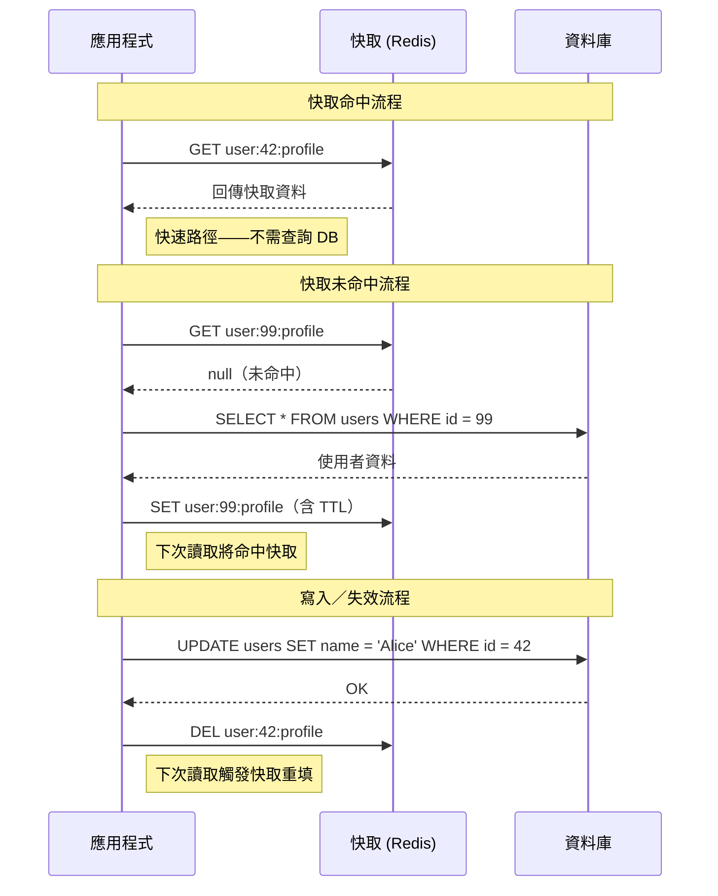

# [DEE-451] Cache-Aside 模式

:::info
Cache-aside 模式（延遲載入）是最常見的快取策略。應用程式明確管理快取的讀取與寫入，先檢查快取，若未命中則回退至資料庫。
:::

## 背景

大多數應用程式的工作負載以讀取為主，相同的資料會被重複擷取。每次請求都查詢資料庫會浪費資源並增加延遲。快取——通常是像 Redis 或 Memcached 這樣的記憶體內儲存——能以比磁碟資料庫快數個數量級的速度提供頻繁存取的資料。

Cache-aside 是最簡單且最廣泛採用的快取模式。與 read-through 或 write-through 模式（由快取層管理資料庫互動）不同，cache-aside 讓應用程式完全掌控快取和資料庫操作。這種明確的控制使模式易於理解和除錯，但也意味著應用程式需負責維持快取與資料庫之間的一致性。

此模式有時被稱為「延遲載入」，因為資料只在首次被請求時才進入快取，而非主動載入。

## 原則

開發者SHOULD將 cache-aside 作為讀取密集型工作負載的預設快取模式，前提是偶爾的快取未命中是可接受的。

開發者MUST為每個快取項目設定 TTL，以防止記憶體無限增長和過時資料累積。

開發者SHOULD設計具有確定性、易讀且具命名空間的快取鍵，以避免衝突（例如 `user:{user_id}:profile`、`product:{product_id}:details`）。

開發者MUST NOT假設快取始終包含最新資料。應用程式MUST優雅地處理快取未命中，回退至資料庫查詢。

## 圖解



## 範例

### 使用 Redis 的 Python 實作

```python
import json
import redis
import hashlib

r = redis.Redis(host="localhost", port=6379, decode_responses=True)

CACHE_TTL_SECONDS = 300  # 5 分鐘

def get_user_profile(user_id: int) -> dict:
    cache_key = f"user:{user_id}:profile"

    # 步驟 1：檢查快取
    cached = r.get(cache_key)
    if cached is not None:
        return json.loads(cached)

    # 步驟 2：快取未命中——查詢資料庫
    profile = db_fetch_user_profile(user_id)  # 你的 DB 查詢

    # 步驟 3：將資料填入快取並設定 TTL
    r.set(cache_key, json.dumps(profile), ex=CACHE_TTL_SECONDS)

    return profile


def update_user_profile(user_id: int, changes: dict) -> None:
    # 步驟 1：寫入資料庫（唯一真實來源）
    db_update_user_profile(user_id, changes)

    # 步驟 2：使快取項目失效
    cache_key = f"user:{user_id}:profile"
    r.delete(cache_key)
    # 下次讀取將從資料庫重新填入快取
```

### 快取鍵設計指南

| 模式 | 範例 | 用途 |
|------|------|------|
| `entity:{id}:field` | `user:42:profile` | 單一實體查詢 |
| `entity:{id}:relation` | `user:42:orders` | 關聯集合 |
| `query:{hash}` | `query:a3f9c1...` | 參數化查詢結果 |
| `v2:entity:{id}` | `v2:product:100` | 版本化鍵，確保部署安全 |

對於複雜查詢，將正規化的查詢參數進行雜湊以產生確定性的鍵：

```python
def cache_key_for_query(table: str, params: dict) -> str:
    normalized = json.dumps(params, sort_keys=True)
    digest = hashlib.sha256(normalized.encode()).hexdigest()[:12]
    return f"query:{table}:{digest}"
```

## 快取失效策略

Cache-aside 需要明確的失效策略。三種主要方法為：

| 策略 | 機制 | 適用場景 |
|------|------|----------|
| **基於 TTL** | 快取項目在固定時間後過期 | 可容忍短暫過時的資料 |
| **明確失效** | 應用程式在寫入時刪除快取鍵 | 需要快速反映寫入的資料 |
| **事件驅動** | 訊息匯流排（Kafka、Redis pub/sub）觸發失效 | 存在多個寫入者的微服務架構 |

實務上，結合 TTL 與明確失效：設定 TTL 作為安全網，並在已知的寫入操作上主動失效。這樣即使失效訊息遺失，過時的項目最終也會過期。

## 常見錯誤

1. **快取項目未設定 TTL。** 沒有 TTL，過時資料會無限期持續存在。如果失效邏輯有錯誤或某個寫入路徑被遺漏，快取將永遠提供過時資料。即使你也有明確失效機制，仍應始終設定 TTL。

2. **快取風暴（驚群效應）。** 當熱門鍵過期時，數百個並行請求可能同時未命中快取並衝擊資料庫。緩解方式包括：分散式鎖（僅一個請求重填快取，其餘等待或提供過時資料）、機率性提前重新計算（在 TTL 歸零前根據遞增機率刷新鍵）、以及為 TTL 添加隨機抖動以避免鍵同時過期。

3. **寫入路徑間的失效不一致。** 如果應用程式在多處寫入資料庫（API 端點、背景任務、遷移腳本），但只有部分路徑會使快取失效，就會提供過時資料。應將失效邏輯集中在資料存取層，而非散布在各個控制器中。

4. **對可變資料未制定快取策略。** 對頻繁變動的資料（如即時計數器、庫存數量）使用長 TTL 進行快取會導致過時的讀取。應使用極短的 TTL、改用 write-through 模式，或完全不快取該資料。

5. **先刪除後寫入的順序錯誤。** 在寫入資料庫前先刪除快取會造成競爭條件：在刪除與寫入之間，並行的讀取者可能會用舊值重新填入快取。應始終先寫入資料庫，再使快取失效。

## 相關 DEE

- [DEE-450](450.md) 快取與搜尋總覽
- [DEE-452](452.md) Read-Through 與 Write-Through 快取 -- 由快取層管理資料庫互動的替代模式
- [DEE-453](453.md) 快取失效策略 -- 深入探討失效方法
- [DEE-454](454.md) Redis 快取資料結構 -- 為快取選擇合適的 Redis 類型

## 參考資料

- AWS: Database Caching Strategies Using Redis. <https://docs.aws.amazon.com/whitepapers/latest/database-caching-strategies-using-redis/caching-patterns.html>
- Microsoft: Cache-Aside Pattern. <https://learn.microsoft.com/en-us/azure/architecture/patterns/cache-aside>
- Redis: Cache-Aside Pattern with Redis. <https://redis.io/tutorials/howtos/solutions/microservices/caching/>
- Wikipedia: Cache stampede. <https://en.wikipedia.org/wiki/Cache_stampede>
