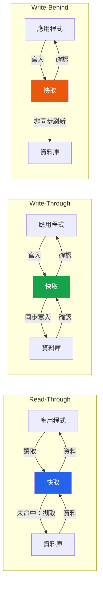

# [DEE-452] Read-Through 與 Write-Through 快取

:::info
在 read-through 與 write-through 快取中，是由快取層——而非應用程式——管理資料庫的讀取與寫入。應用程式僅與快取互動，快取會透明地與資料庫同步。
:::

## 背景

在 cache-aside 模式（[DEE-451](451.md)）中，應用程式明確管理快取和資料庫。這提供了完全的控制權，但快取邏輯會散布在整個應用程式碼中。Read-through 與 write-through 模式將這項責任移入快取層本身，創造更簡潔的程式設計模型，讓應用程式將快取視為主要的資料介面。

這些模式常見於企業級快取框架（Oracle Coherence、NCache、Hazelcast）和 CDN 架構。在原生 Redis 或 Memcached 中較不常見，因為它們不原生提供資料庫支援的 read/write-through 行為——你必須自行建構或設定中間層。

存在三種相關模式：

- **Read-through**：當快取未命中時，快取本身從資料庫擷取資料、儲存並回傳給應用程式。後續的讀取從快取提供。
- **Write-through**：寫入時，快取同步寫入自身和資料庫，在回傳成功給應用程式之前完成兩者。
- **Write-behind（write-back）**：寫入時，快取立即更新自身並回傳成功，然後在背景非同步地將寫入刷新至資料庫。

## 原則

開發者SHOULD在應用程式不應包含快取未命中邏輯，且快取層可設定資料載入器時，使用 read-through 快取。

開發者SHOULD在每次寫入都必須在應用程式繼續前持久化至資料庫，且快取應始終反映最新狀態時，使用 write-through 快取。

開發者MAY在寫入吞吐量至關重要，且應用程式能容忍快取節點在刷新前故障而導致潛在資料遺失的情況下，使用 write-behind 快取。

開發者MUST NOT對不可遺失的資料（如金融交易、稽核日誌）使用 write-behind 快取，除非快取層提供持久性保證（複寫、預寫日誌）。

## 圖解



## 範例

### 概念性 read-through 實作

在 read-through 設定中，你為快取設定一個「載入器」函式。應用程式永遠不直接查詢資料庫：

```python
class ReadThroughCache:
    def __init__(self, cache_store, db_loader, ttl_seconds=300):
        self.cache = cache_store
        self.loader = db_loader
        self.ttl = ttl_seconds

    def get(self, key: str):
        value = self.cache.get(key)
        if value is not None:
            return value

        # 由快取管理 DB 擷取——而非應用程式
        value = self.loader(key)
        if value is not None:
            self.cache.set(key, value, ex=self.ttl)
        return value

# 應用程式碼很簡潔——沒有快取未命中邏輯
cache = ReadThroughCache(
    cache_store=redis_client,
    db_loader=lambda key: db.query_user(key)
)
user = cache.get("user:42")
```

### 概念性 write-through 實作

```python
class WriteThroughCache:
    def __init__(self, cache_store, db_writer):
        self.cache = cache_store
        self.writer = db_writer

    def put(self, key: str, value, ttl_seconds=300):
        # 先寫入資料庫（同步）
        self.writer(key, value)
        # 再更新快取
        self.cache.set(key, value, ex=ttl_seconds)

    def get(self, key: str):
        return self.cache.get(key)
```

### 含批次處理的 write-behind

```python
class WriteBehindCache:
    def __init__(self, cache_store, db_writer, flush_interval=5):
        self.cache = cache_store
        self.writer = db_writer
        self.buffer = {}  # 待處理的寫入
        self.flush_interval = flush_interval

    def put(self, key: str, value):
        # 立即更新快取——快速回傳
        self.cache.set(key, value)
        self.buffer[key] = value

    def flush(self):
        """由背景執行緒定期呼叫。"""
        if self.buffer:
            self.writer.batch_write(self.buffer)
            self.buffer.clear()
```

## 比較表

| 面向 | Cache-Aside | Read-Through | Write-Through | Write-Behind |
|------|------------|--------------|---------------|--------------|
| **誰管理 DB 互動** | 應用程式 | 快取層 | 快取層 | 快取層 |
| **讀取延遲（未命中）** | 快取 + DB 往返 | 相同，但透明 | 不適用 | 不適用 |
| **寫入延遲** | DB 寫入 + 快取失效 | 不適用 | 較高（同步 DB + 快取） | 最低（僅快取） |
| **寫入吞吐量** | 受限於 DB | 不適用 | 受限於 DB | 最高（非同步批次） |
| **快取故障時的資料遺失風險** | 無（DB 為唯一真實來源） | 無 | 無 | **有**——緩衝的寫入可能遺失 |
| **一致性** | 取決於失效策略 | 讀取強一致 | 讀寫強一致 | 最終一致 |
| **實作複雜度** | 低（應用程式邏輯） | 中（快取需有載入器） | 中（快取需有寫入器） | 高（非同步刷新、錯誤處理） |
| **常見實作** | Redis + 應用程式碼 | Oracle Coherence、NCache、Hazelcast | Oracle Coherence、NCache、DAX | Oracle Coherence、NCache、Hazelcast |

## 常見錯誤

1. **Write-behind 的資料遺失風險。** Write-behind 快取在記憶體中緩衝寫入。如果快取節點在刷新前當機，這些寫入將永久遺失。可透過快取複寫、持久性預寫日誌來緩解，或將 write-behind 限制在可承受遺失的資料上（如分析計數器、非關鍵指標）。

2. **假設 write-through 消除了不一致性。** Write-through 保證每次寫入都更新快取和資料庫，但如果其他系統直接寫入資料庫（遷移腳本、管理工具、其他服務），快取將不會反映這些變更。你仍需要 TTL 或失效機制來處理外部寫入。

3. **過度工程化簡單的使用案例。** 如果你的應用程式只有一個資料庫和一個快取，cache-aside 加上明確失效通常更簡單且足夠。Read-through 和 write-through 在原生支援這些模式的框架中（如 Hazelcast MapLoader、DynamoDB DAX），或當你想在大型程式碼庫中將快取邏輯與業務程式碼解耦時，才更有價值。

4. **未處理載入器／寫入器的失敗。** 在 read-through 中，如果資料庫當機，快取無法服務未命中的請求。在 write-through 中，如果資料庫寫入失敗，快取不得被更新。確保快取層將錯誤傳播給應用程式，而非靜默地快取部分或失敗的結果。

5. **混用模式而缺乏明確策略。** 讀取使用 read-through 但寫入使用 cache-aside 的失效方式，會造成快取生命週期管理的混亂。每個資料領域應選擇一致的模式並加以文件化。

## 相關 DEE

- [DEE-450](450.md) 快取與搜尋總覽
- [DEE-451](451.md) Cache-Aside 模式 -- 最常見的替代方案，由應用程式明確管理快取
- [DEE-453](453.md) 快取失效策略 -- 失效機制適用於所有快取模式

## 參考資料

- Oracle: Read-Through, Write-Through, Write-Behind Caching. <https://docs.oracle.com/cd/E16459_01/coh.350/e14510/readthrough.htm>
- AWS: Database Caching Strategies Using Redis. <https://docs.aws.amazon.com/whitepapers/latest/database-caching-strategies-using-redis/caching-patterns.html>
- Hazelcast: Cache Access Patterns. <https://hazelcast.com/foundations/caching/cache-access-patterns/>
- CodeAhoy: Caching Strategies and How to Choose the Right One. <https://codeahoy.com/2017/08/11/caching-strategies-and-how-to-choose-the-right-one/>
