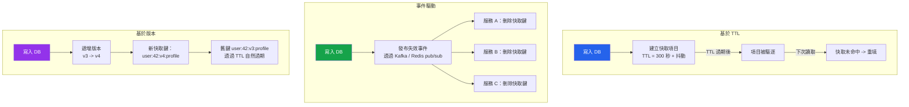

# [DEE-453] 快取失效策略

:::info
「電腦科學中只有兩件困難的事：快取失效和命名。」——Phil Karlton。根據一致性需求、資料變動頻率和系統拓撲來選擇你的失效策略。
:::

## 背景

快取能提升效能，但每個快取值都是潛在的過時資料來源。核心挑戰在於決定何時以及如何移除或刷新快取項目，使應用程式提供合理新鮮的資料，同時不失去快取的效能優勢。

Phil Karlton 的名言（常被歸於不同來源，但起源於 1990 年代中期的 Netscape）道出了根本矛盾：從不失效的快取速度快但不可靠；過於積極失效的快取可靠但速度慢。

沒有通用的最佳策略。正確的選擇取決於底層資料變動的頻率、應用程式能容忍多少過時、有多少服務寫入相同的資料，以及系統拓撲的複雜程度。實務上，生產系統通常為不同的資料領域組合多種策略。

## 原則

開發者MUST為每種快取資料類型定義明確的失效策略。依賴「快取最終會過期」而沒有刻意設定 TTL 不算是一種策略。

開發者SHOULD從基於 TTL 的失效（最簡單的方法）開始，僅在一致性需求要求時再疊加事件驅動或版本化的失效機制。

開發者MUST在多個鍵按相似排程過期時，為 TTL 值添加隨機抖動，以防止驚群效應／快取風暴。

開發者SHOULD將失效邏輯集中在資料存取層，而非散布在控制器、背景任務和腳本中。

## 圖解



## 策略詳解

### 1. 基於 TTL 的失效

最簡單的方法。每個快取項目儲存時帶有過期時間。TTL 經過後，項目會自動被驅逐，下次讀取時觸發從資料庫重填。

```python
import random

BASE_TTL = 300  # 5 分鐘
MAX_JITTER = 60  # 最多 60 秒的隨機抖動

def set_with_jitter(redis_client, key, value):
    ttl = BASE_TTL + random.randint(0, MAX_JITTER)
    redis_client.set(key, value, ex=ttl)
```

**適用時機：** 可容忍短暫過時的資料（產品目錄、使用者資料、設定）。大多數快取從這裡開始。

### 2. 事件驅動失效

當資料變更時，寫入者在訊息匯流排上發布事件。所有快取該資料的服務訂閱事件並刪除其本地快取項目。

```python
import redis

r = redis.Redis()

# 發布者（在寫入路徑中）
def update_user(user_id, changes):
    db_update_user(user_id, changes)
    r.publish("cache:invalidate", f"user:{user_id}:profile")

# 訂閱者（在每個服務實例中執行）
def invalidation_listener():
    pubsub = r.pubsub()
    pubsub.subscribe("cache:invalidate")
    for message in pubsub.listen():
        if message["type"] == "message":
            cache_key = message["data"]
            r.delete(cache_key)
```

**適用時機：** 多個服務快取相同資料且寫入必須快速反映的微服務架構。當寫入者和讀取者是不同服務時也適用。

### 3. 基於版本（快取鍵版本化）

不刪除快取項目，而是遞增版本計數器。快取鍵包含版本號，因此舊項目變得不可達並透過 TTL 自然過期。

```python
def get_user_profile(redis_client, user_id):
    # 取得目前版本（獨立儲存，小且快速）
    version = redis_client.get(f"user:{user_id}:version") or "1"
    cache_key = f"user:{user_id}:v{version}:profile"

    cached = redis_client.get(cache_key)
    if cached:
        return json.loads(cached)

    profile = db_fetch_user(user_id)
    redis_client.set(cache_key, json.dumps(profile), ex=300)
    return profile

def invalidate_user(redis_client, user_id):
    # 遞增版本——舊鍵變成孤立並透過 TTL 過期
    redis_client.incr(f"user:{user_id}:version")
```

**適用時機：** 當你想避免明確刪除（可能導致快取風暴）而偏好漸進式過渡時。也適用於部署時的失效——部署時遞增全域版本。

### 4. 基於標籤的失效

將相關的快取項目歸類在一個標籤下。使標籤失效即可使該群組中的所有項目失效。這是版本化失效應用於集合的變體。

```python
# 標籤："department:engineering"
# 成員：user:42:profile, user:43:profile, user:44:profile

def invalidate_tag(redis_client, tag):
    members = redis_client.smembers(f"tag:{tag}")
    if members:
        redis_client.delete(*members)
        redis_client.delete(f"tag:{tag}")
```

**適用時機：** 當單一變更影響多個快取項目時（例如更新部門名稱應使該部門所有使用者資料失效）。

## 比較表

| 策略 | 一致性 | 複雜度 | 過時窗口 | 風暴風險 | 適用場景 |
|------|--------|--------|----------|----------|----------|
| **基於 TTL** | 最終一致（受限於 TTL） | 低 | 最長為 TTL 時間 | 有（以抖動緩解） | 通用目的、讀取密集的資料 |
| **明確刪除** | 近即時 | 低-中 | 極小（競爭窗口） | 有（熱門鍵） | 單一服務、已知寫入路徑 |
| **事件驅動** | 近即時 | 中-高 | 訊息傳播延遲 | 低（刪除有目標性） | 微服務、多寫入者 |
| **基於版本** | 近即時 | 中 | 舊版本 TTL | 低（無大量過期） | 部署時、漸進式替換 |
| **基於標籤** | 近即時 | 中 | 取決於實作 | 中等（批量刪除） | 相關資料群組 |

## 常見錯誤

1. **TTL 無抖動（驚群效應）。** 如果同一資料類型的數千個快取項目設定了相同的 TTL（例如所有產品頁面快取恰好 300 秒），它們會同時過期。由此產生的大量快取未命中可能壓垮資料庫。應始終添加隨機抖動：`TTL = base + random(0, maxJitter)`。

2. **手動失效散布在程式碼各處。** 當快取刪除放在各別的控制器、背景任務和管理腳本中，幾乎可以保證某些寫入路徑會遺漏失效。應將失效邏輯集中在 repository 或資料存取層，使每次寫入都通過一個同時處理資料庫寫入和快取失效的單一程式碼路徑。

3. **部署後的過時快取。** 新的程式碼版本可能變更了序列化格式、新增了欄位或改變了業務邏輯，但快取中仍包含舊版本寫入的項目。使用鍵版本化（在快取鍵中嵌入應用程式版本或 schema 版本）或在部署時清空快取。如果系統能承受冷快取的負載，完全清空是安全的。

4. **對關鍵資料僅依賴 TTL。** 對於過時會產生業務影響的資料（帳戶餘額、權限、庫存數量），僅靠 TTL 是不夠的。結合 TTL（作為安全網）與明確或事件驅動的失效，使寫入在數秒內而非數分鐘內反映。

5. **忽略失效與風暴之間的取捨。** 刪除熱門鍵會導致快取風暴。版本化失效避免了這個問題，因為舊項目在 TTL 過期前仍然存在，而新請求使用新版本鍵。對於非常熱門的鍵，應優先使用版本化失效或使用鎖／租約機制，僅允許一個請求重填快取。

## 相關 DEE

- [DEE-450](450.md) 快取與搜尋總覽
- [DEE-451](451.md) Cache-Aside 模式 -- 最常見的模式，需要明確失效
- [DEE-452](452.md) Read-Through 與 Write-Through 快取 -- 快取層可內部管理失效的模式

## 參考資料

- Karlton, P. (c. 1996-1997). Attribution via Martin Fowler's Bliki: TwoHardThings. <https://martinfowler.com/bliki/TwoHardThings.html>
- AWS: Database Caching Strategies Using Redis -- Caching Patterns. <https://docs.aws.amazon.com/whitepapers/latest/database-caching-strategies-using-redis/caching-patterns.html>
- Redis: Cache Eviction Strategies. <https://redis.io/blog/cache-eviction-strategies/>
- Wikipedia: Cache stampede. <https://en.wikipedia.org/wiki/Cache_stampede>
- Vattani, A., Chakrabarti, D., Gurevich, M. (2015). "Optimal Probabilistic Cache Stampede Prevention." PVLDB, 8(8). <http://www.vldb.org/pvldb/vol8/p886-vattani.pdf>
