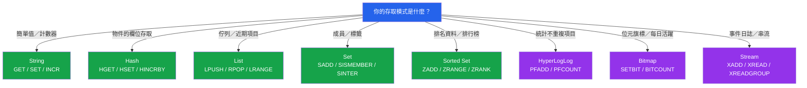

# [DEE-454] Redis 快取資料結構

:::info
Redis 提供超越簡單鍵值字串的專用資料結構。根據存取模式選擇正確的資料結構可減少記憶體用量、簡化應用程式邏輯，並解鎖使用純字串時代價高昂或不可能的操作。
:::

## 背景

許多開發者僅將 Redis 用作鍵值儲存，將所有資料序列化為 JSON 字串。雖然這可行，但忽略了 Redis 最強大的功能：針對特定存取模式量身打造的專用資料結構及其原子操作。

Redis 提供以下核心資料類型：

- **String** -- 最大 512 MB 的二進位安全位元組序列。用於簡單的鍵值快取、計數器和旗標。
- **Hash** -- 單一鍵下的欄位-值對映射。用於需要讀寫個別欄位而無需反序列化整個物件的物件。
- **List** -- 字串的雙向鏈結串列。用於佇列、近期活動動態和有界集合。
- **Set** -- 不重複字串的無序集合。用於成員測試、標籤和集合運算（聯集、交集、差集）。
- **Sorted Set (ZSet)** -- 由浮點數評分的不重複字串集合，以排序順序維護。用於排行榜、速率限制器和時間序列排名。
- **HyperLogLog** -- 以固定 12 KB 記憶體進行基數估算的機率性資料結構。用於統計不重複訪客、不重複事件或任何近似不重複計數。
- **Bitmap** -- 作為位元陣列處理的字串。用於功能旗標、每日活躍用戶追蹤和類 bloom filter 的操作。
- **Stream** -- 支援消費者群組的附加式日誌。用於事件溯源、活動動態和訊息佇列。

自 Redis 2.2 起，小型的 Hash、List、Set 和 Sorted Set 實例以緊湊的「ziplist」（或自 Redis 7.0 起的「listpack」）編碼儲存，記憶體用量可比完整資料結構少高達 10 倍。當元素數量和元素大小低於可設定的閾值時，此編碼會自動使用。

## 原則

開發者SHOULD選擇與主要存取模式匹配的 Redis 資料結構，而非對所有資料預設使用 String + JSON。

開發者MUST在每個用於快取的 Redis 實例上設定 `maxmemory` 和 `maxmemory-policy`，以防止記憶體無限增長。

開發者MUST在快取項目上設定過期時間（`EXPIRE` 或 `SET` 的 `EX`/`PX`），以防止過時資料累積。

開發者SHOULD使用簡短且一致的鍵命名慣例（例如 `user:42:profile`、`lb:daily:scores`），以減少記憶體開銷並提高可除錯性。

## 圖解



## 範例

### String：簡單快取與原子計數器

```redis
-- 快取序列化值並設定 TTL
SET user:42:profile '{"name":"Alice","role":"admin"}' EX 300

-- 原子計數器（無讀取-修改-寫入的競爭條件）
INCR page:views:/home
INCRBY product:42:stock -1
```

### Hash：物件的欄位層級存取

```redis
-- 將使用者資料儲存為 hash
HSET user:42:profile name "Alice" role "admin" login_count 0

-- 讀取單一欄位（無需反序列化整個物件）
HGET user:42:profile name
-- "Alice"

-- 原子遞增單一欄位
HINCRBY user:42:profile login_count 1

-- 設定整個 hash 的過期時間
EXPIRE user:42:profile 300
```

當 hash 的欄位數少於 `hash-max-listpack-entries`（預設 128）且每個欄位值小於 `hash-max-listpack-value`（預設 64 位元組）時，Hash 比將每個欄位儲存為獨立 String 鍵更節省記憶體。在此設定下，Redis 使用緊湊的 listpack 編碼。

### Sorted Set：排行榜

```redis
-- 新增分數（ZADD 為 O(log N)）
ZADD lb:daily:scores 1500 "player:alice"
ZADD lb:daily:scores 2300 "player:bob"
ZADD lb:daily:scores 1800 "player:charlie"

-- 前 10 名（依分數降序）
ZREVRANGE lb:daily:scores 0 9 WITHSCORES

-- 特定玩家的排名（從 0 開始）
ZREVRANK lb:daily:scores "player:alice"

-- 每日過期排行榜
EXPIRE lb:daily:scores 86400
```

### HyperLogLog：不重複訪客計數

```redis
-- 新增訪客 ID（無論基數多大都固定 12 KB）
PFADD uv:2026-04-07 "visitor:abc" "visitor:def" "visitor:ghi"

-- 近似不重複計數（標準誤差 < 1%）
PFCOUNT uv:2026-04-07
-- (integer) 3

-- 合併多天以取得週計數
PFMERGE uv:week:15 uv:2026-04-07 uv:2026-04-06 uv:2026-04-05
PFCOUNT uv:week:15
```

### Set：基於標籤的成員資格

```redis
-- 為文章加標籤
SADD tag:redis "article:101" "article:205" "article:310"
SADD tag:caching "article:101" "article:420"

-- 同時標記為 "redis" 和 "caching" 的文章
SINTER tag:redis tag:caching
-- "article:101"

-- 檢查成員資格
SISMEMBER tag:redis "article:205"
-- (integer) 1
```

## 記憶體最佳化技巧

| 技術 | 影響 | 做法 |
|------|------|------|
| **設定 `maxmemory` + 驅逐策略** | 防止 OOM 當機 | `maxmemory 2gb` + `maxmemory-policy allkeys-lru` |
| **小型物件使用 Hash** | 透過 listpack 減少高達 10 倍記憶體 | 保持 hash 在 128 欄位／64 位元組值以下 |
| **所有快取鍵設定 EXPIRE** | 防止過時資料堆積 | `SET key value EX 300` 或 `EXPIRE key 300` |
| **簡短的鍵名** | 大規模下節省每個鍵的位元組 | `u:42:p` vs `user_profile_for_user_id_42` |
| **避免儲存大型 blob** | 減少記憶體和網路 I/O | 保持值在 100 KB 以下；大型物件存放在 S3/blob store |
| **使用 OBJECT ENCODING 檢查** | 驗證是否使用緊湊編碼 | `OBJECT ENCODING mykey` 應顯示 `listpack` / `ziplist` |
| **選擇正確的驅逐策略** | 保持熱門資料在記憶體中 | `allkeys-lru`（通用）、`volatile-lfu`（TTL 鍵、基於頻率） |

### 驅逐策略參考

| 策略 | 範圍 | 演算法 | 適用場景 |
|------|------|--------|----------|
| `noeviction` | 不適用 | 滿時寫入回傳錯誤 | 不可被驅逐的資料 |
| `allkeys-lru` | 所有鍵 | 最近最少使用 | 通用快取（良好的預設值） |
| `allkeys-lfu` | 所有鍵 | 最不常使用 | 有明確冷熱分層的工作負載 |
| `volatile-lru` | 有 TTL 的鍵 | 過期鍵中的 LRU | 持久性與快取資料混合 |
| `volatile-lfu` | 有 TTL 的鍵 | 過期鍵中的 LFU | 有頻率模式的 TTL 鍵 |
| `volatile-ttl` | 有 TTL 的鍵 | 剩餘 TTL 最短者優先 | 優先保留長壽命的快取項目 |
| `allkeys-random` | 所有鍵 | 隨機驅逐 | 均勻的存取模式 |

## 常見錯誤

1. **所有資料都儲存為 JSON 字串。** 將物件序列化為 JSON 字串並用 `SET` 儲存，意味著每次讀取或部分更新都需要完整的反序列化-修改-重新序列化流程。如果你頻繁存取或更新個別欄位，應使用 Hash。如果需要排名存取，應使用 Sorted Set。讓結構匹配存取模式。

2. **未設定 `maxmemory` 限制。** 沒有記憶體限制，Redis 會消耗所有可用 RAM，最終被作業系統 OOM killer 終止，導致整台伺服器當機。快取工作負載應始終設定 `maxmemory` 和驅逐策略。

3. **快取鍵缺少 EXPIRE。** 沒有過期時間的鍵會持續存在，直到被明確刪除或被驅逐策略驅逐。如果驅逐策略是 `noeviction` 或 `volatile-*`（僅驅逐有 TTL 的鍵），無過期的鍵會無限累積。應為每個快取項目設定 TTL。

4. **過大的鍵和值。** 一個持有 10 MB JSON blob 的鍵會在序列化和傳輸期間阻塞 Redis（命令執行是單執行緒的）。應將大型值拆分為較小的鍵或使用外部 blob store。Redis SLOWLOG 可協助識別被大型資料阻塞的命令。

5. **在生產環境使用 KEYS。** `KEYS *` 會掃描整個鍵空間並阻塞 Redis。在生產環境中應使用 `SCAN` 進行迭代式鍵探索。

## 相關 DEE

- [DEE-450](450.md) 快取與搜尋總覽
- [DEE-451](451.md) Cache-Aside 模式 -- 最常以 Redis 實作的模式
- [DEE-453](453.md) 快取失效策略 -- 適用於所有 Redis 資料結構的 TTL 和失效模式

## 參考資料

- Redis: Data Types. <https://redis.io/docs/latest/develop/data-types/>
- Redis: Memory Optimization. <https://redis.io/docs/latest/operate/oss_and_stack/management/optimization/memory-optimization/>
- Redis: Key Eviction. <https://redis.io/docs/latest/develop/reference/eviction/>
- Redis: Cache Eviction Strategies (blog). <https://redis.io/blog/cache-eviction-strategies/>
- AWS: Evictions -- Database Caching Strategies Using Redis. <https://docs.aws.amazon.com/whitepapers/latest/database-caching-strategies-using-redis/evictions.html>
