# [DEE-455] Redis 持久化（RDB vs AOF）

:::info
Redis 是一個記憶體內資料儲存，但它提供兩種持久化機制 -- RDB 快照與 AOF（Append-Only File） -- 以及結合兩者的混合模式。選擇正確的持久化策略決定了在當機時可以承受多少資料遺失，以及 Redis 恢復的速度。
:::

## 背景

Redis 將整個資料集保存在記憶體中以獲得速度優勢，但記憶體是易失性的。沒有持久化的話，Redis 重啟意味著完全的資料遺失。對於純快取場景這是可以接受的（資料庫是真實資料來源），但許多 Redis 部署存放的是權威資料 -- 會話狀態、速率限制計數器、工作佇列、排行榜 -- 在重啟時遺失資料是不可接受的。

Redis 提供兩種持久化機制，可以獨立使用或組合使用：

- **RDB（Redis Database）**：整個資料集的定期時間點快照，以緊湊的二進位檔案（`dump.rdb`）寫入。
- **AOF（Append-Only File）**：伺服器接收的每個寫入命令的日誌，在啟動時重播以重建資料集。

從 Redis 4.0 開始，**混合模式**結合了兩者：AOF 檔案以 RDB 前導區（完整快照）開頭，後接增量 AOF 命令，兼具快速恢復與細粒度持久性。

## 原則

開發人員SHOULD為任何存放無法從其他真實資料來源輕易重建的資料的 Redis 實例啟用持久化。

開發人員MUST根據持久性需求選擇持久化策略：RDB 用於可接受資料遺失視窗的定期備份、AOF 用於接近零資料遺失、混合模式則在恢復速度與持久性之間取得最佳平衡。

開發人員SHOULD使用 `appendfsync everysec` 作為預設的 AOF fsync 策略，它在持久性（最多一秒的資料遺失）與效能之間提供了實用的平衡。

開發人員MUST NOT在需要零資料遺失時僅依賴 RDB 持久化，因為 RDB 快照是定期執行的，自上次快照以來的任何寫入在當機時都會遺失。

## 圖示

```mermaid
graph TD
    subgraph "RDB 快照"
        direction LR
        W1[寫入] --> M1[記憶體內資料集]
        M1 -->|每 N 秒 BGSAVE<br/>若有 M 個變更| S1[dump.rdb]
        S1 -->|重啟時載入| M1
    end

    subgraph "AOF 附加日誌檔"
        direction LR
        W2[寫入] --> M2[記憶體內資料集]
        M2 -->|附加每個寫入| A1[appendonly.aof]
        A1 -->|重啟時重播| M2
        A1 -->|定期重寫| A2[壓縮後的 AOF]
    end

    subgraph "混合模式 RDB + AOF"
        direction LR
        W3[寫入] --> M3[記憶體內資料集]
        M3 -->|AOF 重寫| H1[RDB 前導區 + AOF 尾部]
        H1 -->|批次載入 RDB<br/>然後重播 AOF| M3
    end

    style S1 fill:#2563eb,color:#fff
    style A1 fill:#16a34a,color:#fff
    style A2 fill:#16a34a,color:#fff
    style H1 fill:#ea580c,color:#fff
```



## 範例

### 僅 RDB 配置（`redis.conf`）

```ini
# 當至少 M 個 key 在 N 秒內發生變更時觸發 RDB 快照
save 900 1        # 900 秒後若至少 1 個 key 變更
save 300 10       # 300 秒後若至少 10 個 key 變更
save 60 10000     # 60 秒後若至少 10000 個 key 變更

dbfilename dump.rdb
dir /var/lib/redis

rdbcompression yes
rdbchecksum yes
stop-writes-on-bgsave-error yes

# 停用 AOF
appendonly no
```

### 僅 AOF 配置（`redis.conf`）

```ini
# 停用 RDB 快照
save ""

# 啟用 AOF
appendonly yes
appendfilename "appendonly.aof"

# fsync 策略 -- 平衡持久性與效能
appendfsync everysec

# AOF 重寫觸發條件（防止檔案無限成長）
auto-aof-rewrite-percentage 100   # 當 AOF 為上次重寫後大小的 2 倍時重寫
auto-aof-rewrite-min-size 64mb    # AOF 小於 64 MB 時不重寫

aof-load-truncated yes
```

### 混合 RDB + AOF 配置（`redis.conf`） -- 建議用於生產環境

```ini
# 保留 RDB 快照作為備份安全網
save 900 1
save 300 10
save 60 10000

# 啟用 AOF 與混合前導區
appendonly yes
appendfilename "appendonly.aof"
appendfsync everysec
aof-use-rdb-preamble yes          # 混合模式：AOF 重寫產生 RDB 前綴 + AOF 尾部

auto-aof-rewrite-percentage 100
auto-aof-rewrite-min-size 64mb
```

當 Redis 重啟時若同時存在 RDB 與 AOF，它會載入 AOF 檔案（因為更完整）。在混合模式下，AOF 以緊湊的 RDB 快照開頭以快速批次載入，後面只有自該快照以來的增量命令。

## fsync 策略

`appendfsync` 指令控制 AOF 緩衝區刷新到磁碟的頻率。這是 Redis 中最重要的持久性與效能權衡：

| 策略 | 持久性 | 效能影響 | 資料遺失視窗 |
|--------|-----------|-------------------|-----------------|
| `always` | 最高 -- 每次寫入都 fsync | 嚴重（比 `everysec` 慢約 100 倍） | 幾乎為零 |
| `everysec` | 高 -- fsync 在背景執行緒每秒執行 | 極小 -- 主執行緒很少被阻塞 | 最多約 1 秒的寫入 |
| `no` | 取決於作業系統 -- Linux 通常每 30 秒刷新 | 最佳 -- 無明確 fsync | 最多約 30 秒的寫入 |

對於大多數生產工作負載，`everysec` 是正確的預設值。僅在確實無法容忍任何資料遺失且效能損失可接受時使用 `always`（例如低寫入量的金融狀態）。僅在持久化只是錦上添花的臨時資料時使用 `no`。

## 比較表

| 面向 | 僅 RDB | 僅 AOF | 混合模式（RDB + AOF） |
|--------|---------|---------|-------------------|
| **當機時資料遺失** | 自上次快照以來的所有寫入（分鐘級） | 取決於 fsync 策略（0 秒至約 30 秒） | 取決於 fsync 策略（0 秒至約 30 秒） |
| **重啟速度** | 快 -- 載入單一二進位檔案 | 慢 -- 重播每個命令 | 快 -- 載入 RDB 前導區，然後重播短的 AOF 尾部 |
| **磁碟空間** | 緊湊的二進位快照 | 較大 -- 記錄每個命令（透過重寫緩解） | 中等 -- RDB 前導區 + 增量命令 |
| **寫入效能影響** | 定期 fork() 執行 BGSAVE（記憶體尖峰） | 持續附加 + 定期重寫 | 與 AOF 相同 |
| **檔案格式** | 二進位，非人類可讀 | 基於文字的 Redis 命令（人類可讀） | 二進位 RDB 前綴 + 文字 AOF 後綴 |
| **備份友善度** | 優秀 -- 單一檔案，易於複製到其他主機 | 較大的檔案，但完整 | 良好 -- 內嵌快照的單一 AOF 檔案 |
| **最適合** | 備份、災難復原、開發環境 | 需要持久性的生產系統 | 需要持久性與快速恢復的生產系統 |

## 常見錯誤

1. **生產環境未啟用持久化。** 對於無法輕易重建的資料，在沒有任何持久化的情況下運行 Redis，意味著重啟（計劃性或非計劃性）會導致完全資料遺失。即使 Redis「只是快取」，也要評估重啟時冷快取的瞬間湧入是否會壓垮資料庫。至少應啟用 RDB 快照。

2. **未配置 AOF 重寫。** 如果沒有設定 `auto-aof-rewrite-percentage` 和 `auto-aof-rewrite-min-size`，AOF 檔案會無限成長。在疏於管理的部署中，2 GB 資料集對應 100 GB AOF 是常見的。這浪費磁碟空間，且因 Redis 重播數百萬個冗餘命令而使重啟極為緩慢。

3. **假設 RDB 足以實現零資料遺失。** RDB 快照是定期執行的。使用 `save 60 10000` 時，可能遺失最多 60 秒的寫入（如果變更的 key 少於 10000 個則更長）。如果需要時間點恢復，你需要 AOF。

4. **使用 `appendfsync always` 而未衡量效能影響。** `always` 可能將寫入吞吐量降低數個數量級。在啟用前先對你的工作負載進行基準測試，並考慮 `everysec`（最多遺失一秒）是否是可接受的權衡。

5. **忽略 BGSAVE fork() 的記憶體開銷。** RDB 持久化使用 `fork()` 建立子程序。由於寫時複製語意，寫入密集的工作負載可能導致子程序消耗與父程序幾乎相同的記憶體。確保主機有足夠的記憶體餘量（通常為 Redis 記憶體的 2 倍），否則作業系統會 OOM-kill Redis。

6. **未測試恢復。** 如果你從未驗證 RDB 或 AOF 檔案在重新載入時能產生正確、完整的資料集，持久化就毫無意義。定期從持久化檔案還原到測試實例並驗證資料。

## 相關 DEE

- [DEE-450](450.md) 快取與搜尋總覽
- [DEE-451](451.md) Cache-Aside 模式 -- 持久化支撐記憶體層的快取策略
- [DEE-454](454.md) Redis 快取資料結構 -- 選擇影響持久化檔案大小的資料結構

## 參考資料

- Redis: Persistence. <https://redis.io/docs/latest/operate/oss_and_stack/management/persistence/>
- Redis: Persistence and Durability at Scale. <https://redis.io/tutorials/operate/redis-at-scale/persistence-and-durability/>
- Engineering at Scale: Redis Persistence Deep Dive. <https://engineeringatscale.substack.com/p/redis-persistence-aof-rdb-crash-recovery>
