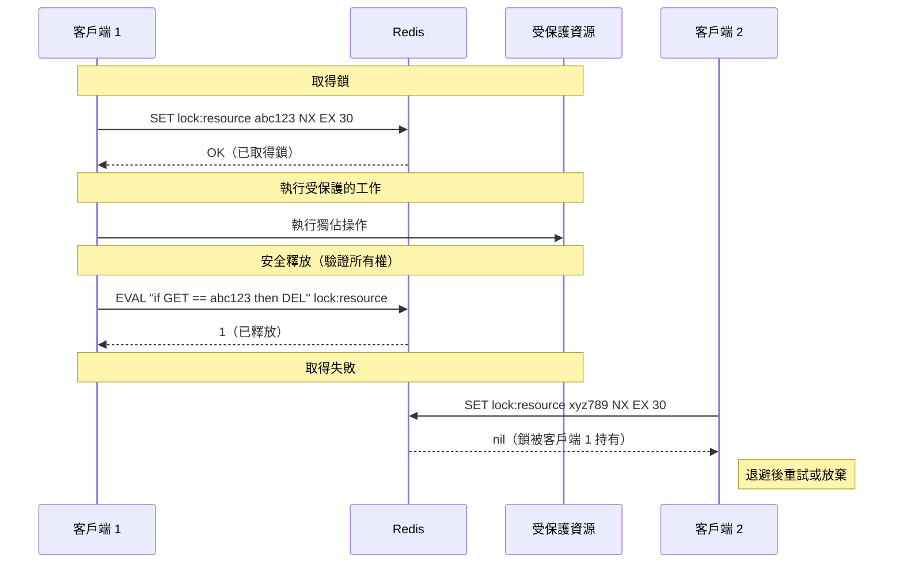

# [DEE-456] Redis 分散式鎖

:::info
分散式系統需要協調原語來防止並行程序破壞共享資源。Redis 常被用於分散式鎖定，因為它速度快、廣泛部署且支援原子操作 -- 但基於 Redis 的鎖有重要的安全注意事項，開發人員必須了解。
:::

## 背景

在分散式系統中，多個程序或服務可能需要獨佔存取共享資源 -- 更新資料庫記錄、寫入檔案、呼叫有速率限制的外部 API，或確保工作僅處理一次。分散式鎖為這些獨立程序提供互斥。

Redis 是分散式鎖定的熱門選擇，因為它提供原子原語（`SET NX EX`）、亞毫秒延遲，而且通常已是基礎設施的一部分。主要有兩種方式：

- **單實例鎖**：在單一 Redis 節點上使用 `SET key value NX EX ttl`。簡單、快速，對於偶爾重複執行可容忍的盡力而為協調已足夠。
- **Redlock（多實例）**：在 N 個獨立 Redis master（通常 5 個）的多數上取得鎖。設計上可以承受任何少數節點的故障。

Redlock 演算法引發了 Martin Kleppmann（分散式系統研究者）與 Salvatore Sanfilippo（antirez，Redis 創建者）之間的知名辯論，討論分散式鎖何時能、何時不能提供正確性保證。

## 原則

開發人員SHOULD在偶爾重複執行後果可接受的情況下使用單實例 Redis 鎖（`SET NX EX`）進行盡力而為的協調（例如背景工作的去重、速率限制、可容忍短暫腦裂的 leader 選舉）。

開發人員MUST始終在鎖定 key 上設定 TTL，以防止鎖持有者在未釋放的情況下當機時造成死鎖。

開發人員MUST使用唯一的鎖值（例如 UUID）並在釋放前驗證所有權，以避免刪除其他客戶端的鎖。

開發人員SHOULD NOT在沒有額外 fencing 機制的情況下，依賴 Redlock 進行正確性關鍵的互斥（例如防止重複扣款、金融交易），因為 Redlock 的安全性依賴於時序假設，而真實系統可能違反這些假設。

開發人員SHOULD在受保護資源支援 fencing token 時使用它，因為它提供獨立於鎖定時序的正確性保證。

## 圖示



## 範例

### 單實例鎖：取得與釋放

```python
import uuid
import redis
import time

r = redis.Redis(host="localhost", port=6379, decode_responses=True)

LOCK_TTL_SECONDS = 30

def acquire_lock(resource: str, ttl: int = LOCK_TTL_SECONDS) -> str | None:
    """嘗試取得鎖。成功時回傳 token，失敗時回傳 None。"""
    token = str(uuid.uuid4())
    acquired = r.set(f"lock:{resource}", token, nx=True, ex=ttl)
    return token if acquired else None


def release_lock(resource: str, token: str) -> bool:
    """僅在仍擁有鎖時釋放（透過 Lua 進行原子檢查與刪除）。"""
    lua_script = """
    if redis.call("GET", KEYS[1]) == ARGV[1] then
        return redis.call("DEL", KEYS[1])
    else
        return 0
    end
    """
    result = r.eval(lua_script, 1, f"lock:{resource}", token)
    return result == 1


# 使用方式
token = acquire_lock("order:42")
if token:
    try:
        process_order(42)  # 獨佔工作
    finally:
        release_lock("order:42", token)
else:
    print("無法取得鎖 -- 另一個 worker 正在處理此訂單")
```

### 為什麼要用 Lua 釋放？原子性很重要

沒有 Lua 腳本的話，天真的釋放方式有競態條件：

```python
# 不安全 -- 請勿使用
def unsafe_release(resource: str, token: str):
    key = f"lock:{resource}"
    if r.get(key) == token:        # (1) 檢查所有權
        # <-- 鎖可能在此過期，另一個客戶端取得了它
        r.delete(key)              # (2) 刪除 -- 現在刪除的是別人的鎖！
```

Lua 腳本在 Redis 伺服器上原子執行，消除了這個競態。

### Redlock 多實例模式（虛擬碼）

```python
# Redlock 使用 N 個獨立的 Redis master（通常 5 個，無複寫）。
# 鎖僅在多數節點（N/2 + 1）上持有時才算取得。

QUORUM = 3  # 5 個節點的多數
LOCK_TTL_MS = 30_000
CLOCK_DRIFT_FACTOR = 0.01

def redlock_acquire(nodes: list, resource: str, ttl_ms: int) -> str | None:
    token = str(uuid.uuid4())
    start_ms = current_time_ms()

    acquired_count = 0
    for node in nodes:
        if node.set(f"lock:{resource}", token, nx=True, px=ttl_ms):
            acquired_count += 1

    elapsed_ms = current_time_ms() - start_ms
    drift = ttl_ms * CLOCK_DRIFT_FACTOR + 2  # 時鐘漂移容許值
    validity_ms = ttl_ms - elapsed_ms - drift

    if acquired_count >= QUORUM and validity_ms > 0:
        return token  # 鎖已取得，剩餘有效期為 validity_ms

    # 失敗 -- 釋放所有已取得的鎖
    for node in nodes:
        release_lock_on_node(node, resource, token)
    return None
```

### Fencing token 確保正確性

```
客戶端 A 取得鎖（fence token = 33）
客戶端 A 暫停（GC、網路延遲）
鎖過期
客戶端 B 取得鎖（fence token = 34）
客戶端 B 以 fence = 34 寫入儲存
客戶端 A 恢復，以 fence = 33 寫入儲存
儲存拒絕寫入：33 < 34（過期的 token）
```

Fencing token 是隨每次鎖取得而發出的單調遞增數字。受保護資源檢查 token 並拒絕來自過期鎖持有者的操作。即使鎖過早過期，這也能提供正確性保證。

## Kleppmann 與 Antirez 的辯論

Redlock 的安全性已被分散式系統社群中兩位受尊敬的聲音公開辯論：

**Martin Kleppmann 的批評**（2016）：Redlock「非驢非馬」-- 對於僅追求效率的鎖來說太重，對於正確性關鍵的鎖來說又太弱。他的核心論點：

- Redlock 假設有界的網路延遲、有界的程序暫停和大致同步的時鐘。真實系統會違反這些假設（GC 暫停、網路分區、時鐘偏差）。
- 沒有 fencing token 的話，在取得鎖後暫停的客戶端可以在鎖過期後恢復並破壞資源，而此時另一個客戶端持有鎖。
- 如果受保護資源支援 fencing token，你不需要 Redlock 的複雜性 -- 單一 Redis 實例就足夠了。

**Antirez 的辯護**（2016）：在取得多數後，Redlock 客戶端會重新檢查是否未超過 TTL。這限制了脆弱視窗。Antirez 也主張 Redlock 的隨機值可以在具有 compare-and-set 語意的系統中作為一種 fencing 形式。

**實務指引**：對於僅追求效率的鎖（防止重複工作、降低負載），帶 TTL 的單實例 Redis 鎖簡單且足夠。對於正確性關鍵的鎖（防止資料損壞），在受保護資源上使用 fencing token，這適用於任何鎖實作。Redlock 在需要鎖服務本身能承受 Redis 節點故障時有其價值，但它無法在所有故障模式下保證互斥。

## 常見錯誤

1. **鎖定 key 未設 TTL（當機時死鎖）。** 如果鎖持有者當機或失去連線而未釋放鎖，且未設定 TTL，鎖將永遠被持有。每個鎖MUST有 TTL。選擇一個遠大於預期操作時間、但短到能在可接受視窗內恢復的 TTL。

2. **DEL 時未檢查所有權。** 直接呼叫 `DEL lock:resource` 而未驗證你是否仍持有鎖，可能釋放另一個客戶端的鎖。務必儲存唯一 token 並使用原子檢查與刪除（Lua 腳本或帶比較的 `GETDEL`）。

3. **在正確性關鍵系統中依賴 Redlock。** Redlock 的安全性依賴時序假設（有界的網路延遲、有界的程序暫停、有限的時鐘漂移）。如果客戶端暫停足夠長導致鎖過期，Redlock 無法阻止第二個客戶端取得鎖並繼續執行。對於正確性，受保護資源本身必須透過 fencing token 強制執行順序。

4. **鎖 TTL 短於操作時間。** 如果受保護操作的耗時超過鎖 TTL，鎖會在操作仍在執行時過期，另一個客戶端可以取得它。要麼設定有安全餘量的充裕 TTL、實作到期前的鎖延展（續約），或重新設計操作使其更快。

5. **競爭時的重試風暴。** 當多個客戶端競爭同一個鎖並在失敗後立即重試時，會產生瞬間湧入。在重試嘗試之間使用帶隨機抖動的指數退避。

6. **將 Redlock 與有複寫的 Redis 一起使用。** Redlock 需要 N 個獨立的 Redis master，彼此之間無複寫。與 Redis Sentinel 或 Redis Cluster（使用複寫）一起使用會違反演算法的假設 -- 故障轉移可能導致兩個客戶端同時持有鎖。

## 相關 DEE

- [DEE-450](450.md) 快取與搜尋總覽
- [DEE-454](454.md) Redis 快取資料結構 -- 鎖定所依賴的底層資料類型
- [DEE-455](455.md) Redis 持久化（RDB vs AOF） -- 持久化影響跨重啟的鎖持久性

## 參考資料

- Redis: Distributed Locks with Redis. <https://redis.io/docs/latest/develop/clients/patterns/distributed-locks/>
- Martin Kleppmann: How to do distributed locking. <https://martin.kleppmann.com/2016/02/08/how-to-do-distributed-locking.html>
- Antirez: Is Redlock safe? <https://antirez.com/news/101>
- Leapcell: Implementing Distributed Locks with Redis. <https://leapcell.io/blog/implementing-distributed-locks-with-redis-delving-into-setnx-redlock-and-their-controversies>
