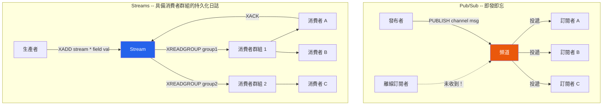

# [DEE-457] Redis Pub/Sub 與 Streams

:::info
Redis 提供兩種保證截然不同的訊息原語：Pub/Sub 是一種即發即忘的廣播機制，無持久化；而 Streams 是一種持久化、基於日誌的資料結構，具備消費者群組。選擇哪一種取決於訊息是否必須在斷線後存活，以及消費者是否需要獨立的進度追蹤。
:::

## 背景

應用程式經常需要在元件之間分發事件或訊息 -- 通知訂閱者狀態變更、將工作分散給處理器，或串流資料進行即時分析。Redis 為此提供兩種內建機制：

- **Pub/Sub**：經典的發布-訂閱系統。發布者將訊息發送到頻道；所有目前已連線的訂閱者即時接收。訊息不會被儲存 -- 如果訂閱者在訊息發布時斷線，該訊息將永遠遺失。沒有消費者群組、沒有確認、也沒有重播。

- **Streams**（Redis 5.0 引入）：一種持久化、僅附加的日誌資料結構，靈感來自 Apache Kafka。訊息（稱為條目）以自動產生的 ID 儲存，並持久化直到被明確裁剪。消費者可以從串流中的任何位置讀取，消費者群組允許多個消費者協作處理串流，並提供至少一次交付語意。

這些原語服務於不同的使用場景，混淆它們是資料遺失 bug 的常見來源。

## 原則

開發人員SHOULD在訊息遺失可接受的臨時即時通知場景中使用 Pub/Sub（例如快取失效信號、即時儀表板更新、輸入中指示器）。

開發人員SHOULD在訊息不可遺失、消費者需要按自己的節奏處理訊息、或多個消費者群組需要相同資料的獨立檢視時使用 Streams。

開發人員MUST使用 `XACK` 確認消費者群組中已處理的訊息，以防止待處理條目清單（PEL）無限成長。

開發人員MUST在 Streams 上配置保留策略（`MAXLEN` 或 `MINID`），以防止記憶體和磁碟的無限成長。

## 圖示



## 範例

### Pub/Sub：發布與訂閱

```bash
# 終端機 1 -- 訂閱者
redis-cli SUBSCRIBE notifications

# 終端機 2 -- 發布者
redis-cli PUBLISH notifications '{"event":"cache_invalidated","key":"user:42"}'

# 訂閱者輸出：
# 1) "message"
# 2) "notifications"
# 3) "{\"event\":\"cache_invalidated\",\"key\":\"user:42\"}"
```

```python
# Python 訂閱者範例
import redis

r = redis.Redis(host="localhost", port=6379, decode_responses=True)
pubsub = r.pubsub()
pubsub.subscribe("notifications")

for message in pubsub.listen():
    if message["type"] == "message":
        print(f"收到：{message['data']}")
```

### Streams：生產、透過消費者群組消費、確認

```bash
# 新增條目到串流
XADD orders * customer_id 42 product "widget" qty 3
# 回傳："1712345678901-0"

XADD orders * customer_id 99 product "gadget" qty 1
# 回傳："1712345678902-0"

# 建立消費者群組，從串流的開頭開始
XGROUP CREATE orders processing-group 0

# 消費者 "worker-1" 讀取最多 2 筆待處理訊息
XREADGROUP GROUP processing-group worker-1 COUNT 2 STREAMS orders >
# 回傳分配給此消費者的條目

# 處理完成後，確認完成
XACK orders processing-group 1712345678901-0

# 檢查待處理（未確認）的條目
XPENDING orders processing-group
```

```python
# Python 串流消費者搭配消費者群組
import redis

r = redis.Redis(host="localhost", port=6379, decode_responses=True)

STREAM = "orders"
GROUP = "processing-group"
CONSUMER = "worker-1"

# 建立群組（若已存在則忽略錯誤）
try:
    r.xgroup_create(STREAM, GROUP, id="0", mkstream=True)
except redis.ResponseError:
    pass

while True:
    # 讀取分配給此消費者的新訊息
    entries = r.xreadgroup(GROUP, CONSUMER, {STREAM: ">"}, count=10, block=5000)

    if not entries:
        continue  # 無新訊息，回到阻塞等待

    for stream_name, messages in entries:
        for msg_id, fields in messages:
            try:
                process_order(fields)           # 你的商業邏輯
                r.xack(STREAM, GROUP, msg_id)   # 確認成功
            except Exception:
                pass  # 訊息留在 PEL 中等待重試或被其他消費者認領
```

### Stream 保留：防止無限成長

```bash
# 將串流上限設為約 10,000 筆條目（近似裁剪以提升效能）
XADD orders MAXLEN ~ 10000 * customer_id 42 product "widget" qty 1

# 或按最小 ID 裁剪（丟棄早於給定 ID 的條目）
XTRIM orders MINID ~ 1712345600000-0
```

## 比較表

| 面向 | Redis Pub/Sub | Redis Streams | Apache Kafka | RabbitMQ |
|--------|--------------|---------------|-------------|----------|
| **訊息持久化** | 無 -- 即發即忘 | 是 -- 儲存直到裁剪 | 是 -- 按時間/大小策略保留 | 是 -- 直到確認 |
| **消費者群組** | 否 | 是 -- 使用 XREADGROUP | 是 -- 跨消費者分區 | 是 -- 佇列上的競爭消費者 |
| **交付保證** | 最多一次 | 至少一次（搭配 XACK） | 至少一次 / 恰好一次 | 至少一次 / 最多一次 |
| **訊息重播** | 不可能 | 是 -- 從任意 ID 讀取 | 是 -- 跳轉到任意 offset | 否（一旦消費並確認） |
| **排序** | 每頻道，僅即時 | 每串流，全序 | 每分區 | 每佇列（有附帶條件） |
| **吞吐量** | 極高（記憶體內扇出） | 高（記憶體內日誌） | 極高（基於磁碟，水平擴展） | 中等（經由 broker 中介） |
| **延遲** | 亞毫秒 | 亞毫秒 | 低毫秒（通常 10-30ms） | 低毫秒 |
| **水平擴展** | 有限（單節點頻道） | 有限（每串流單節點） | 優秀（分區跨 broker） | 良好（叢集佇列） |
| **最適合** | 即時通知、快取失效、輸入中指示器 | 任務佇列、事件溯源、Redis 生態內的活動串流 | 大量事件串流、跨服務事件匯流排 | 複雜路由、請求-回應、任務佇列 |

## 何時選擇什麼

- **Pub/Sub**：你需要即時扇出到所有已連線的訂閱者，且訂閱者離線時丟棄訊息是可接受的。典型用途：快取失效廣播、即時 UI 更新、聊天在線指示器。
- **Redis Streams**：你需要 Redis 內的訊息持久性、用於工作分配的消費者群組，以及從某個點重播或恢復的能力。典型用途：任務佇列、事件日誌、活動串流，適用於 Redis 已在技術棧中且 Kafka 會過度工程化的場景。
- **Kafka**：你需要跨服務的持久化、大量事件串流，具備強排序保證、水平擴展性和長期保留。Kafka 叢集的營運開銷是合理的。
- **RabbitMQ**：你需要複雜路由（topic exchange、headers-based routing、dead-letter queue）或具有豐富協定支援（AMQP）的請求-回應模式。

## 常見錯誤

1. **在訊息不可遺失時使用 Pub/Sub。** Pub/Sub 完全沒有持久化。如果訂閱者斷線 -- 即使只是重連期間的一毫秒 -- 在該視窗內發布的任何訊息都會消失。對於持久化訊息傳遞，使用 Streams、Kafka 或 RabbitMQ。

2. **串流無限成長，未設定 MAXLEN 或 MINID。** 沒有裁剪策略的話，Redis Stream 會無限成長，消耗記憶體直到 Redis 達到 `maxmemory` 限制。務必使用 `MAXLEN ~`（近似裁剪比精確裁剪效能更好）或 `MINID` 設定上限，以丟棄早於閾值的條目。

3. **未確認消費者群組中的訊息。** 未確認的訊息會在待處理條目清單（PEL）中累積。隨著時間推移，PEL 成長，消耗記憶體並使 `XPENDING` 回應變得龐大。在成功處理後使用 `XACK`。對於失敗的訊息，使用 `XCLAIM` 在逾時後將其重新分配給另一個消費者。

4. **將 Redis Streams 當作大規模的 Kafka 替代品。** Redis Streams 存在於單一節點上（每個串流 key）。它們不像 Kafka topic 那樣跨叢集分區。對於大量、多服務的事件串流且需要水平擴展，Kafka 或專用訊息中介才是正確的工具。

5. **未處理 Pub/Sub 訂閱者重連。** 當 Pub/Sub 訂閱者在網路短暫中斷後重連時，它無法知道錯過了什麼。如果你的應用程式需要可靠交付，要麼切換到 Streams，要麼實作補救機制（例如重連時從資料庫查詢最新狀態）。

6. **用 Pub/Sub 阻塞 Redis 連線。** 處於訂閱模式的 Redis 連線無法執行其他命令。為 Pub/Sub 使用專用連線，並為一般 Redis 操作使用另一個連線。

## 相關 DEE

- [DEE-450](450.md) 快取與搜尋總覽
- [DEE-453](453.md) 快取失效策略 -- Pub/Sub 常用於事件驅動的快取失效
- [DEE-454](454.md) Redis 快取資料結構 -- Streams 是一種具有獨特屬性的 Redis 資料結構

## 參考資料

- Redis: Pub/Sub. <https://redis.io/docs/latest/develop/interact/pubsub/>
- Redis: Streams. <https://redis.io/docs/latest/develop/data-types/streams/>
- Redis: Introduction to Redis Streams. <https://redis.io/docs/latest/develop/data-types/streams-tutorial/>
- Redis Blog: Choosing the Right Messaging Tool. <https://redis.io/blog/what-to-choose-for-your-synchronous-and-asynchronous-communication-needs-redis-streams-redis-pub-sub-kafka-etc-best-approaches-synchronous-asynchronous-communication/>
- DEV Community: Choosing the Right Messaging Tool. <https://dev.to/lovestaco/choosing-the-right-messaging-tool-redis-streams-redis-pubsub-kafka-and-more-577a>
