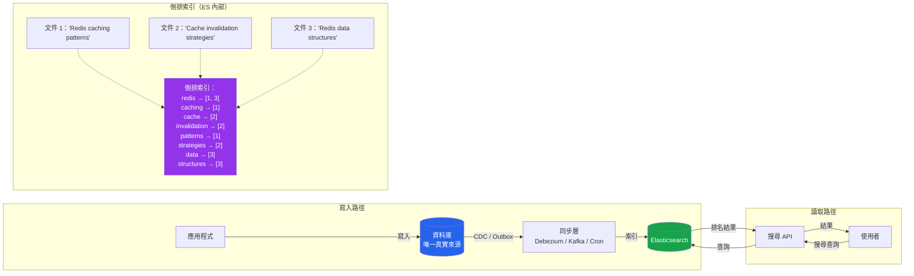

# [DEE-458] Elasticsearch 全文搜尋

:::info
Elasticsearch 提供超越關聯式資料庫 FTS 的全文搜尋能力：相關性評分、分面搜尋、模糊匹配，以及跨大型資料集的多欄位查詢。它是搜尋引擎，而非主要資料儲存。
:::

## 背景

關聯式資料庫提供基本的全文搜尋（PostgreSQL 的 `tsvector`/`tsquery`、MySQL 的 `FULLTEXT` 索引），對中等資料量的簡單關鍵字搜尋效果良好。但當需求增長——跨多欄位的相關性排名、錯字容忍、分面導覽、語言感知詞幹處理、同義詞擴展、自動完成建議——就需要專用的搜尋引擎。

Elasticsearch 建構在 Apache Lucene 之上，將資料儲存在倒排索引中：一種將每個唯一詞彙（token）對應到包含它的文件清單的資料結構。當搜尋查詢到達時，Elasticsearch 在倒排索引中查找匹配的詞彙、套用評分演算法（預設為 BM25），並回傳按相關性排名的結果。

核心概念：

- **Index** -- 類似於資料庫表格。包含具有定義 schema（mapping）的文件。
- **Mapping** -- 索引的 schema 定義。指定欄位類型、分析器和索引行為。
- **Analyzer** -- 將原始文字轉換為詞彙的管線：字元過濾器（去除 HTML）、分詞器（依空白／標點分割）和詞彙過濾器（小寫化、詞幹處理、同義詞）。
- **倒排索引** -- 核心資料結構。將詞彙對應到文件 ID，附帶用於相關性評分的中繼資料（位置、頻率）。

Elasticsearch 預設為分散式，將資料分片至多個節點以實現水平擴展。然而，它不是交易型資料儲存，不應取代主要資料庫。資料庫仍是唯一真實來源；Elasticsearch 是該資料用於搜尋目的的讀取最佳化投影。

## 原則

開發者SHOULD在應用程式需要相關性評分的全文搜尋、分面導覽、模糊匹配或跨大型資料集的多欄位搜尋，且超出資料庫原生 FTS 實務限制時，使用 Elasticsearch。

開發者MUST NOT將 Elasticsearch 作為主要資料儲存。它不提供 ACID 交易，在 refresh 之前不保證持久的單文件寫入，且在沒有適當複寫的情況下可能發生資料遺失。

開發者MUST在索引資料前定義明確的 index mapping。在生產環境依賴 dynamic mapping 會導致類型衝突、mapping 膨脹和搜尋品質不佳。

開發者MUST在建構搜尋功能前規劃來源資料庫與 Elasticsearch 之間的資料同步策略。

## 圖解



## 範例

### 建立含明確 mapping 的索引

```json
PUT /products
{
  "settings": {
    "number_of_shards": 3,
    "number_of_replicas": 1,
    "analysis": {
      "analyzer": {
        "product_analyzer": {
          "type": "custom",
          "tokenizer": "standard",
          "filter": ["lowercase", "english_stemmer", "english_stop"]
        }
      },
      "filter": {
        "english_stemmer": {
          "type": "stemmer",
          "language": "english"
        },
        "english_stop": {
          "type": "stop",
          "stopwords": "_english_"
        }
      }
    }
  },
  "mappings": {
    "properties": {
      "name": {
        "type": "text",
        "analyzer": "product_analyzer",
        "fields": {
          "keyword": { "type": "keyword" }
        }
      },
      "description": {
        "type": "text",
        "analyzer": "product_analyzer"
      },
      "category": {
        "type": "keyword"
      },
      "price": {
        "type": "float"
      },
      "tags": {
        "type": "keyword"
      },
      "created_at": {
        "type": "date"
      }
    }
  }
}
```

### 含相關性評分的搜尋查詢

```json
POST /products/_search
{
  "query": {
    "bool": {
      "must": {
        "multi_match": {
          "query": "wireless noise cancelling headphones",
          "fields": ["name^3", "description", "tags^2"],
          "type": "best_fields",
          "fuzziness": "AUTO"
        }
      },
      "filter": [
        { "term": { "category": "electronics" } },
        { "range": { "price": { "lte": 300 } } }
      ]
    }
  },
  "aggs": {
    "by_category": {
      "terms": { "field": "category", "size": 10 }
    },
    "price_ranges": {
      "range": {
        "field": "price",
        "ranges": [
          { "to": 50 },
          { "from": 50, "to": 150 },
          { "from": 150, "to": 300 },
          { "from": 300 }
        ]
      }
    }
  },
  "highlight": {
    "fields": {
      "name": {},
      "description": {}
    }
  }
}
```

此查詢的重點：
- `multi_match` 跨多欄位搜尋並加權（`name^3` 的權重為 3 倍）。
- `fuzziness: "AUTO"` 容忍錯字（依詞彙長度允許 1-2 個字元編輯）。
- `filter` 子句是不影響相關性評分的精確匹配，且會被快取。
- `aggs` 提供分面計數以建構篩選 UI。
- `highlight` 回傳匹配的片段以供顯示。

## 資料同步模式

資料庫是唯一真實來源。Elasticsearch 必須保持同步。四種常見方法：

| 模式 | 機制 | 延遲 | 一致性 | 複雜度 |
|------|------|------|--------|--------|
| **雙重寫入** | 應用程式同時寫入 DB 和 ES | 低 | 弱（無原子性） | 低 |
| **交易 outbox + CDC** | DB 寫入 -> outbox 表 -> Debezium/Kafka -> ES | 秒級 | 強（outbox 具交易性） | 高 |
| **應用層事件** | 寫入 DB、發布事件、消費者索引至 ES | 秒級 | 取決於事件遞送 | 中 |
| **定期同步（cron）** | 批次查詢 DB 的變更，大量索引至 ES | 分鐘級 | 最終一致 | 低 |

**建議：** 避免雙重寫入——它無法保證跨兩個獨立系統的原子性。如果 DB 寫入成功但 ES 索引失敗（或反之），資料會靜默地分歧。生產系統應使用 CDC（Change Data Capture）搭配 Debezium，或在較簡單的設定中使用應用層事件搭配可靠的訊息代理。

### CDC 搭配 Debezium（推薦）

```
PostgreSQL (WAL) -> Debezium connector -> Kafka topic -> 
  Kafka Connect Elasticsearch Sink -> Elasticsearch index
```

此方法從預寫日誌擷取每個資料庫變更，確保不會遺漏任何寫入。同步延遲通常為 1-5 秒。

### 應用層事件（較簡單的替代方案）

```python
def create_product(product_data):
    # 1. 寫入資料庫（交易性）
    product = db.products.insert(product_data)

    # 2. 發布事件（非同步，含重試）
    event_bus.publish("product.created", {
        "id": product.id,
        "payload": product_data
    })

# 消費者索引至 Elasticsearch
@event_bus.subscribe("product.created")
def index_product(event):
    es.index(index="products", id=event["id"], document=event["payload"])
```

## 常見錯誤

1. **將 Elasticsearch 作為主要資料儲存。** Elasticsearch 不是資料庫。它不提供 ACID 交易，且文件在索引後不會立即可見（需要「refresh」，預設為 1 秒）。如果 Elasticsearch 資料遺失，應能從來源資料庫完全重建。

2. **未事先規劃 index mapping。** 依賴 dynamic mapping 會造成問題：已索引為 `text` 的欄位無法在不重新索引的情況下變更為 `keyword`。字串欄位預設會同時獲得 `text` 和 `keyword` 子欄位，使儲存量加倍。應為每個索引定義明確的 mapping。

3. **忽略同步延遲。** 資料庫寫入和 Elasticsearch 索引更新之間始終存在延遲（CDC 為秒級、cron 為分鐘級）。如果應用程式在寫入後立即顯示搜尋結果，新資料可能尚未出現。應在 UX 中處理此問題（例如樂觀地顯示剛建立的項目）或在 API 中處理（從資料庫而非 ES 進行 read-your-own-writes）。

4. **過度索引欄位。** 將每個欄位同時索引為 `text`（全文搜尋）和 `keyword`（精確匹配、聚合）會浪費儲存空間並降低索引速度。僅索引使用者實際搜尋或篩選的欄位。對於儲存但從不查詢的欄位使用 `"index": false`。

5. **缺乏索引生命週期管理。** 沒有保留策略的索引會無限增長。使用 Index Lifecycle Management (ILM) 自動滾動、縮減和刪除舊索引。這對時間序列資料（日誌、事件）尤其重要。

6. **對非搜尋讀取查詢 Elasticsearch。** 如果應用程式需要依 ID 取得產品，應查詢資料庫——而非 Elasticsearch。ES 針對搜尋最佳化，而非點查詢。將 ES 同時用於搜尋和 CRUD 讀取會使應用程式耦合於 ES 的可用性。

## 相關 DEE

- [DEE-450](450.md) 快取與搜尋總覽
- [DEE-451](451.md) Cache-Aside 模式 -- 快取頻繁搜尋的結果
- [DEE-454](454.md) Redis 快取資料結構 -- Redis 搭配 ES 用於快取搜尋結果

## 參考資料

- Elastic: How Full-Text Search Works. <https://www.elastic.co/docs/solutions/search/full-text/how-full-text-works>
- Elastic: Mapping. <https://www.elastic.co/docs/manage-data/data-store/mapping>
- Elastic: Specify an Analyzer. <https://www.elastic.co/docs/manage-data/data-store/text-analysis/specify-an-analyzer>
- CockroachDB: Full Text Search with CockroachDB and Elasticsearch (CDC pattern). <https://www.cockroachlabs.com/blog/cockroachdb-cdc-elasticsearch/>
- Debezium: Streaming Database Changes to Elasticsearch. <https://debezium.io/documentation/reference/stable/tutorial.html>
- Wikipedia: Inverted index. <https://en.wikipedia.org/wiki/Inverted_index>
