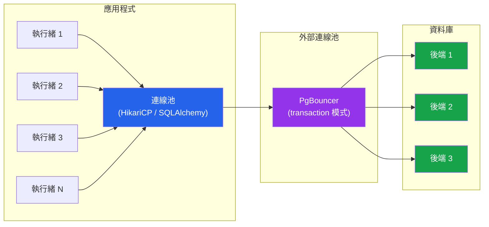

# [DEE-501] 連線池設定

:::info
每個應用程式存取關聯式資料庫時MUST使用連線池。連線池大小SHOULD根據工作負載特性進行調校，而非沿用預設值。
:::

## 背景

開啟資料庫連線的成本很高。每次連線都需要 TCP 交握、TLS 協商（若有加密）、身份驗證，以及伺服器端的記憶體配置。例如，PostgreSQL 會為每個連線 fork 一個新的作業系統行程——每個行程大約消耗 5-10 MB 的 RAM。MySQL 則使用每連線一個執行緒的模式，雖然較輕量，但在大規模情境下仍不容忽視。

如果不使用連線池，一個處理 200 個並行請求的應用程式會開啟 200 個資料庫連線，其中大多數在應用程式處理結果或等待其他 I/O 時處於閒置狀態。這些閒置連線浪費資料庫記憶體、佔用 `max_connections` 的配額，並且在鎖和緩衝區等共享資源上產生競爭。

連線池透過維護一組固定的可重用連線來解決此問題。應用程式執行緒從池中借用連線、執行查詢，然後歸還。連線池負責連線的建立、驗證和生命週期管理。

連線池分為兩個層級：**應用程式端**（HikariCP、c3p0、SQLAlchemy pool），連線池位於每個應用程式實例內部；以及**代理端**（PgBouncer、ProxySQL、Amazon RDS Proxy），由外部行程將多個應用程式實例的連線多工降頻至較少的資料庫連線。對於擁有多個應用程式實例的 PostgreSQL 工作負載，通常會同時使用這兩層。

## 原則

- 每個應用程式MUST使用連線池——在生產環境中，每次查詢或每次請求都開啟新連線是絕對不可接受的。
- 連線池大小SHOULD根據以下公式調校：`connections = (core_count * 2) + effective_spindle_count`，其中 `effective_spindle_count` 在資料完全快取時為 0，在 SSD 儲存時為 1。
- 開發人員MUST設定閒置連線逾時，以防止過期連線佔用資料庫配額。
- 使用 PostgreSQL 且擁有多個應用程式實例的團隊SHOULD部署 PgBouncer 或同等的外部連線池，以 transaction 模式運行來減少後端連線總數。
- 開發人員MUST NOT將連線池大小設定超過資料庫可支撐的上限——所有應用程式實例的連線總數必須低於 `max_connections` 減去保留連線數。

## 視覺化



**關鍵洞察：**50 個應用程式執行緒共用一個含 10 個連線的連線池。PgBouncer 進一步將多個應用程式連線池多工降頻至少數資料庫後端。資料庫服務的連線更少，但每個連線的工作量更大。

## 範例

### 連線池大小公式

HikariCP wiki 記錄了一個基於 PostgreSQL 基準測試的公式：

```
connections = (core_count * 2) + effective_spindle_count
```

| 伺服器 | 核心數 | 儲存 | 公式 | 連線池大小 |
|--------|-------|---------|---------|-----------|
| 4 核心, SSD | 4 | SSD (spindle=1) | (4 * 2) + 1 | **9-10** |
| 8 核心, 完全快取 | 8 | RAM (spindle=0) | (8 * 2) + 0 | **16** |
| 16 核心, HDD RAID | 16 | 4 spindles | (16 * 2) + 4 | **36** |

一個較小的連線池（讓執行緒等待連線）的效能優於一個大型連線池（連線之間競爭 CPU、磁碟和鎖）。違反直覺的是，將連線池從 50 縮小到 10 往往能提升吞吐量。

### HikariCP 設定（Java / Spring Boot）

```yaml
spring:
  datasource:
    hikari:
      maximum-pool-size: 10        # 經過調校，而非預設值（預設為 10，但需驗證）
      minimum-idle: 10             # 固定連線池：min = max 以獲得穩定效能
      idle-timeout: 600000         # 10 分鐘——回收閒置連線
      max-lifetime: 1800000        # 30 分鐘——在資料庫端逾時前回收
      connection-timeout: 30000    # 30 秒——連線池耗盡時快速失敗
      leak-detection-threshold: 60000  # 連線持有超過 60 秒時記錄警告
```

### PgBouncer 設定

```ini
[databases]
mydb = host=127.0.0.1 port=5432 dbname=mydb

[pgbouncer]
listen_port = 6432
pool_mode = transaction          ; 每次交易結束後釋放連線
default_pool_size = 20           ; 每個 user/database 配對的連線數
max_client_conn = 400            ; 接受的客戶端連線總數
reserve_pool_size = 5            ; 為突發流量保留的額外連線
reserve_pool_timeout = 3         ; 使用保留連線池前的等待秒數
server_idle_timeout = 600        ; 10 分鐘後關閉未使用的後端連線
```

**Transaction 模式**是最常見的選擇：後端連線在每次交易完成後歸還至連線池，最大化連線重用。Session 模式會將後端連線綁定到客戶端的整個 session（在使用 prepared statements 或 session 層級功能時需要）。Statement 模式則很少使用。

### PostgreSQL max_connections 計算

```
max_connections >= (app_instances * pool_size_per_instance)
                 + superuser_reserved_connections
                 + monitoring_connections

-- 範例：5 個應用程式實例 * 每個 10 連線 + 3 保留 + 2 監控 = 55
-- 設定 max_connections = 60（含緩衝空間）
```

搭配前端的 PgBouncer：

```
max_connections >= pgbouncer_default_pool_size
                 + pgbouncer_reserve_pool_size
                 + superuser_reserved_connections

-- 範例：20 + 5 + 3 = 28——設定 max_connections = 30
```

## 常見錯誤

1. **連線池過大。**將 `maximum-pool-size: 100` 設為「更多連線代表更高吞吐量」是錯誤的。資料庫連線會競爭 CPU、記憶體和 I/O。在 4 核心伺服器上設定 100 個連線，代表任何時間點都有 96 個連線在等待，增加了上下文切換開銷和鎖競爭。從大小公式開始，再根據負載測試調整。

2. **未設定閒置連線逾時。**無限期閒置的連線會消耗資料庫記憶體並佔用 `max_connections` 配額。若資料庫重啟或發生網路分割，過期連線將導致錯誤。設定 `idle-timeout` 和 `max-lifetime` 以定期回收連線。

3. **PostgreSQL 未使用外部連線池。**PostgreSQL 的每連線一行程模式意味著 200 個連線會在資料庫伺服器上消耗超過 1 GB 的 RAM。當多個應用程式實例各自維護自己的連線池時，連線總數會快速倍增。PgBouncer 的 transaction 模式可將資料庫端連線減少 10 倍以上。

4. **連線洩漏。**從連線池借用連線卻未歸還（例如缺少 `finally` 區塊、在 `close()` 之前發生例外），會耗盡連線池。啟用洩漏偵測（HikariCP 的 `leak-detection-threshold`），並始終使用 try-with-resources 或等效模式來保證連線歸還。

5. **忽略連線驗證。**連線池中的連線在入池時可能有效，但之後可能變得無效（資料庫重啟、網路逾時）。設定連線驗證（`connection-test-query` 或 `connectionTestQuery`），或依賴連線池內建的驗證機制（HikariCP 預設在借用時驗證）。若未驗證，在過期連線上執行的第一個查詢會失敗，應用程式需自行處理重試。

6. **多個應用程式實例超出 max_connections。**每個應用程式實例有自己的連線池。10 個實例搭配 20 的連線池大小，就需要 200 個資料庫連線——可能超出 `max_connections`。在部署前先計算所有實例的連線總數。

## 相關 DEE

- [DEE-500](500.md) 應用模式總覽
- [DEE-502](502.md) ORM 陷阱與最佳實踐——ORM 透過連線池管理連線
- [DEE-200](../查詢與效能/200.md) 查詢與效能總覽

## 參考資料

- [HikariCP Wiki: About Pool Sizing](https://github.com/brettwooldridge/HikariCP/wiki/About-Pool-Sizing) -- 原始連線池大小公式與原理
- [PgBouncer Configuration](https://www.pgbouncer.org/config.html) -- 官方 PgBouncer 設定參考
- [PostgreSQL Documentation: Connection Settings](https://www.postgresql.org/docs/current/runtime-config-connection.html) -- max_connections 及相關參數
- [Vlad Mihalcea: The Best Way to Determine the Optimal Connection Pool Size](https://vladmihalcea.com/optimal-connection-pool-size/) -- 實務基準測試方法
- [Heroku: Best Practices for PgBouncer Configuration](https://devcenter.heroku.com/articles/best-practices-pgbouncer-configuration) -- 生產環境 PgBouncer 調校
- [AWS Database Blog: Scaling Connections with Amazon RDS Proxy](https://aws.amazon.com/blogs/database/multi-tenant-data-isolation-with-postgresql-row-level-security/) -- AWS 託管連線池
