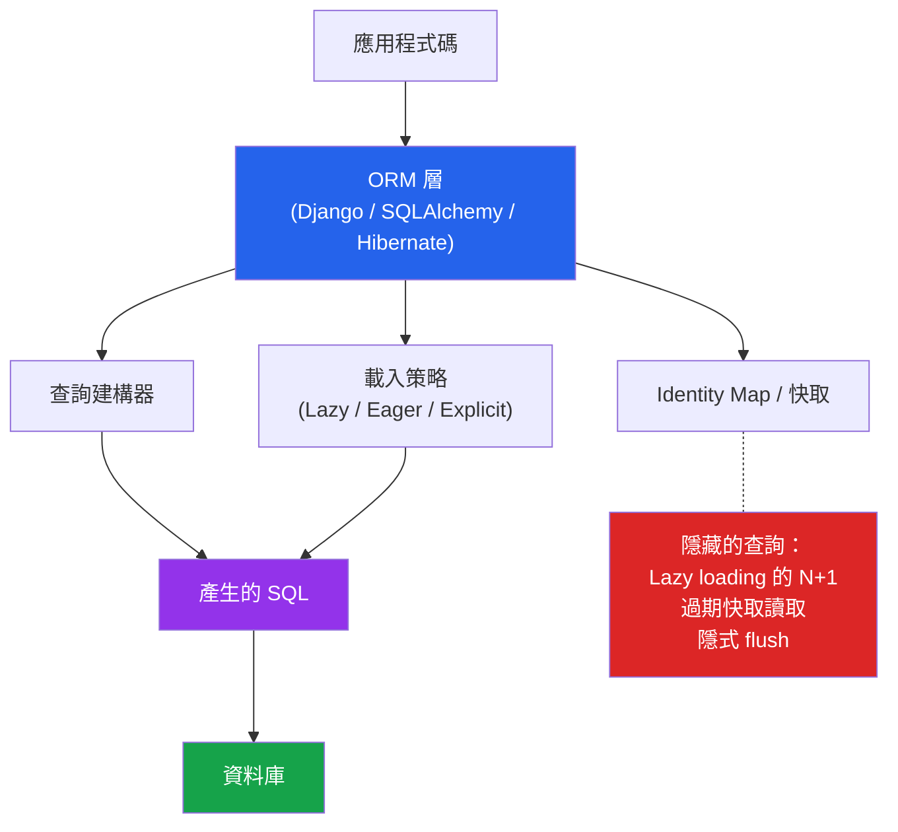

# [DEE-502] ORM 陷阱與最佳實踐

:::info
開發人員MUST了解 ORM 產生的 SQL。ORM 能提升生產力，但會隱藏資料庫行為——不可見的低效率會累積成嚴重的效能問題。
:::

## 背景

物件關聯對映（ORM）讓開發人員可以將資料庫列當作物件來操作，減少樣板程式碼並加速開發。每個主流框架都內建或推薦一個 ORM：Django ORM、SQLAlchemy、Hibernate/JPA、TypeORM、Prisma、ActiveRecord。

這層抽象是有代價的。ORM 會自行決定何時載入關聯資料、如何建構 JOIN、何時批次處理查詢。這些決策在簡單情境下是合理的預設值，但在生產工作負載中就會出問題。最常見的失敗模式是 **N+1 查詢問題**——存取 N 個父物件的列表時，觸發 N 次額外查詢來擷取關聯的子物件，將一個查詢變成 N+1 個。

核心矛盾在於 ORM 為開發人員便利性而最佳化（寫更少程式碼），而資料庫為集合式操作而最佳化（批次處理資料）。當開發人員以物件和迴圈思考，但資料庫需要 JOIN 和批次操作時，效能就會無聲地下降。

## 原則

- 開發人員MUST在開發期間啟用 SQL 記錄，以查看 ORM 產生的每一個查詢。
- 開發人員MUST在迴圈或列表情境中存取關聯物件時，使用積極載入（`select_related`、`joinedload`、`JOIN FETCH`）。
- 開發人員SHOULD對複雜查詢使用 ORM 的原生 SQL 逃脫機制，而非強行使用 ORM 的查詢建構器。
- 開發人員SHOULD NOT在未理解其影響的情況下信任 ORM 的載入策略、批次大小或快取的預設值。
- 團隊MUST在程式碼審查中檢視 ORM 產生的 SQL，尤其是處理集合或在迴圈中執行的資料存取路徑。

## 視覺化



## 範例

### 跨 ORM 的 N+1 問題

**Django ORM -- N+1：**

```python
# 不好：1 個查詢取得訂單 + N 個查詢取得客戶（每筆訂單一個）
orders = Order.objects.all()
for order in orders:
    print(order.customer.name)  # Lazy load 每次迭代觸發查詢

# 好：1 個查詢搭配 JOIN
orders = Order.objects.select_related('customer').all()
for order in orders:
    print(order.customer.name)  # 已載入，不會額外查詢

# 好：2 個查詢（一個取得訂單，一個取得所有關聯客戶）
orders = Order.objects.prefetch_related('items').all()
```

**SQLAlchemy -- N+1：**

```python
from sqlalchemy.orm import joinedload, selectinload

# 不好：預設 lazy loading——每次 order.customer 觸發一個查詢
orders = session.query(Order).all()
for order in orders:
    print(order.customer.name)

# 好：使用 JOIN 積極載入
orders = session.query(Order).options(joinedload(Order.customer)).all()

# 好：使用獨立 SELECT 積極載入（對大型集合更佳）
orders = session.query(Order).options(selectinload(Order.items)).all()
```

**JPA / Hibernate -- N+1：**

```java
// 不好：@ManyToOne 預設 EAGER，但 @OneToMany 預設 LAZY
// 在迴圈中存取 order.getItems() 會觸發 N 個查詢
List<Order> orders = em.createQuery("SELECT o FROM Order o", Order.class)
    .getResultList();
for (Order o : orders) {
    o.getItems().size();  // 每筆訂單一次 lazy load
}

// 好：JOIN FETCH 在一個查詢中載入所有資料
List<Order> orders = em.createQuery(
    "SELECT o FROM Order o JOIN FETCH o.items", Order.class)
    .getResultList();

// 好：@EntityGraph 宣告式擷取計畫
@EntityGraph(attributePaths = {"items", "customer"})
List<Order> findAllByStatus(String status);
```

### 何時使用原生 SQL

| 情境 | 使用 ORM | 使用原生 SQL |
|-----------|---------|-------------|
| 簡單 CRUD（單一資料表） | 是 | 否 |
| 帶關聯物件的列表 | 是（搭配積極載入） | 視複雜度而定 |
| 複雜報表 / 聚合 | 視情況 | 是 |
| 批量 INSERT/UPDATE（數千筆） | 否（太慢） | 是 |
| 資料庫特定功能（CTE、窗口函數、LATERAL） | 檢查 ORM 支援度 | 是 |
| 效能關鍵的熱路徑 | 先做效能分析 | 是，若 ORM 產生額外開銷 |

**原生 SQL 逃脫機制範例：**

```python
# Django
orders = Order.objects.raw('''
    SELECT o.*, COUNT(i.id) as item_count
    FROM orders o
    LEFT JOIN order_items i ON i.order_id = o.id
    WHERE o.status = %s
    GROUP BY o.id
    HAVING COUNT(i.id) > %s
''', ['shipped', 5])

# SQLAlchemy
from sqlalchemy import text
result = session.execute(text('''
    SELECT customer_id, SUM(total) as lifetime_value
    FROM orders
    WHERE created_at >= :start_date
    GROUP BY customer_id
    HAVING SUM(total) > :threshold
'''), {"start_date": "2025-01-01", "threshold": 10000})
```

### 啟用 SQL 記錄

```python
# Django settings.py
LOGGING = {
    'loggers': {
        'django.db.backends': {
            'level': 'DEBUG',  # 記錄每個 SQL 查詢及其時間
        },
    },
}

# SQLAlchemy
engine = create_engine("postgresql://...", echo=True)  # 記錄所有 SQL
```

```yaml
# Hibernate (application.yml)
spring:
  jpa:
    show-sql: true
    properties:
      hibernate:
        format_sql: true
        generate_statistics: true  # 每個 session 的查詢計數
```

## 常見錯誤

1. **盲目信任 ORM 預設值。**大多數 ORM 預設對關聯使用 lazy loading。這對單一物件存取是安全的，但對列表視圖來說是災難性的。一個顯示 50 筆訂單及其客戶的頁面會產生 51 個查詢而非 1 個。對於任何回傳多個帶有關聯的物件的查詢，都要明確選擇載入策略。

2. **開發時未記錄 SQL。**如果看不到 ORM 產生的查詢，就無法識別 N+1 問題、冗餘查詢或缺少的索引。在每個開發環境中都啟用 SQL 記錄。Django Debug Toolbar、SQLAlchemy 的 `echo=True` 和 Hibernate 的 `generate_statistics` 等工具可以讓隱形的查詢現形。

3. **硬拗 ORM 而非使用原生 SQL。**當複雜查詢需要在 ORM 的查詢建構器中做各種扭曲——串接的方法呼叫比等效的 SQL 更難閱讀時——直接使用原生 SQL 逃脫機制。每個成熟的 ORM 都有提供。沒有必要強迫每個查詢都通過 ORM 的抽象層。

4. **忽視 ORM 自動產生的 migration。**自動產生的 migration 可能建立低效的索引、遺漏必要的索引，或產生會長時間鎖定資料表的 schema 變更。在套用至生產環境前，務必審查產生的 migration SQL。使用 `sqlmigrate`（Django）或同等工具來檢視實際的 DDL。

5. **使用 ORM 物件進行批量操作。**建立 10,000 個 ORM 物件並在迴圈中呼叫 `save()` 來插入 10,000 筆資料，會產生 10,000 個獨立的 INSERT 語句。使用批量操作：`bulk_create()`（Django）、`session.bulk_save_objects()`（SQLAlchemy），或使用多列 INSERT 的原生 SQL。

6. **預設選取所有欄位。**ORM 除非另有指示，否則會載入模型的所有欄位。對於含有大型 TEXT 或 BLOB 欄位的資料表，這會浪費頻寬和記憶體。使用 `defer()`（Django）、`load_only()`（SQLAlchemy）或投影來僅擷取所需的欄位。

## 相關 DEE

- [DEE-500](500.md) 應用模式總覽
- [DEE-202](204.md) N+1 查詢問題——最常見的 ORM 效能失敗模式
- [DEE-501](501.md) 連線池設定——ORM 內部使用連線池
- [DEE-503](503.md) Repository 模式——超越 ORM 的資料存取抽象

## 參考資料

- [SQLAlchemy Documentation: Relationship Loading Techniques](https://docs.sqlalchemy.org/en/20/orm/queryguide/relationships.html) -- joinedload、selectinload 及其他策略
- [Django Documentation: select_related and prefetch_related](https://docs.djangoproject.com/en/5.1/ref/models/querysets/#select-related) -- Django 的積極載入機制
- [Hibernate Documentation: Fetching Strategies](https://docs.jboss.org/hibernate/orm/6.4/userguide/html_single/Hibernate_User_Guide.html#fetching) -- JPA/Hibernate 擷取類型與 entity graph
- [Vlad Mihalcea: The Best Way to Handle the N+1 Query Issue with JPA and Hibernate](https://vladmihalcea.com/n-plus-1-query-problem/) -- 實務 Hibernate N+1 解法
- [TypeORM Documentation: Eager and Lazy Relations](https://typeorm.io/eager-and-lazy-relations) -- TypeORM 載入策略
- [Martin Fowler: OrmHate](https://martinfowler.com/bliki/OrmHate.html) -- 對 ORM 取捨的平衡觀點
