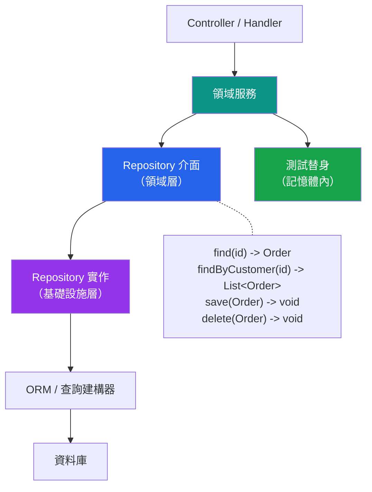

# [DEE-503] Repository 模式

:::info
使用 repository 模式將業務邏輯與資料存取細節解耦。Repository 在持久層之上提供類似集合的介面，使領域邏輯可測試且資料存取可替換。
:::

## 背景

在大多數應用程式中，業務邏輯和資料庫查詢是交織在一起的。一個計算訂單總額的服務也會建構 SQL 查詢、處理分頁並管理交易。這種耦合使得業務邏輯更難測試（測試需要資料庫）、更難變更（切換資料庫需要改寫業務邏輯），以及更難理解（領域規則被埋藏在查詢建構之中）。

Repository 模式由 Martin Fowler 在 *Patterns of Enterprise Application Architecture* 中提出，也是領域驅動設計（DDD）的核心概念，它透過提供一個行為類似領域物件記憶體內集合的抽象來解決此問題。業務邏輯向 repository 請求物件並將物件存回，而不需要知道底層儲存是 PostgreSQL、MongoDB 還是記憶體內的測試替身。

在 DDD 中，repository 僅為聚合根（aggregate root）而存在——而非每個資料表或實體。`OrderRepository` 管理 `Order` 聚合；單獨的 `OrderItem` 資料列透過其父 `Order` 存取，而非透過獨立的 repository。這維護了聚合邊界和交易一致性。

## 原則

- 當業務邏輯必須在無資料庫的情況下可測試，或資料存取可能獨立於領域邏輯變更時，團隊SHOULD使用 repository 模式。
- Repository MUST暴露面向領域的介面（例如 `findActiveOrdersByCustomer`），而非面向資料的介面（例如 `query(sql)` 或 `findBy(column, value)`）。
- 在 DDD 的脈絡中，repository SHOULD僅為聚合根建立，而非每個實體或資料表。
- 對於 ORM 已提供足夠抽象和可測試性的簡單 CRUD 應用程式，團隊SHOULD NOT使用 repository 模式。
- Repository 介面MUST NOT暴露實作細節，例如查詢建構器、ORM session 或 SQL 片段。

## 視覺化



**關鍵洞察：**領域服務依賴 repository *介面*（定義在領域層）。實際實作（使用 ORM 或原生 SQL）位於基礎設施層。測試時，以簡單的記憶體內實作取代真實實作。

## 範例

### Repository 介面（與語言無關）

```
interface OrderRepository:
    find(id: OrderId) -> Order | null
    findByCustomer(customerId: CustomerId) -> List<Order>
    findActiveByDateRange(start: Date, end: Date) -> List<Order>
    save(order: Order) -> void
    delete(order: Order) -> void
```

### 使用 SQL 的實作

```python
# Python / SQLAlchemy 實作
class SqlOrderRepository(OrderRepository):
    def __init__(self, session: Session):
        self._session = session

    def find(self, order_id: OrderId) -> Order | None:
        return self._session.get(OrderModel, order_id.value)

    def find_by_customer(self, customer_id: CustomerId) -> list[Order]:
        stmt = (
            select(OrderModel)
            .where(OrderModel.customer_id == customer_id.value)
            .order_by(OrderModel.created_at.desc())
        )
        return list(self._session.scalars(stmt))

    def save(self, order: Order) -> None:
        self._session.merge(order.to_model())

    def delete(self, order: Order) -> None:
        model = self._session.get(OrderModel, order.id.value)
        if model:
            self._session.delete(model)
```

### 記憶體內測試替身

```python
class InMemoryOrderRepository(OrderRepository):
    def __init__(self):
        self._orders: dict[OrderId, Order] = {}

    def find(self, order_id: OrderId) -> Order | None:
        return self._orders.get(order_id)

    def find_by_customer(self, customer_id: CustomerId) -> list[Order]:
        return [
            o for o in self._orders.values()
            if o.customer_id == customer_id
        ]

    def save(self, order: Order) -> None:
        self._orders[order.id] = order

    def delete(self, order: Order) -> None:
        self._orders.pop(order.id, None)
```

### 在服務中使用 Repository

```python
class OrderService:
    def __init__(self, orders: OrderRepository):
        self._orders = orders

    def cancel_order(self, order_id: OrderId) -> None:
        order = self._orders.find(order_id)
        if order is None:
            raise OrderNotFound(order_id)
        order.cancel()          # 聚合上的領域邏輯
        self._orders.save(order)

# 生產環境
service = OrderService(SqlOrderRepository(db_session))

# 測試
service = OrderService(InMemoryOrderRepository())
```

### 何時不使用 Repository 模式

| 情境 | 使用 Repository？ | 原因 |
|----------|----------------|-----|
| 簡單 CRUD API（無複雜領域邏輯） | 否 | ORM 本身已充當 repository |
| 小型專案 / 原型 | 否 | 過度抽象會拖慢開發速度 |
| 具有多個聚合的複雜領域 | 是 | 可測試性和邊界強制 |
| 需要更換資料儲存（SQL -> NoSQL） | 是 | 抽象使切換成為可能 |
| 多讀取模型（CQRS） | 是（寫入端） | 分離命令和查詢職責 |
| 僅含一個實體的微服務 | 視情況 | 取決於測試需求 |

## 常見錯誤

1. **洩漏的抽象。**透過 repository 介面暴露 ORM 查詢建構器、`IQueryable` 或 SQL 片段就違背了初衷。如果呼叫方在建構查詢，repository 就沒有抽象任何東西。介面應暴露領域操作（`findActiveOrders`），而非泛用查詢能力（`findWhere(predicate)`）。

2. **Repository 只是轉傳層。**如果每個 repository 方法都是對 ORM 的單行委派（`find(id)` 呼叫 `session.get(id)`），repository 只增加了間接性而無價值。這表示領域要麼簡單到不需要此模式，要麼 repository 方法過於泛用。透過領域特定的查詢方法、封裝的交易邊界或聚合重建邏輯來增加價值。

3. **每個資料表一個 repository。**在 DDD 中，repository 僅為聚合根而存在。為單一聚合建立 `OrderRepository`、`OrderItemRepository` 和 `OrderStatusHistoryRepository` 會破壞封裝。`OrderItem` 應只透過 `Order` 聚合及其 repository 來存取。

4. **在簡單應用程式中過度抽象。**一個將 HTTP 端點直接對映到資料庫表的 CRUD API 不需要 repository 模式。ORM 內建的查詢功能已經足夠。為一個簡單的 TODO 應用程式添加 repository 層、服務層和介面層只會增加維護成本，而不會帶來可測試性的好處。

5. **將業務邏輯放在 repository 中。**Repository 的職責是資料存取，而非領域規則。驗證、狀態轉換和業務計算屬於領域模型或服務層。在 repository 中放置一個檢查取消規則的 `cancel_order` 方法是錯放職責。

## 相關 DEE

- [DEE-500](500.md) 應用模式總覽
- [DEE-502](502.md) ORM 陷阱與最佳實踐——repository 所包裝的資料存取層
- [DEE-504](504.md) 多租戶資料隔離——repository 可以封裝租戶過濾

## 參考資料

- [Martin Fowler: Repository Pattern](https://martinfowler.com/eaaCatalog/repository.html) -- 出自 *Patterns of Enterprise Application Architecture* 的原始模式定義
- [Microsoft: Designing the Infrastructure Persistence Layer](https://learn.microsoft.com/en-us/dotnet/architecture/microservices/microservice-ddd-cqrs-patterns/infrastructure-persistence-layer-design) -- DDD 微服務中的 repository 模式
- [DevIQ: Repository Pattern](https://deviq.com/design-patterns/repository-pattern/) -- 簡潔的說明與實作指引
- [Eric Evans: Domain-Driven Design](https://www.domainlanguage.com/ddd/) -- DDD 脈絡中 repository 的基礎文獻
- [Vaughn Vernon: Implementing Domain-Driven Design](https://www.oreilly.com/library/view/implementing-domain-driven-design/9780133039900/ch12lev1sec6.html) -- repository 與 DAO 的區別
