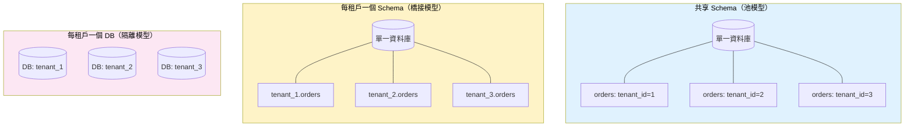

# [DEE-504] 多租戶資料隔離

:::info
根據合規需求、租戶數量和營運複雜度來選擇多租戶隔離策略。沒有單一最佳方案——每種策略都在隔離保證與成本及營運負擔之間取捨。
:::

## 背景

SaaS 應用程式從共享基礎設施服務多個客戶（租戶）。核心的資料庫設計問題是如何隔離每個租戶的資料，使租戶 A 永遠無法看到租戶 B 的資料，同時維持合理的基礎設施成本和營運複雜度。

有三種基本策略，各有不同的隔離、成本和複雜度特性：

1. **共享 schema（池模型）：**所有租戶共用相同的資料表。每個資料表中的 `tenant_id` 欄位區分所有權。Row-Level Security（RLS）或應用程式層的過濾來強制隔離。
2. **每租戶一個 schema（橋接模型）：**每個租戶在同一個資料庫實例中取得獨立的資料庫 schema。各 schema 中的資料表結構相同，但資料在物理上是分離的。
3. **每租戶一個資料庫（隔離模型）：**每個租戶取得專屬的資料庫實例。最大隔離但成本最高。

選擇取決於法規要求（醫療和金融產業通常要求強隔離）、租戶數量（每租戶一個 schema 在超過數百個時會遇到瓶頸），以及營運能力（管理數千個資料庫實例需要自動化）。

## 原則

- 團隊MUST在建構多租戶功能之前選擇隔離策略——事後改造隔離極其困難。
- 使用共享 schema 的應用程式MUST在資料庫層級強制租戶隔離（PostgreSQL RLS），而非僅依賴應用程式碼。
- 使用共享 schema 模型時，每個包含租戶資料的資料表MUST包含 `tenant_id` 欄位。
- 除非合規或合約要求更強的隔離，團隊SHOULD將共享 schema 搭配 RLS 作為預設策略。
- 選擇每租戶一個資料庫的團隊MUST自動化佈建、migration 和監控——手動管理無法擴展超過少數幾個租戶。

## 視覺化



### 策略比較

| 面向 | 共享 Schema（池模型） | 每租戶一個 Schema（橋接模型） | 每租戶一個 DB（隔離模型） |
|--------|---------------------|---------------------------|---------------------|
| **隔離層級** | 邏輯（列層級） | 邏輯（schema 層級） | 物理 |
| **每租戶成本** | 最低 | 中等 | 最高 |
| **營運複雜度** | 低 | 中高 | 高 |
| **Schema migration** | 一次 migration 套用所有 | 每個 schema 一次 | 每個資料庫一次 |
| **最大租戶數** | 數百萬 | 數百 | 數十到數百 |
| **跨租戶查詢** | 容易（同資料表） | 可行（跨 schema） | 困難（跨資料庫） |
| **合規適用性** | 標準 SaaS | 受監管產業 | 最嚴格要求 |
| **嘈雜鄰居風險** | 高（共享資源） | 中等 | 無 |
| **備份/還原粒度** | 所有租戶一起 | 每個 schema（複雜） | 每個租戶 |

## 範例

### 共享 Schema 搭配 PostgreSQL Row-Level Security

**步驟 1：在每個資料表加入 tenant_id**

```sql
CREATE TABLE orders (
    order_id    BIGSERIAL PRIMARY KEY,
    tenant_id   UUID NOT NULL,
    customer_id BIGINT NOT NULL,
    total       NUMERIC(12,2) NOT NULL,
    status      TEXT NOT NULL DEFAULT 'pending',
    created_at  TIMESTAMPTZ NOT NULL DEFAULT now()
);

CREATE INDEX idx_orders_tenant ON orders (tenant_id);
```

**步驟 2：啟用 RLS 並建立策略**

```sql
-- 在資料表上啟用 RLS
ALTER TABLE orders ENABLE ROW LEVEL SECURITY;

-- 即使是資料表擁有者也強制 RLS（對安全性很重要）
ALTER TABLE orders FORCE ROW LEVEL SECURITY;

-- 策略：使用者只能看到 tenant_id 與其 session 變數相符的資料列
CREATE POLICY tenant_isolation ON orders
    USING (tenant_id = current_setting('app.current_tenant')::UUID);

-- 針對 INSERT 的獨立策略，確保新資料列具有正確的 tenant_id
CREATE POLICY tenant_insert ON orders
    FOR INSERT
    WITH CHECK (tenant_id = current_setting('app.current_tenant')::UUID);
```

**步驟 3：在每個請求中設定租戶上下文**

```sql
-- 在每個請求/交易開始時：
SET LOCAL app.current_tenant = 'a1b2c3d4-e5f6-7890-abcd-ef1234567890';

-- 後續所有查詢都會自動過濾：
SELECT * FROM orders WHERE status = 'shipped';
-- 內部變成：
-- SELECT * FROM orders WHERE status = 'shipped'
--   AND tenant_id = 'a1b2c3d4-e5f6-7890-abcd-ef1234567890';
```

**應用程式 middleware 範例（Python/FastAPI）：**

```python
@app.middleware("http")
async def set_tenant_context(request: Request, call_next):
    tenant_id = request.headers.get("X-Tenant-ID")
    if not tenant_id:
        return JSONResponse(status_code=400, content={"error": "Missing tenant"})

    async with db.connection() as conn:
        await conn.execute(
            "SET LOCAL app.current_tenant = $1", tenant_id
        )
        request.state.db = conn
        response = await call_next(request)
    return response
```

### 每租戶一個 Schema

```sql
-- 為每個租戶建立 schema
CREATE SCHEMA tenant_acme;
CREATE SCHEMA tenant_globex;

-- 在每個 schema 中建立相同的資料表
CREATE TABLE tenant_acme.orders (
    order_id BIGSERIAL PRIMARY KEY,
    total NUMERIC(12,2) NOT NULL
);

CREATE TABLE tenant_globex.orders (
    order_id BIGSERIAL PRIMARY KEY,
    total NUMERIC(12,2) NOT NULL
);

-- 透過設定 search_path 來路由查詢
SET search_path = tenant_acme, public;
SELECT * FROM orders;  -- 查詢 tenant_acme.orders
```

## 常見錯誤

1. **查詢遺漏 tenant_id（資料洩漏）。**若未使用 RLS，每個查詢都必須包含 `WHERE tenant_id = ?`。只要有一個過濾器遺漏，就會將一個租戶的資料暴露給另一個租戶。這就是為什麼資料庫層級的強制（RLS）至關重要——應用程式層的過濾容易出錯，且無法在資料庫層驗證。

2. **未強制 RLS，僅依賴應用程式碼。**應用程式層的租戶過濾在有人撰寫原生查詢、migration 腳本或除錯 session 而忘記過濾器時就會失效。RLS 策略無論查詢如何到達資料庫都會強制隔離。務必使用 `FORCE ROW LEVEL SECURITY`，讓即使是資料表擁有者也受策略約束。

3. **大規模下選擇每租戶一個資料庫。**每租戶一個資料庫適合 10-100 個高價值企業租戶。對於擁有 10,000 個租戶的 SaaS，管理 10,000 個資料庫（migration、監控、備份、連線管理）在營運上是壓倒性的。除非法規或合約要求物理隔離，否則預設使用共享 schema 搭配 RLS。

4. **缺少 tenant_id 索引。**每個查詢都會命中 `tenant_id` 過濾器（無論是透過 RLS 還是應用程式碼）。若 `tenant_id` 沒有索引（或沒有以 `tenant_id` 為開頭的複合索引），每個查詢都會變成依租戶過濾的循序掃描。將 `tenant_id` 作為最常用索引的前導欄位。

5. **未測試租戶隔離。**撰寫整合測試驗證：(a) 租戶 A 無法讀取租戶 B 的資料、(b) INSERT 遵循租戶上下文、(c) UPDATE/DELETE 無法影響其他租戶的資料列。這些測試應在 CI 中針對啟用 RLS 的真實資料庫運行。

6. **每租戶一個 schema 的租戶數過多。**PostgreSQL 的 catalog 效能會在數百個 schema（每個包含多個資料表）時退化。每租戶一個 schema 在 10-200 個租戶時運作良好，但在更大規模時會成為瓶頸。連線池也會變得複雜，因為每個租戶可能需要不同的 `search_path`。

## 相關 DEE

- [DEE-500](500.md) 應用模式總覽
- [DEE-501](501.md) 連線池設定——多租戶應用程式需要謹慎的連線池管理
- [DEE-505](505.md) 軟刪除 vs 硬刪除——租戶資料刪除涉及合規考量

## 參考資料

- [AWS Database Blog: Multi-Tenant Data Isolation with PostgreSQL Row Level Security](https://aws.amazon.com/blogs/database/multi-tenant-data-isolation-with-postgresql-row-level-security/) -- 全面的 RLS 實作指南
- [PostgreSQL Documentation: Row Security Policies](https://www.postgresql.org/docs/current/ddl-rowsecurity.html) -- 官方 RLS 參考文件
- [Crunchy Data: Row Level Security for Tenants in Postgres](https://www.crunchydata.com/blog/row-level-security-for-tenants-in-postgres) -- 實務 RLS 模式與陷阱
- [The Nile Dev: Shipping Multi-Tenant SaaS Using Postgres Row-Level Security](https://www.thenile.dev/blog/multi-tenant-rls) -- 端對端多租戶 RLS 實作
- [Microsoft Azure: Multi-Tenant SaaS Patterns](https://learn.microsoft.com/en-us/azure/azure-sql/database/saas-tenancy-app-design-patterns) -- 跨隔離模型的策略比較
- [Citus Documentation: Multi-Tenant Applications](https://docs.citusdata.com/en/stable/use_cases/multi_tenant.html) -- 分散式 PostgreSQL 的多租戶工作負載
