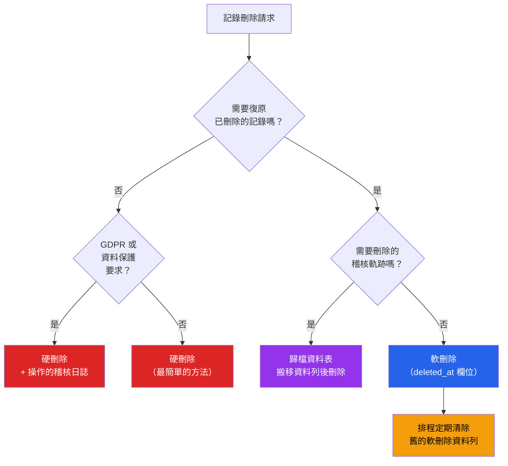

# [DEE-505] 軟刪除 vs 硬刪除

:::info
根據復原需求、稽核要求和合規義務來選擇刪除策略。軟刪除**不一定**是正確的選擇——它會增加複雜度，且可能違反資料保護法規。
:::

## 背景

當應用程式需要「刪除」資料時，有三種基本方法：

1. **硬刪除：**執行 `DELETE FROM` 永久移除資料列。資料就此消失（除非從備份復原）。
2. **軟刪除：**設定一個標記（`deleted_at` 時間戳記或 `is_deleted` 布林值）將資料列標記為已刪除。資料列留在資料庫中，但被排除在一般查詢之外。
3. **歸檔資料表：**將資料列搬移到獨立的歸檔資料表，然後從主資料表硬刪除。保留歷史記錄而不污染活躍資料集。

軟刪除成為廣泛的預設選擇，因為感覺安全——「我們以後可能需要它。」但軟刪除有實際成本：每個查詢都必須過濾已刪除的資料列、唯一約束與已刪除資料列衝突、資料表大小無限增長，以及 GDPR 等法規可能要求實際移除資料。

正確的策略取決於使用案例。財務紀錄可能在法律上要求保留。GDPR 下的使用者設定檔刪除要求實際清除個人資料。稽核日誌需要不可變的歷史記錄，但不一定需要原始資料表結構。

## 原則

- 團隊MUST根據業務需求逐實體選擇刪除策略，而非將軟刪除作為一概而論的預設。
- 使用軟刪除的應用程式MUST加入預設範圍或查詢中介層，將已刪除的資料列排除在所有一般查詢之外。
- 包含個人資訊的軟刪除資料MUST被硬刪除或匿名化，以符合 GDPR 被遺忘權（第 17 條）及類似法規。
- 當主要目的是稽核歷史而非復原功能時，團隊SHOULD優先選擇歸檔資料表而非軟刪除。
- 開發人員MUST在使用軟刪除時處理唯一約束衝突——已刪除資料列的唯一值不得阻擋新的插入。

## 視覺化



## 範例

### 軟刪除：deleted_at 欄位模式

```sql
-- 支援軟刪除的資料表
CREATE TABLE users (
    user_id     BIGSERIAL PRIMARY KEY,
    email       TEXT NOT NULL,
    name        TEXT NOT NULL,
    created_at  TIMESTAMPTZ NOT NULL DEFAULT now(),
    deleted_at  TIMESTAMPTZ          -- NULL = 活躍，非 NULL = 已刪除
);

-- 部分唯一索引：僅對活躍（未刪除）資料列強制
CREATE UNIQUE INDEX idx_users_email_active
ON users (email)
WHERE deleted_at IS NULL;

-- 排除已刪除資料列的預設 view
CREATE VIEW active_users AS
SELECT * FROM users WHERE deleted_at IS NULL;
```

**ORM 整合（Django）：**

```python
class SoftDeleteManager(models.Manager):
    def get_queryset(self):
        return super().get_queryset().filter(deleted_at__isnull=True)

class User(models.Model):
    email = models.EmailField()
    name = models.CharField(max_length=255)
    deleted_at = models.DateTimeField(null=True, blank=True)

    objects = SoftDeleteManager()      # 預設：排除已刪除
    all_objects = models.Manager()     # 包含已刪除（供管理員使用）

    def soft_delete(self):
        self.deleted_at = timezone.now()
        self.save(update_fields=['deleted_at'])

    def restore(self):
        self.deleted_at = None
        self.save(update_fields=['deleted_at'])
```

### 歸檔資料表模式

```sql
-- 活躍資料表（乾淨，無已刪除資料列）
CREATE TABLE orders (
    order_id    BIGSERIAL PRIMARY KEY,
    customer_id BIGINT NOT NULL,
    total       NUMERIC(12,2) NOT NULL,
    status      TEXT NOT NULL,
    created_at  TIMESTAMPTZ NOT NULL DEFAULT now()
);

-- 歸檔資料表（相同結構 + 中繼資料）
CREATE TABLE orders_archive (
    order_id    BIGINT NOT NULL,          -- 非 SERIAL，保留原始 ID
    customer_id BIGINT NOT NULL,
    total       NUMERIC(12,2) NOT NULL,
    status      TEXT NOT NULL,
    created_at  TIMESTAMPTZ NOT NULL,
    archived_at TIMESTAMPTZ NOT NULL DEFAULT now(),
    archived_by TEXT NOT NULL             -- 誰發起了刪除
);

-- 歸檔函數
CREATE OR REPLACE FUNCTION archive_order(p_order_id BIGINT, p_user TEXT)
RETURNS VOID AS $$
BEGIN
    INSERT INTO orders_archive (order_id, customer_id, total, status, created_at, archived_by)
    SELECT order_id, customer_id, total, status, created_at, p_user
    FROM orders
    WHERE order_id = p_order_id;

    DELETE FROM orders WHERE order_id = p_order_id;
END;
$$ LANGUAGE plpgsql;
```

### GDPR 合規刪除

```sql
-- 對個人資料：硬刪除 + 操作的稽核日誌（非資料本身）
CREATE TABLE deletion_audit_log (
    log_id      BIGSERIAL PRIMARY KEY,
    table_name  TEXT NOT NULL,
    record_id   BIGINT NOT NULL,
    deleted_by  TEXT NOT NULL,
    reason      TEXT NOT NULL,           -- 例如 'GDPR erasure request #1234'
    deleted_at  TIMESTAMPTZ NOT NULL DEFAULT now()
    -- 注意：不要在此儲存已刪除的資料——那會違背目的
);

-- 刪除個人資料
BEGIN;
    INSERT INTO deletion_audit_log (table_name, record_id, deleted_by, reason)
    VALUES ('users', 42, 'system', 'GDPR erasure request #1234');

    DELETE FROM users WHERE user_id = 42;
COMMIT;
```

**替代方案：匿名化而非刪除**（保留參照完整性）：

```sql
-- 以匿名化值取代個人資料
UPDATE users
SET email = 'deleted_' || user_id || '@removed.invalid',
    name = 'Deleted User',
    phone = NULL,
    address = NULL,
    deleted_at = now()
WHERE user_id = 42;
```

### 軟刪除的唯一約束解決方案

```sql
-- PostgreSQL：部分唯一索引（最佳方法）
CREATE UNIQUE INDEX idx_users_email_active
ON users (email) WHERE deleted_at IS NULL;

-- MySQL（無部分索引）：在唯一約束中加入刪除 token
ALTER TABLE users ADD COLUMN delete_token BIGINT NOT NULL DEFAULT 0;
-- 活躍資料列：delete_token = 0
-- 已刪除資料列：delete_token = user_id（每列唯一）
ALTER TABLE users ADD UNIQUE INDEX idx_email_token (email, delete_token);

-- 軟刪除時：
UPDATE users SET deleted_at = NOW(), delete_token = user_id WHERE user_id = 42;
```

## 常見錯誤

1. **預設對所有資料表軟刪除。**「以防萬一」對每個資料表套用軟刪除，意味著每個查詢都必須過濾 `deleted_at IS NULL`，資料表大小永遠增長，且累積了沒有明確保留策略的資料。僅在復原或復原是真實需求的實體上選擇軟刪除。

2. **忘記在所有查詢中過濾已刪除的資料列。**最危險的軟刪除 bug：查詢將已刪除的資料列回傳給使用者。這發生在原生 SQL 查詢、報表儀表板、繞過 ORM 預設範圍的 API 端點，以及未檢查 `deleted_at` 的 JOIN 條件中。每個存取路徑都必須被稽核。這就是為什麼資料庫 VIEW 或 ORM 預設 manager 是必要的。

3. **軟刪除資料列的唯一約束衝突。**使用者刪除帳號（軟刪除，`email = alice@example.com`），然後試圖以相同 email 重新註冊。標準的 email 唯一索引會阻擋插入。使用部分唯一索引（PostgreSQL）或刪除 token 欄位（MySQL）來將唯一性範圍限制在活躍資料列。

4. **軟刪除作為 GDPR 合規。**將資料列標記為已刪除但保留所有個人資料在資料庫中，不符合 GDPR 被遺忘權的要求。資料主體的個人資訊必須被實際移除或完全匿名化。軟刪除是保留機制，而非刪除機制。

5. **未排程清除軟刪除資料列。**軟刪除的資料列無限期累積，增加資料表大小、減慢循序掃描並膨脹備份。定義保留策略（例如清除超過 90 天的軟刪除資料列）並自動化清除。

6. **未考慮歸檔資料表。**當目標是稽核歷史（誰刪除了什麼以及何時），歸檔資料表比軟刪除更乾淨。活躍資料表保持小而乾淨、唯一約束正常運作、查詢不需要額外過濾器，且歸檔資料表可以有不同的保留和存取策略。

## 相關 DEE

- [DEE-500](500.md) 應用模式總覽
- [DEE-504](504.md) 多租戶資料隔離——租戶資料刪除有獨特的合規考量
- [DEE-400](../結構演進/400.md) 結構演進總覽——為新增軟刪除或歸檔資料表的 migration

## 參考資料

- [GDPR Article 17: Right to Erasure](https://gdpr-info.eu/art-17-gdpr/) -- 資料刪除要求的法律依據
- [GDPR.eu: Right to Be Forgotten](https://gdpr.eu/right-to-be-forgotten/) -- GDPR 清除義務的實務指南
- [PostgreSQL Documentation: Partial Indexes](https://www.postgresql.org/docs/current/indexes-partial.html) -- 軟刪除用的部分唯一索引
- [Halim Samy: SQL Soft Deleting and Unique Constraint](https://halimsamy.com/sql-soft-deleting-and-unique-constraint) -- 唯一約束問題的實務解法
- [GDPR for SaaS: Deleting Personal Data](https://gdpr4saas.eu/deleting-personal-data) -- GDPR 下的軟刪除 vs 硬刪除
- [Brent Ozar: Soft Deletes are a Code Smell](https://www.brentozar.com/archive/2020/02/what-are-soft-deletes-and-how-are-they-implemented/) -- 對一概軟刪除模式的批評
