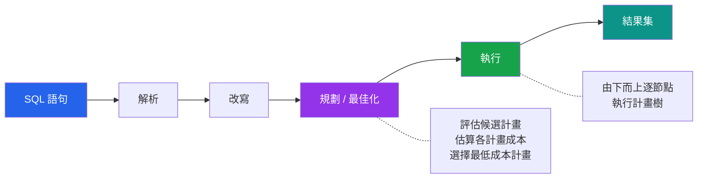

# [DEE-201] 解讀執行計畫

:::info
開發者在最佳化任何查詢之前，SHOULD先使用 EXPLAIN ANALYZE。執行計畫揭示了資料庫實際的運作方式——僅憑查詢語法猜測會導致白費力氣或適得其反的修改。
:::

## 背景

每條 SQL 語句在回傳結果前都會經歷三個階段：解析（parsing）、規劃（planning）和執行（execution）。在規劃階段，查詢最佳化器會評估許多可能的策略——不同的 JOIN 順序、掃描方式和排序演算法——然後選擇預估成本最低的計畫。執行計畫就是最佳化器所選的策略，以操作樹（tree of operations）的形式呈現。

如果不讀執行計畫，開發者就是憑直覺在做最佳化：加了從未被使用的索引、改寫了原本就很有效率的查詢，或是完全忽略了真正的瓶頸。PostgreSQL（`EXPLAIN` / `EXPLAIN ANALYZE`）和 MySQL（`EXPLAIN` / `EXPLAIN ANALYZE`）都會揭露各自的執行計畫，而閱讀它們是進行任何有意義最佳化工作的前提。

`EXPLAIN` 和 `EXPLAIN ANALYZE` 之間的區別至關重要。`EXPLAIN` 顯示規劃器的*預估*計畫，但不會實際執行查詢。`EXPLAIN ANALYZE` 則會*執行*查詢，並在計畫上標註實際的時間和資料列數。預估值與實際值之間的差距，往往就是效能問題藏匿之處。

## 原則

- 開發者在嘗試任何查詢最佳化之前，SHOULD先執行 `EXPLAIN ANALYZE`。
- 開發者MUST NOT僅憑直覺或查詢語法來最佳化查詢，而不檢視執行計畫。
- 開發者SHOULD比較預估資料列數與實際資料列數——差異過大表示統計資訊過時或資料分佈具有誤導性。
- 開發者SHOULD優先檢視最昂貴的節點——那些實際時間最高或預估與實際資料列數差距最大的節點。

## 視覺化



## 範例

### PostgreSQL EXPLAIN ANALYZE

```sql
EXPLAIN ANALYZE
SELECT o.order_id, o.total, c.name
FROM orders o
JOIN customers c ON c.customer_id = o.customer_id
WHERE o.status = 'shipped'
  AND o.created_at >= '2025-01-01';
```

```
Hash Join  (cost=15.20..450.30 rows=120 width=52)
           (actual time=0.310..3.450 rows=1451 loops=1)
  Hash Cond: (o.customer_id = c.customer_id)
  ->  Seq Scan on orders o  (cost=0.00..380.00 rows=120 width=20)
                             (actual time=0.020..2.800 rows=1451 loops=1)
        Filter: ((status = 'shipped') AND (created_at >= '2025-01-01'))
        Rows Removed by Filter: 85000
  ->  Hash  (cost=10.50..10.50 rows=500 width=36)
            (actual time=0.250..0.250 rows=500 loops=1)
        ->  Seq Scan on customers c  (cost=0.00..10.50 rows=500 width=36)
                                      (actual time=0.010..0.120 rows=500 loops=1)
Planning Time: 0.150 ms
Execution Time: 3.700 ms
```

**如何解讀此計畫：**

| 檢查項目 | 數值 | 解讀 |
|----------|------|------|
| **orders 的掃描類型** | `Seq Scan` | 全表掃描——篩選條件未使用索引 |
| **預估 vs 實際資料列數（orders）** | 120 vs 1,451 | 低估 12 倍——統計資訊可能過時；執行 `ANALYZE orders` |
| **被篩選器移除的資料列** | 85,000 | 掃描讀取了 86,451 列才回傳 1,451 列——在 `(status, created_at)` 上建立索引會有幫助 |
| **JOIN 方式** | `Hash Join` | 規劃器將較小的表（customers）建立雜湊表後探測——在此情境下很有效率 |
| **總執行時間** | 3.7 ms | 目前可接受，但隨著 orders 表增長會劣化 |

新增索引後：

```sql
CREATE INDEX idx_orders_status_created ON orders (status, created_at);
```

```
Nested Loop  (cost=5.10..85.30 rows=1400 width=52)
              (actual time=0.050..0.620 rows=1451 loops=1)
  ->  Index Scan using idx_orders_status_created on orders o
        (cost=0.42..45.20 rows=1400 width=20)
        (actual time=0.030..0.280 rows=1451 loops=1)
        Index Cond: ((status = 'shipped') AND (created_at >= '2025-01-01'))
  ->  Index Scan using customers_pkey on customers c
        (cost=0.28..0.30 rows=1 width=36)
        (actual time=0.001..0.001 rows=1 loops=1451)
Planning Time: 0.200 ms
Execution Time: 0.750 ms
```

`Seq Scan` 變成了 `Index Scan`，被篩選器移除的資料列降為零，執行時間從 3.7 ms 降至 0.75 ms。

### MySQL EXPLAIN

```sql
EXPLAIN
SELECT o.order_id, o.total, c.name
FROM orders o
JOIN customers c ON c.customer_id = o.customer_id
WHERE o.status = 'shipped'
  AND o.created_at >= '2025-01-01';
```

```
+----+-------+-------+---------------+---------+------+------+-------------+
| id | table | type  | possible_keys | key     | rows | filt | Extra       |
+----+-------+-------+---------------+---------+------+------+-------------+
|  1 | o     | ALL   | NULL          | NULL    | 8645 |  1.4 | Using where |
|  1 | c     | eq_ref| PRIMARY       | PRIMARY |    1 |  100 | NULL        |
+----+-------+-------+---------------+---------+------+------+-------------+
```

**MySQL EXPLAIN 中需要檢查的關鍵欄位：**

| 欄位 | 觀察重點 |
|------|----------|
| **type** | `ALL` = 全表掃描（對大表不利）；`ref`/`range`/`eq_ref` = 有使用索引；`const` = 單列查找 |
| **key** | `NULL` 表示未選用索引——查詢需要索引 |
| **rows** | 預估掃描的資料列數——跨 JOIN 表時需相乘以計算總工作量 |
| **filtered** | 通過 WHERE 子句的資料列百分比——低值搭配高資料列數表示缺少索引 |
| **Extra** | `Using index` = 覆蓋索引；`Using filesort` = 排序未來自索引；`Using temporary` = 建立了暫存表 |

### 需要辨識的關鍵計畫節點類型

| PostgreSQL 節點 | MySQL type | 意義 | 效能 |
|----------------|------------|------|------|
| Seq Scan | ALL | 全表掃描 | 大表上很慢 |
| Index Scan | ref, range | B-tree 走訪 + heap 存取 | 良好 |
| Index Only Scan | Using index | 完全從索引回答 | 最佳 |
| Bitmap Index Scan | index_merge | 建立符合資料列的 bitmap，再存取 heap | 中等選擇率時良好 |
| Nested Loop | nested loop | 對外層每列掃描內層 | 內層有索引時良好 |
| Hash Join | hash join (8.0.18+) | 建立雜湊表後探測 | 大型未排序集合時良好 |
| Merge Join | -- | 合併兩個已排序輸入 | 兩個輸入皆已預排序時良好 |
| Sort | Using filesort | 明確的排序操作 | 注意大型排序 |

## 常見錯誤

1. **不看 EXPLAIN 就最佳化。** 在未先閱讀執行計畫的情況下新增索引、改寫查詢或反正規化，都只是在猜測。計畫可能揭示瓶頸在意想不到的地方——缺少統計資訊、錯誤的 JOIN 順序，或隱式型別轉換阻止了索引使用。

2. **只用 EXPLAIN 不用 ANALYZE。** 單獨的 `EXPLAIN` 只顯示預估值。當統計資訊過時或資料分佈偏斜時，預估值可能嚴重偏離。務必使用 `EXPLAIN ANALYZE`（會實際執行查詢）來查看實際資料列數和時間。對 INSERT/UPDATE/DELETE 使用 `EXPLAIN ANALYZE` 時要謹慎——用交易包裹後回滾。

3. **忽視預估與實際資料列數之間的差距。** 當規劃器預估 100 列但實際回傳 50,000 列時，後續的每個決策（JOIN 策略、記憶體配置、排序方式）都建立在錯誤的假設上。透過對相關表執行 `ANALYZE` 來更新統計資訊以修正此問題。

4. **只關注執行時間。** 今天查詢很快，可能只是因為表很小或資料在快取中。要看計畫結構：在 1,000 列的表上做 Seq Scan 沒問題，但同樣的計畫在 1,000 萬列的表上將無法擴展。

5. **未以接近正式環境的資料量測試。** 在只有 100 列的開發資料庫上，最佳化器可能選擇與正式環境 1,000 萬列時完全不同的計畫。請針對合理的資料規模測試執行計畫。

## 相關 DEE

- [DEE-200](200.md) 查詢與效能總覽
- [DEE-205](205.md) 查詢最佳化模式——應用執行計畫揭示的發現
- [DEE-300](300.md) 索引總覽——執行計畫所參照的索引

## 參考資料

- [PostgreSQL Documentation: Using EXPLAIN](https://www.postgresql.org/docs/current/using-explain.html) -- 閱讀 PostgreSQL 執行計畫的官方指南
- [PostgreSQL Documentation: EXPLAIN command](https://www.postgresql.org/docs/current/sql-explain.html) -- EXPLAIN 的語法與選項
- [MySQL Documentation: EXPLAIN Output Format](https://dev.mysql.com/doc/en/explain-output.html) -- MySQL EXPLAIN 欄位的官方參考
- [Use The Index, Luke: PostgreSQL Execution Plan Operations](https://use-the-index-luke.com/sql/explain-plan/postgresql/operations) -- PostgreSQL 計畫節點的視覺化指南
- [Cybertec: How to Interpret PostgreSQL EXPLAIN ANALYZE Output](https://www.cybertec-postgresql.com/en/how-to-interpret-postgresql-explain-analyze-output/) -- 實務演練
- [Thoughtbot: Reading an EXPLAIN ANALYZE Query Plan](https://thoughtbot.com/blog/reading-an-explain-analyze-query-plan) -- 對開發者友善的說明
