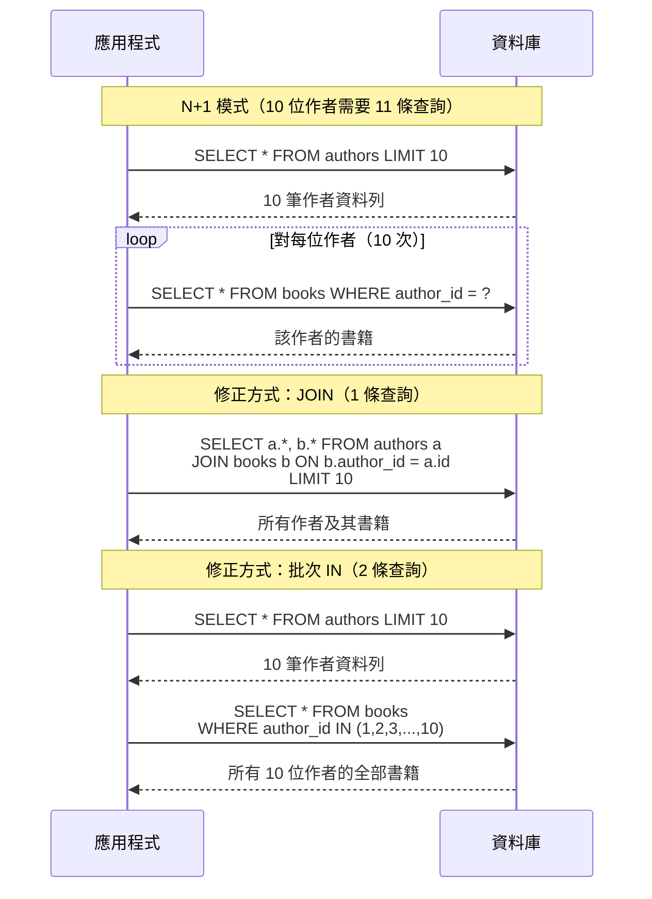

# [DEE-202] N+1 查詢問題

:::info
資料存取模式在開發過程中MUST審查是否存在 N+1 查詢。N+1 問題是使用 ORM 或手寫資料擷取迴圈的 Web 應用程式中最常見的效能問題。
:::

## 背景

N+1 查詢問題發生在應用程式程式碼用一條查詢擷取 N 筆父記錄，然後為每筆父記錄發出 N 條額外查詢來擷取關聯資料——導致原本一兩次就能完成的資料庫往返，變成了 N+1 次。

這種模式很隱蔽，因為在小規模下看不出來。擷取 10 位作者及其書籍，用 11 條查詢只需幾毫秒。擷取 10,000 位作者及其書籍，用 10,001 條查詢可能需要數分鐘，並耗盡資料庫連線池。這個問題常常隱藏在 ORM 的懶載入（lazy-loading）預設行為之後——關聯物件在首次存取時被透明地擷取。

N+1 並不僅限於 ORM。任何遍歷結果集並在每次迭代中發出查詢的程式碼都有同樣的問題：REST API handler 在迴圈中擷取關聯資源、GraphQL resolver 逐一載入巢狀欄位，或者在 for-each 迴圈中撰寫原始 SQL。

## 原則

- 資料存取模式在開發和程式碼審查期間MUST審查是否存在 N+1 查詢。
- 開發者SHOULD在開發和測試環境中監控每個請求的查詢次數。
- 開發者SHOULD使用 JOIN 或批次擷取（IN 清單）來取代 N+1 模式。
- 開發者MUST NOT依賴快取來掩蓋 N+1 問題——快取隱藏了症狀但未修正根本原因；快取未命中時會回到 N+1 行為。

## 視覺化



## 範例

### 原始 SQL 中的 N+1 問題

```sql
-- 查詢 1：擷取所有作者
SELECT author_id, name FROM authors;
-- 回傳 1000 列

-- 查詢 2..1001：在應用程式迴圈中擷取每位作者的書籍
SELECT title, published_year FROM books WHERE author_id = 1;
SELECT title, published_year FROM books WHERE author_id = 2;
SELECT title, published_year FROM books WHERE author_id = 3;
-- ... 還有 997 條查詢 ...
```

**總計：1,001 條查詢。** 每條查詢都有網路往返開銷（localhost 通常 0.5-2 ms，跨網路 5-20 ms）。以 1 ms 往返計算，這在查詢執行時間之前就增加了 1 秒的純延遲。

### 修正方式 1：JOIN

```sql
-- 單一查詢：同時擷取作者和書籍
SELECT a.author_id, a.name, b.title, b.published_year
FROM authors a
LEFT JOIN books b ON b.author_id = a.author_id
ORDER BY a.author_id;
```

**總計：1 條查詢。** LEFT JOIN 確保沒有書籍的作者仍然出現。取捨是當作者有很多書時，作者欄位會重複出現在每一列，增加資料傳輸量。

### 修正方式 2：使用 IN 的批次查詢

```sql
-- 查詢 1：擷取所有作者
SELECT author_id, name FROM authors;
-- 應用程式收集作者 ID：[1, 2, 3, ..., 1000]

-- 查詢 2：用一條查詢擷取所有作者的書籍
SELECT author_id, title, published_year
FROM books
WHERE author_id IN (1, 2, 3, ..., 1000);
```

**總計：2 條查詢。** 應用程式在記憶體中組合結果。這避免了 JOIN 的資料重複，在 IN 清單符合資料庫的參數上限時效果良好（PostgreSQL 沒有硬性上限；MySQL 允許最多 65,535 個佔位符）。

### 修正方式 3：ORM 框架中的批次載入

大多數 ORM 提供內建的解決方案：

```python
# Django: select_related (JOIN) 和 prefetch_related (批次 IN)
authors = Author.objects.prefetch_related('books').all()

# SQLAlchemy: joinedload 或 subqueryload
authors = session.query(Author).options(joinedload(Author.books)).all()
```

```java
// JPA/Hibernate: 在集合上使用 @BatchSize
@OneToMany(mappedBy = "author")
@BatchSize(size = 100)
private List<Book> books;
```

```ruby
# Rails ActiveRecord: includes（自動選擇 JOIN 或批次 IN）
authors = Author.includes(:books).all
```

### 在開發中偵測 N+1

| 工具 / 技術 | 如何幫助 |
|-------------|----------|
| **Django Debug Toolbar** | 顯示每個請求的查詢次數和重複查詢 |
| **Bullet gem (Rails)** | 偵測 N+1 查詢並建議 eager loading |
| **Hibernate `hibernate.generate_statistics`** | 記錄查詢次數和擷取統計 |
| **pg_stat_statements (PostgreSQL)** | 跨應用程式彙總查詢執行次數 |
| **MySQL slow query log 搭配 `log_queries_not_using_indexes`** | 捕捉未使用索引的查詢，通常是 N+1 的症狀 |
| **應用層級查詢計數器** | 包裝 DB 驅動來計算每個請求的查詢次數；超過閾值時告警 |

## 常見錯誤

1. **信任 ORM 預設值。** 大多數 ORM 預設使用懶載入，這在設計上就會觸發 N+1。開發者SHOULD為已知的存取模式設定 eager loading，並定期審查產生的 SQL。ORM 的便利性並不免除你理解其產生的查詢的責任。

2. **不監控每個請求的查詢次數。** 一個產生 500 條資料庫查詢的 HTTP 請求是個警訊，無論個別查詢有多快。在開發和 CI 中加入查詢次數監控——許多 N+1 問題可以透過簡單的閾值檢查發現（例如，請求超過 20 條查詢時告警）。

3. **用快取而非查詢設計來修正 N+1。** 在 N+1 查詢前面加上快取層（Redis、Memcached）只在快取是熱的時候有效。快取未命中、冷啟動和快取失效都會回到原始的 N+1 行為。先修正查詢模式；如有需要，再另外加入快取作為額外的最佳化。

4. **過度 eager loading 所有東西。** 另一個極端——在每條查詢上 eagerly 載入所有關聯——在不需要關聯資料時會浪費記憶體和頻寬。只載入當前程式碼路徑實際使用的資料。使用明確的 eager loading（指定哪些關聯）而非全域 eager loading。

5. **忽視 GraphQL resolver 中的 N+1。** GraphQL 的巢狀欄位解析天然會產生 N+1 模式。使用 dataloader 函式庫（例如 `graphql/dataloader`、`Strawberry DataLoader`）來批次處理和去重單一請求中的資料庫呼叫。

## 相關 DEE

- [DEE-200](200.md) 查詢與效能總覽
- [DEE-201](201.md) 解讀執行計畫——在資料庫層級診斷 N+1
- [DEE-203](203.md) JOIN 策略——用來修正 N+1 的 JOIN 類型
- [DEE-205](205.md) 查詢最佳化模式——更廣泛的最佳化技術

## 參考資料

- [PingCAP: How to Efficiently Solve the N+1 Query Problem](https://www.pingcap.com/article/how-to-efficiently-solve-the-n1-query-problem/) -- 含 ORM 範例的完整概述
- [Django Documentation: prefetch_related](https://docs.djangoproject.com/en/5.0/ref/models/querysets/#prefetch-related) -- Django 的批次載入策略
- [SQLAlchemy Documentation: Relationship Loading Techniques](https://docs.sqlalchemy.org/en/20/orm/queryguide/relationships.html) -- joinedload、subqueryload、selectinload
- [Rails Guides: Eager Loading Associations](https://guides.rubyonrails.org/active_record_querying.html#eager-loading-associations) -- includes、preload、eager_load
- [graphql/dataloader on GitHub](https://github.com/graphql/dataloader) -- 用於批次處理的參考 DataLoader 實作
- [Digma: What is the N+1 Query Problem and How to Detect It](https://digma.ai/n1-query-problem-and-how-to-detect-it/) -- 偵測策略與工具
