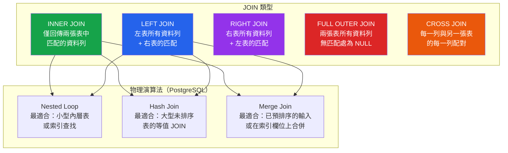

# [DEE-203] JOIN 策略

:::info
根據資料需求選擇 JOIN 類型，而非出於方便。每種 JOIN 類型有不同的語意——使用錯誤的類型會無聲地產生不正確的結果或不必要的效能開銷。
:::

## 背景

JOIN 是關聯式資料庫用來合併多張表資料的機制。它不是效能功能也不是便利設施——而是關聯模型的運作方式。沒有 JOIN，你要麼把所有東西反正規化到一張表中（違反正規化原則），要麼在多條查詢中擷取資料並在應用程式碼中組裝（N+1 模式）。

SQL 定義了數種 JOIN 類型，每種對於匹配和未匹配資料列的處理方式都不同。選擇錯誤的 JOIN 類型是邏輯錯誤，不只是效能問題。在該用 INNER JOIN 的地方使用 LEFT JOIN 會回傳含有 NULL 欄位的資料列，而下游程式碼可能無法預期。在該用有條件 JOIN 的地方使用 CROSS JOIN 會產生笛卡兒積，結果可能比預期大好幾個數量級。

除了邏輯 JOIN 類型之外，資料庫引擎還必須選擇物理 JOIN 演算法——Nested Loop、Hash Join 或 Merge Join——來實際執行操作。理解邏輯類型和物理演算法兩者有助於開發者撰寫高效查詢並解讀執行計畫。

## 原則

- 開發者MUST選擇符合資料需求的 JOIN 類型，而非自己最熟悉的那個。
- 開發者SHOULD將 INNER JOIN 作為預設，除非明確需要未匹配的資料列。
- 開發者MUST確保 JOIN 欄位有索引，尤其是一對多關係中「多」的那一側。
- 開發者SHOULD NOT使用 CROSS JOIN，除非確實需要笛卡兒積（例如，為日曆或矩陣產生組合）。

## 視覺化



## JOIN 類型參考

| JOIN 類型 | 匹配的列 | 左表未匹配 | 右表未匹配 | 使用時機 |
|-----------|:---:|:---:|:---:|----------|
| **INNER JOIN** | 包含 | 排除 | 排除 | 只需要兩張表都有匹配的資料列 |
| **LEFT JOIN** | 包含 | 包含（右側為 NULL） | 排除 | 無論是否匹配都需要左表所有資料列 |
| **RIGHT JOIN** | 包含 | 排除 | 包含（左側為 NULL） | 需要右表所有資料列（通常改寫為 LEFT JOIN） |
| **FULL OUTER JOIN** | 包含 | 包含（右側為 NULL） | 包含（左側為 NULL） | 需要兩張表的所有資料列（例如對帳報表） |
| **CROSS JOIN** | 不適用——所有組合 | 不適用 | 不適用 | 確實需要每一列的所有組合（笛卡兒積） |

## 範例

### 範例資料

```sql
CREATE TABLE departments (
    dept_id   INT PRIMARY KEY,
    dept_name TEXT NOT NULL
);

INSERT INTO departments VALUES
    (1, 'Engineering'),
    (2, 'Marketing'),
    (3, 'Finance');

CREATE TABLE employees (
    emp_id    INT PRIMARY KEY,
    name      TEXT NOT NULL,
    dept_id   INT REFERENCES departments(dept_id)
);

INSERT INTO employees VALUES
    (101, 'Alice',  1),
    (102, 'Bob',    1),
    (103, 'Carol',  2),
    (104, 'Dave',   NULL);  -- Dave 沒有部門
```

### INNER JOIN -- 僅匹配的列

```sql
SELECT e.name, d.dept_name
FROM employees e
INNER JOIN departments d ON d.dept_id = e.dept_id;
```

| name  | dept_name   |
|-------|-------------|
| Alice | Engineering |
| Bob   | Engineering |
| Carol | Marketing   |

Dave 被排除（沒有匹配的部門）。Finance 被排除（沒有匹配的員工）。

### LEFT JOIN -- 所有員工，即使沒有部門

```sql
SELECT e.name, d.dept_name
FROM employees e
LEFT JOIN departments d ON d.dept_id = e.dept_id;
```

| name  | dept_name   |
|-------|-------------|
| Alice | Engineering |
| Bob   | Engineering |
| Carol | Marketing   |
| Dave  | NULL        |

Dave 以 dept_name 為 NULL 的形式出現。Finance 仍被排除（沒有員工參照它）。

### FULL OUTER JOIN -- 兩張表的所有列

```sql
SELECT e.name, d.dept_name
FROM employees e
FULL OUTER JOIN departments d ON d.dept_id = e.dept_id;
```

| name  | dept_name   |
|-------|-------------|
| Alice | Engineering |
| Bob   | Engineering |
| Carol | Marketing   |
| Dave  | NULL        |
| NULL  | Finance     |

Dave（無部門）和 Finance（無員工）都出現了。

### CROSS JOIN -- 笛卡兒積

```sql
-- 產生排班表格：每位員工 x 每個部門
SELECT e.name, d.dept_name
FROM employees e
CROSS JOIN departments d;
-- 回傳 4 x 3 = 12 列
```

### 使用 LEFT JOIN 的反連接模式

```sql
-- 找出沒有員工的部門
SELECT d.dept_name
FROM departments d
LEFT JOIN employees e ON e.dept_id = d.dept_id
WHERE e.emp_id IS NULL;
```

| dept_name |
|-----------|
| Finance   |

這比使用子查詢的 `NOT IN` 更有效率，尤其是當子查詢可能包含 NULL 時。

## 物理 JOIN 演算法

資料庫引擎會獨立於邏輯 JOIN 類型來選擇如何物理執行 JOIN。理解這些有助於解讀執行計畫（參見 [DEE-201](201.md)）。

| 演算法 | 運作方式 | 最適用於 | 成本 |
|--------|----------|----------|------|
| **Nested Loop** | 對外層表的每一列，掃描內層表（或使用索引） | 小表，或內層 JOIN 欄位有索引 | 無索引 O(N * M)，有索引 O(N * log M) |
| **Hash Join** | 從較小的表建立雜湊表，然後用較大表的每一列來探測 | 沒有合適索引的大表，僅限等值條件 | O(N + M)，但需要記憶體存放雜湊表 |
| **Merge Join** | 將兩個輸入按 JOIN 鍵排序（或使用預排序的索引），然後合併 | 兩個輸入皆已排序，或大表在 JOIN 鍵上有索引 | 排序 O(N log N + M log M)，合併 O(N + M) |

PostgreSQL 三種都支援。MySQL 在 8.0.18 版新增 Hash Join 支援；之前的版本大多數 JOIN 依賴 Nested Loop 搭配索引查找。

## 常見錯誤

1. **意外的 CROSS JOIN。** 省略 ON 子句或使用逗號分隔的表而沒有 WHERE 條件會產生笛卡兒積。兩張 10,000 列的表會產生 1 億列。務必指定明確的 JOIN 條件。

    ```sql
    -- 錯誤：意外的 cross join（逗號語法，缺少條件）
    SELECT * FROM orders, customers;

    -- 正確：明確的 join
    SELECT * FROM orders o JOIN customers c ON c.customer_id = o.customer_id;
    ```

2. **INNER JOIN 就夠時用 LEFT JOIN。** 當商業邏輯保證一定有匹配（例如 NOT NULL 外鍵）時「以防萬一」地使用 LEFT JOIN 會增加不必要的開銷。最佳化器可能無法消除外連接邏輯，導致次佳計畫。當每一列保證有匹配時，使用 INNER JOIN。

3. **未對 JOIN 欄位建立索引。** 如果 JOIN 欄位沒有索引（尤其是外鍵側），資料庫會退回到循序掃描或 Hash Join，即使使用索引的 Nested Loop 會快得多。務必確保外鍵欄位有索引。

4. **在不同型別上做 JOIN。** 將 VARCHAR 欄位與 INT 欄位做 JOIN 會強制對每一列進行隱式型別轉換，阻止索引使用。確保 JOIN 欄位具有相同的資料型別。

5. **使用 RIGHT JOIN 而不改寫為 LEFT JOIN。** RIGHT JOIN 在語意上等同於交換表順序的 LEFT JOIN。大多數團隊為了可讀性標準化使用 LEFT JOIN。RIGHT JOIN 增加認知負擔而沒有任何好處。

6. **忽視外連接中的 NULL 語意。** LEFT JOIN 之後，右表的欄位可能因未匹配而為 NULL。在 WHERE 子句中對這些欄位進行篩選（例如 `WHERE right_table.column = 'value'`）會隱式地將 LEFT JOIN 轉換為 INNER JOIN，因為 NULL 永遠不等於任何值。如果想保留外連接行為，請將這些篩選條件放在 ON 子句中。

## 相關 DEE

- [DEE-200](200.md) 查詢與效能總覽
- [DEE-201](201.md) 解讀執行計畫——看資料庫如何執行你的 JOIN
- [DEE-202](202.md) N+1 查詢問題——JOIN 是主要的解決方案
- [DEE-204](204.md) 子查詢 vs JOIN——何時使用哪個

## 參考資料

- [PostgreSQL Documentation: Table Expressions (JOIN)](https://www.postgresql.org/docs/current/queries-table-expressions.html) -- 官方 JOIN 語法與語意
- [MySQL Documentation: JOIN Clause](https://dev.mysql.com/doc/refman/8.4/en/join.html) -- MySQL JOIN 語法參考
- [Cybertec: Join Strategies and Performance in PostgreSQL](https://www.cybertec-postgresql.com/en/join-strategies-and-performance-in-postgresql/) -- JOIN 演算法深入探討
- [Use The Index, Luke: Join Operations](https://use-the-index-luke.com/sql/join) -- 索引感知的 JOIN 最佳化
- [Crunchy Data: Postgres Scan Types in EXPLAIN Plans](https://www.crunchydata.com/blog/postgres-scan-types-in-explain-plans) -- 理解 JOIN 的計畫節點
