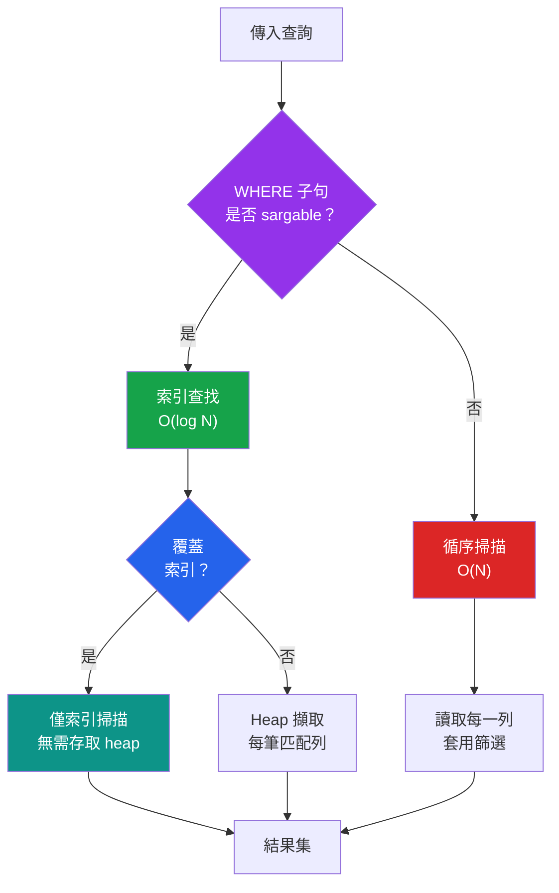

# [DEE-205] 查詢最佳化模式

:::info
撰寫能使用索引的查詢，並在最佳化前先測量。過早最佳化浪費力氣；沒有測量的最佳化則把力氣浪費在錯誤的地方。
:::

## 背景

查詢最佳化不是要寫出巧妙的 SQL——而是要寫出能與資料庫引擎的最佳化器和索引結構協作的 SQL。影響最大的最佳化是結構性的：確保查詢能使用索引、避免不必要的工作，以及選擇可擴展的分頁策略。

大多數慢查詢都屬於少數幾種模式：阻止索引使用的非 sargable WHERE 子句、擷取不必要欄位的 SELECT *、在深層分頁時劣化的 OFFSET 分頁，以及迫使昂貴 heap 查找的缺失覆蓋索引。

本 DEE 涵蓋實用的、反覆出現的最佳化模式。每個模式都是開發者在撰寫查詢時——在查詢成為效能問題之前——就能應用的，並可用 EXPLAIN ANALYZE 驗證。

## 原則

- 開發者MUST撰寫 sargable（Search ARGument ABLE）的 WHERE 子句——允許資料庫使用索引的條件。
- 開發者SHOULD只選取需要的欄位，而非 `SELECT *`。
- 開發者SHOULD對任何可能到達深層分頁的使用者介面，使用游標式（keyset）分頁而非 OFFSET。
- 開發者在最佳化前後MUST用 EXPLAIN ANALYZE 測量查詢效能，以確認改善效果。
- 開發者SHOULD NOT最佳化未經測量證實為瓶頸的查詢——過早最佳化增加複雜度而沒有經過驗證的效益。

## 視覺化



## 範例

### 模式 1：Sargable vs 非 sargable 的 WHERE 子句

Sargable 條件允許資料庫直接在索引中搜尋。非 sargable 條件因為無法使用索引而強制全表掃描。

```sql
-- 非 SARGABLE：在有索引的欄位上使用函式會阻止索引使用
SELECT * FROM orders
WHERE YEAR(created_at) = 2025;

-- SARGABLE：範圍條件能使用 created_at 上的索引
SELECT * FROM orders
WHERE created_at >= '2025-01-01'
  AND created_at < '2026-01-01';
```

```sql
-- 非 SARGABLE：在有索引的欄位上使用表達式
SELECT * FROM products
WHERE price * 1.1 > 100;

-- SARGABLE：將運算移到右側
SELECT * FROM products
WHERE price > 100 / 1.1;
```

```sql
-- 非 SARGABLE：前導萬用字元阻止索引使用
SELECT * FROM customers
WHERE name LIKE '%smith';

-- SARGABLE：尾端萬用字元可以使用 B-tree 索引
SELECT * FROM customers
WHERE name LIKE 'Smith%';
```

**常見非 sargable 模式及其 sargable 改寫：**

| 非 Sargable | Sargable 改寫 |
|-------------|--------------|
| `WHERE YEAR(date_col) = 2025` | `WHERE date_col >= '2025-01-01' AND date_col < '2026-01-01'` |
| `WHERE LOWER(email) = 'user@example.com'` | 建立函式索引：`CREATE INDEX idx ON t (LOWER(email))` |
| `WHERE col + 1 = 10` | `WHERE col = 9` |
| `WHERE col * 2 > 100` | `WHERE col > 50` |
| `WHERE CAST(varchar_col AS INT) = 42` | 將欄位儲存為 INT，或建立函式索引 |
| `WHERE name LIKE '%search%'` | 使用全文搜尋（GIN/GiST 索引）或 `pg_trgm` |

### 模式 2：覆蓋索引（僅索引掃描）

覆蓋索引包含查詢所需的所有欄位，因此資料庫無需存取 heap（表資料）。這消除了每筆匹配列的隨機 I/O。

```sql
-- 僅需要已出貨訂單的 order_id 和 total 的查詢
SELECT order_id, total
FROM orders
WHERE status = 'shipped'
  AND created_at >= '2025-01-01';

-- 覆蓋索引：包含 WHERE 和 SELECT 中的所有欄位
CREATE INDEX idx_orders_covering
ON orders (status, created_at)
INCLUDE (order_id, total);
```

```
-- 之前（Index Scan + heap 擷取）：
Index Scan using idx_orders_status on orders
  (actual time=0.03..2.10 rows=1451 loops=1)

-- 之後（Index Only Scan——無需存取 heap）：
Index Only Scan using idx_orders_covering on orders
  (actual time=0.02..0.45 rows=1451 loops=1)
  Heap Fetches: 0
```

INCLUDE 子句（PostgreSQL 11+、SQL Server）將欄位加入索引的葉頁，但不影響索引排序順序。MySQL 透過在索引定義中包含欄位來達到相同效果（在 InnoDB 中，所有次要索引欄位實際上都是 INCLUDE 欄位，因為次要索引指向主鍵）。

### 模式 3：游標式（keyset）分頁 vs OFFSET

OFFSET 告訴資料庫跳過 N 列。對深層分頁而言，它必須掃描並丟棄所有前面的列——offset 100,000 的頁面需要在回傳所請求的頁面之前掃描 100,000 列。

```sql
-- OFFSET 分頁：隨分頁深度線性劣化
-- 第 1 頁（快）：
SELECT order_id, total, created_at
FROM orders ORDER BY created_at DESC LIMIT 20 OFFSET 0;

-- 第 5000 頁（慢——掃描 100,000 列，回傳 20 列）：
SELECT order_id, total, created_at
FROM orders ORDER BY created_at DESC LIMIT 20 OFFSET 99980;
```

```sql
-- 游標式分頁：無論深度，效能恆定
-- 第 1 頁：
SELECT order_id, total, created_at
FROM orders
ORDER BY created_at DESC, order_id DESC
LIMIT 20;

-- 下一頁：使用最後一列的值作為游標
SELECT order_id, total, created_at
FROM orders
WHERE (created_at, order_id) < ('2025-06-15 10:30:00', 48573)
ORDER BY created_at DESC, order_id DESC
LIMIT 20;
```

| 面向 | OFFSET | 游標式（Keyset） |
|------|--------|-----------------|
| **第 1 頁速度** | 快 | 快 |
| **第 5000 頁速度** | 慢（掃描 10 萬列） | 快（索引搜尋） |
| **寫入時的一致性** | 可能跳過或重複列 | 游標位置穩定 |
| **隨機頁面存取** | 是（`OFFSET = (page - 1) * size`） | 否（僅支援前進/後退） |
| **實作複雜度** | 簡單 | 中等（必須追蹤游標狀態） |
| **最適合** | 後台介面、小型資料集 | API、無限捲動、大型資料集 |

**OFFSET 可接受的情況：** 小型結果集（約 10,000 列以下）、深層分頁罕見的後台/內部工具，或隨機頁面存取是硬性需求時。

### 模式 4：避免 SELECT *

```sql
-- 不好：擷取所有欄位，包括大型 TEXT/BLOB 欄位
SELECT * FROM articles WHERE category = 'tech';

-- 好：只擷取需要的欄位
SELECT article_id, title, published_at FROM articles WHERE category = 'tech';
```

`SELECT *` 有多重成本：
- **阻止覆蓋索引最佳化。** 查詢必須存取 heap 以取得不在索引中的欄位。
- **增加資料傳輸。** 擷取未使用的 BLOB 或 TEXT 欄位浪費網路頻寬和記憶體。
- **Schema 變更時會壞掉。** 新增欄位會無聲地改變結果集，可能破壞依賴欄位順序的應用程式碼。
- **增加 buffer pool 壓力。** 較大的列意味著每頁較少的列，相同邏輯結果需要更多 I/O。

### 模式 5：使用索引的 ORDER BY 以避免 filesort

```sql
-- 沒有索引：資料庫必須排序所有匹配列（filesort）
SELECT order_id, total FROM orders
WHERE customer_id = 42
ORDER BY created_at DESC;

-- 有複合索引：排序順序來自索引
CREATE INDEX idx_orders_cust_created
ON orders (customer_id, created_at DESC);

-- 現在 ORDER BY 是「免費的」——索引按順序產生列
```

在 MySQL EXPLAIN 中，注意 Extra 欄位的 `Using filesort`——表示結果必須在記憶體或磁碟中排序。匹配 WHERE 欄位後接 ORDER BY 欄位的索引可以消除它。

## 常見錯誤

1. **過早最佳化。** 在測量之前就加覆蓋索引、改寫查詢或切換分頁策略是適得其反的。覆蓋索引有寫入成本（每次 INSERT/UPDATE/DELETE 都需維護）。只最佳化 EXPLAIN ANALYZE 顯示為實際瓶頸的查詢。

2. **在 API 中使用 OFFSET 做深層分頁。** 接受 `?page=5000&size=20` 的公開 API 會產生 `OFFSET 99980` 的查詢，效能線性劣化。服務可能有大型結果集的 API SHOULD從一開始就使用游標式分頁——事後改造需要 API 變更。

3. **在有索引的欄位上包裹函式。** `WHERE UPPER(email) = 'USER@EXAMPLE.COM'` 無法使用 `email` 上的標準 B-tree 索引。要麼以標準化形式儲存欄位、建立函式索引（`CREATE INDEX ON t (UPPER(email))`），要麼使用不區分大小寫的 collation。

4. **在正式查詢中使用 SELECT *。** SELECT * 阻止覆蓋索引最佳化、增加資料傳輸，並建立與 schema 的脆弱耦合。明確的欄位清單只需多打幾個字，但在效能和可維護性上回報豐厚。

5. **不用 EXPLAIN ANALYZE 就最佳化查詢。** 開發者有時根據對什麼慢的假設來新增索引或改寫查詢。實際的執行計畫可能揭示完全不同的瓶頸——過時的統計資訊、錯誤的 JOIN 順序，或不同表上的循序掃描。務必先測量。

6. **忽視索引的寫入成本。** 每個索引在 INSERT、UPDATE（有索引的欄位）和 DELETE 時都必須更新。為加速一條讀取查詢而新增的覆蓋索引可能拖慢高頻的寫入路徑。讀取最佳化與寫入開銷之間需要取得平衡。

## 相關 DEE

- [DEE-200](200.md) 查詢與效能總覽
- [DEE-201](201.md) 解讀執行計畫——測量最佳化影響的必備工具
- [DEE-202](202.md) N+1 查詢問題——一種特定的最佳化模式
- [DEE-203](203.md) JOIN 策略——選擇高效的 JOIN 方式
- [DEE-204](204.md) 子查詢 vs JOIN——查詢結構最佳化
- [DEE-300](300.md) 索引總覽——這些模式所依賴的索引結構

## 參考資料

- [Use The Index, Luke: The WHERE Clause](https://use-the-index-luke.com/sql/where-clause) -- sargable 條件與索引使用的完整指南
- [Use The Index, Luke: Pagination Done the Right Way](https://use-the-index-luke.com/no-offset) -- keyset 分頁說明
- [PostgreSQL Documentation: Index-Only Scans](https://www.postgresql.org/docs/current/indexes-index-only-scans.html) -- 覆蓋索引行為
- [PostgreSQL Documentation: CREATE INDEX (INCLUDE clause)](https://www.postgresql.org/docs/current/sql-createindex.html) -- 覆蓋索引的 INCLUDE 語法
- [MySQL Documentation: Covering Indexes](https://dev.mysql.com/doc/refman/8.4/en/index-merge-optimization.html) -- InnoDB 如何使用覆蓋索引
- [PlanetScale: Pagination in MySQL](https://planetscale.com/blog/mysql-pagination) -- 分頁策略的實務比較
- [PingCAP: Limit/Offset vs Cursor Pagination](https://www.pingcap.com/article/limit-offset-pagination-vs-cursor-pagination-in-mysql/) -- 效能基準比較
- [Wikipedia: Sargable](https://en.wikipedia.org/wiki/Sargable) -- sargable 表達式的定義與範例
