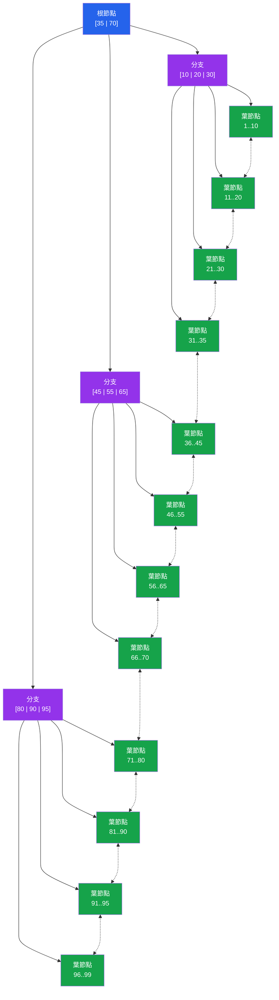

# [DEE-151] B-Tree 索引

:::info
B-tree 是所有主流關聯式資料庫的預設索引類型。開發者在考慮任何專用索引類型之前，MUST先理解 B-tree 的行為——它的優勢、限制與結構。
:::

## 背景

當你執行 `CREATE INDEX` 而未指定方法時，PostgreSQL 與 MySQL 都會建立 B-tree 索引。這並非偶然。B-tree 是關聯式資料庫中最通用的索引結構：它支援等值查詢、範圍掃描、排序以及 MIN/MAX 聚合，且效能表現穩定，具有可預測的對數時間複雜度。

B-tree 中的「B」代表「平衡」（balanced）。每個葉節點與根節點的距離相同，這保證了無論搜尋哪個值，查詢時間都一致。一棵包含數百萬筆資料的 B-tree 通常只有 4 到 5 層深度，意味著任何值只需 4-5 次分頁讀取即可定位。

其結構包含三個層級。葉節點儲存實際的索引值（或指向堆元組的指標），並透過雙向鏈結串列連接，使資料庫可以高效地進行範圍掃描，而不需要回到根節點。分支節點包含分隔鍵，引導從根節點向下遍歷到正確的葉節點。根節點是頂端的唯一進入點。

由於 B-tree 能處理絕大多數真實世界的存取模式，正確的預設策略是使用 B-tree，只在有量測證據顯示 B-tree 效能不足以應付特定工作負載時，才切換到專用索引類型（hash、GIN、GiST、BRIN）。

## 原則

- 開發者MUST在評估替代索引類型之前，先理解 B-tree 的能力。
- 開發者SHOULD將 B-tree 索引作為所有通用索引需求的預設選擇。
- B-tree 索引支援：`=`、`<`、`<=`、`>=`、`>`、`BETWEEN`、`IN`、`IS NULL`、`IS NOT NULL`、`LIKE 'prefix%'`、`ORDER BY`，以及 `MIN`/`MAX` 聚合。
- 開發者SHOULD NOT對低基數欄位（例如只有 2-3 個值的布林或狀態欄位）單獨建立索引，除非與其他欄位組合成複合索引，或作為部分索引的條件。

## 視覺化



**藍色** = 根節點、**紫色** = 分支節點、**綠色** = 葉節點。葉節點之間的虛線代表雙向鏈結串列，用於高效的範圍掃描。

## 範例

### 基本 B-tree 索引建立

```sql
-- PostgreSQL 與 MySQL：預設索引類型為 B-tree
CREATE INDEX idx_orders_created_at ON orders (created_at);

-- 明確指定 B-tree（結果相同）
CREATE INDEX idx_orders_created_at ON orders USING BTREE (created_at);
```

### B-tree 支援的操作

```sql
-- 等值查詢：遍歷根節點 -> 分支 -> 葉節點
SELECT * FROM orders WHERE order_id = 12345;

-- 範圍掃描：找到起始葉節點，沿鏈結串列掃描
SELECT * FROM orders
 WHERE created_at >= '2025-01-01'
   AND created_at <  '2025-02-01';

-- 排序：索引已按順序儲存值
SELECT * FROM orders ORDER BY created_at DESC LIMIT 20;

-- MIN/MAX：直接跳到第一個或最後一個葉節點
SELECT MIN(created_at) FROM orders;
SELECT MAX(created_at) FROM orders;

-- BETWEEN：等同於範圍掃描
SELECT * FROM orders
 WHERE total BETWEEN 100 AND 500;

-- 前綴 LIKE：因為 B-tree 按字典順序排序，所以有效
SELECT * FROM customers WHERE last_name LIKE 'John%';
```

### 多欄位 B-tree 索引

```sql
-- 支援篩選 (status)、(status, created_at)
-- 或 (status, created_at, customer_id) 的查詢
CREATE INDEX idx_orders_status_date ON orders (status, created_at, customer_id);

-- 使用索引（最左前綴匹配）
SELECT * FROM orders WHERE status = 'shipped' AND created_at >= '2025-06-01';

-- 無法有效使用此索引（跳過了前導欄位）
SELECT * FROM orders WHERE created_at >= '2025-06-01';
```

## 常見錯誤

1. **對低基數欄位單獨建立索引。** 對布林欄位如 `is_active` 建立 B-tree 索引幾乎沒有用處。只有兩個不同的值時，索引無法有效縮小搜尋範圍——資料庫通常會選擇循序掃描。使用複合索引或部分索引來使低基數篩選條件更有效。

2. **建立過多索引。** 每個索引在每次 INSERT、UPDATE 和 DELETE 時都必須維護。一張有 10 個索引的資料表意味著每次資料列變更都有 10 次額外的寫入操作。定期稽核你的索引：如果某個索引從未被使用（在 PostgreSQL 中檢查 `pg_stat_user_indexes`，在 MySQL 中檢查 `sys.schema_unused_indexes`），就刪除它。

3. **不理解索引欄位順序。** 在 `(A, B, C)` 的多欄位 B-tree 索引中，資料先按 A 排序，然後在每個 A 值內按 B 排序，再按 C 排序。只篩選 B 或 C 的查詢無法有效使用此索引。欄位順序必須符合你的查詢模式——詳見 [DEE-153](153.md)。

4. **假設索引總是能加速查詢。** 對於小資料表（數百列），循序掃描通常比索引查詢更快，因為它避免了樹遍歷和隨機 I/O 的開銷。最佳化器知道這一點，會忽略小資料表上的索引——這是正確的行為。

5. **過早使用特殊索引類型。** Hash、GIN、GiST 和 BRIN 索引各有其特定用途。在確認 B-tree 無法滿足效能需求之前就使用它們，只會增加複雜度而無實質幫助。先用 B-tree；有證據時才切換。

## 相關 DEE

- [DEE-150](150.md) 索引與儲存總覽
- [DEE-152](152.md) Hash 索引——B-tree 的純等值查詢替代方案
- [DEE-153](153.md) 複合索引——多欄位索引設計
- [DEE-201](../查詢與效能/202.md) 讀懂執行計畫——驗證你的索引是否被使用

## 參考資料

- [PostgreSQL Documentation: Index Types](https://www.postgresql.org/docs/current/indexes-types.html) -- B-tree 及其他索引類型的官方文件
- [MySQL 8.4 Reference Manual: Comparison of B-Tree and Hash Indexes](https://dev.mysql.com/doc/refman/8.4/en/index-btree-hash.html) -- MySQL B-tree 的能力與限制
- [Use The Index, Luke: Anatomy of an Index](https://use-the-index-luke.com/sql/anatomy/the-tree) -- B-tree 結構與遍歷的視覺化說明
- [Use The Index, Luke: The Where Clause](https://use-the-index-luke.com/sql/where-clause) -- B-tree 索引如何服務不同的查詢條件
- [PostgreSQL Documentation: Multicolumn Indexes](https://www.postgresql.org/docs/current/indexes-multicolumn.html) -- 多欄位 B-tree 行為
