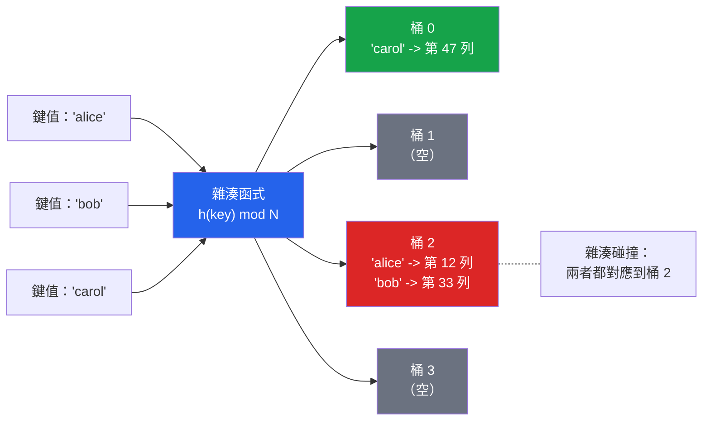

# [DEE-152] Hash 索引

:::info
Hash 索引僅支援等值比較。開發者SHOULD只在等值查詢主導工作負載，且已量測出 B-tree 開銷為瓶頸時才使用 hash 索引——這在實務中很少見。
:::

## 背景

Hash 索引透過雜湊函式將每個索引值對應到一個桶（bucket）。當資料庫查詢某個值時，它會計算雜湊值、直接跳到對應的桶，並找到匹配的資料列指標。這在概念上是每次查詢 O(1)，相比 B-tree 遍歷的 O(log n)。

在實務中，hash 索引相較 B-tree 在等值查詢上的效能優勢很小。深度為 4-5 層的 B-tree 在點查詢時已經非常快。Hash 索引能提供可量測改善的場景很有限：非常大的資料表（B-tree 深度變得顯著時），或幾乎完全由等值查詢組成、沒有範圍查詢、排序或前綴匹配的工作負載。

### PostgreSQL hash 索引歷史

PostgreSQL hash 索引有一段坎坷的歷史。在 PostgreSQL 10 之前，hash 索引不支援 WAL 記錄（Write-Ahead Log），意味著它們不具備崩潰安全性，也無法被複製。崩潰後需要完整的 `REINDEX`。從 PostgreSQL 10 開始，hash 索引完全支援 WAL 記錄且具備崩潰安全性，成為可行的選項。然而，PostgreSQL 文件仍指出 B-tree 索引通常更受推薦，因為它們更通用。

### MySQL hash 索引

在 MySQL 中，hash 索引主要與 MEMORY（HEAP）儲存引擎關聯。InnoDB 使用內部的「自適應雜湊索引」（adaptive hash index），引擎會自動在頻繁存取的分頁上基於 B-tree 索引建立——這不受使用者控制。對於 InnoDB 資料表，你無法明確建立 hash 索引；`HASH` 索引類型僅適用於 MEMORY 資料表。

## 原則

- 開發者SHOULD僅在純等值查詢（`=`）且已量測出 B-tree 開銷為瓶頸時使用 hash 索引。
- 開發者MUST NOT將 hash 索引用於範圍查詢（`<`、`>`、`BETWEEN`）、排序（`ORDER BY`）或前綴匹配（`LIKE 'prefix%'`）——hash 索引不支援這些操作。
- 在 PostgreSQL 中，開發者SHOULD優先使用 B-tree，除非資料表非常大且工作負載完全是等值查詢。
- 在 MySQL 中，開發者SHOULD了解明確的 hash 索引僅適用於 MEMORY 引擎資料表；InnoDB 會自動管理其自適應雜湊索引。

## 視覺化



雜湊函式將每個鍵值對應到一個桶編號。查詢時計算雜湊值並直接跳到對應的桶。碰撞（多個鍵值在同一個桶中）透過掃描桶內資料來解決。

## 範例

### PostgreSQL hash 索引

```sql
-- 為純等值查詢建立 hash 索引
CREATE INDEX idx_sessions_token ON sessions USING HASH (session_token);

-- 此查詢使用 hash 索引（等值）
SELECT * FROM sessions WHERE session_token = 'abc123def456';

-- 以下查詢無法使用 hash 索引：
-- 範圍查詢
SELECT * FROM sessions WHERE session_token > 'abc';
-- 排序
SELECT * FROM sessions ORDER BY session_token;
-- 前綴匹配
SELECT * FROM sessions WHERE session_token LIKE 'abc%';
```

### 比較 B-tree 與 hash 在等值查詢的表現

```sql
-- B-tree 索引（支援等值與範圍查詢）
CREATE INDEX idx_users_email_btree ON users USING BTREE (email);

-- Hash 索引（僅支援等值查詢）
CREATE INDEX idx_users_email_hash ON users USING HASH (email);

-- 對此查詢，兩種索引都有效：
EXPLAIN ANALYZE SELECT * FROM users WHERE email = 'alice@example.com';

-- 對此查詢，只有 B-tree 有效：
EXPLAIN ANALYZE SELECT * FROM users WHERE email LIKE 'alice%';
```

### MySQL MEMORY 引擎 hash 索引

```sql
-- 在 MySQL 中，明確的 hash 索引僅適用於 MEMORY 資料表
CREATE TABLE session_cache (
    session_id VARCHAR(64) NOT NULL,
    user_id    INT NOT NULL,
    data       TEXT,
    INDEX USING HASH (session_id)
) ENGINE = MEMORY;

-- InnoDB 的自適應雜湊索引是自動的，不受使用者控制
-- 查看其狀態：
SHOW ENGINE INNODB STATUS;
-- 尋找 "INSERT BUFFER AND ADAPTIVE HASH INDEX" 區段
```

## 常見錯誤

1. **將 hash 索引用於範圍查詢。** Hash 索引以雜湊桶順序儲存值，而非排序順序。它無法回答「給我所有 created_at > X 的資料列」——它只能回答「給我所有 session_token = X 的資料列」。如果你需要範圍查詢，請使用 B-tree。

2. **假設 hash 在等值查詢時一定更快。** 理論上的 O(1) 與 O(log n) 差異具有誤導性。一棵有 1000 萬列的 B-tree 深度約為 4-5 層。1 次 hash 查詢與 4-5 次 B-tree 分頁讀取之間的實際 I/O 差異很小，尤其是當 B-tree 的上層節點已快取在記憶體中時。切換前請先做基準測試。

3. **在 10 之前的版本使用 PostgreSQL hash 索引。** PostgreSQL 10 之前，hash 索引不支援 WAL 記錄。崩潰後需要手動 `REINDEX`。如果你使用 PostgreSQL 9.x 或更早版本，請勿在正式環境使用 hash 索引。

4. **期望在 MySQL InnoDB 資料表上建立 hash 索引。** InnoDB 不支援使用者建立的 hash 索引。`USING HASH` 語法僅對 MEMORY 儲存引擎有效。InnoDB 的自適應雜湊索引是引擎自動管理的內部最佳化。

5. **忽略 hash 索引的空間使用。** Hash 索引為每個索引值儲存一個 32 位元的雜湊碼。對於短鍵值（如整數），hash 索引實際上可能比同一欄位的 B-tree 索引更大。在假設能節省空間之前，請用 `pg_relation_size()` 量測實際索引大小。

## 相關 DEE

- [DEE-150](150.md) 索引與儲存總覽
- [DEE-151](151.md) B-Tree 索引——預設且更通用的替代方案
- [DEE-153](153.md) 複合索引——hash 索引在 PostgreSQL 中不支援多欄位複合索引

## 參考資料

- [PostgreSQL Documentation: Index Types](https://www.postgresql.org/docs/current/indexes-types.html) -- hash 索引的官方文件
- [MySQL 8.4 Reference Manual: Comparison of B-Tree and Hash Indexes](https://dev.mysql.com/doc/refman/8.4/en/index-btree-hash.html) -- MySQL hash 索引的限制
- [PostgreSQL Wiki: Hash Indexes](https://wiki.postgresql.org/wiki/Hash_Indexes) -- WAL 支援的歷史與現況
- [MySQL 8.4 Reference Manual: The MEMORY Storage Engine](https://dev.mysql.com/doc/refman/8.4/en/memory-storage-engine.html) -- MEMORY 引擎 hash 索引的細節
