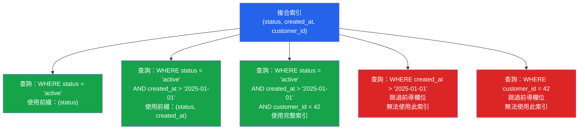

# [DEE-153] 複合索引

:::info
複合索引中的欄位順序MUST符合你的查詢模式。`(A, B, C)` 的複合索引可用於 `(A)`、`(A, B)` 或 `(A, B, C)` 的查詢——但無法用於僅查詢 `(B)`、`(C)` 或 `(B, C)` 的情況。
:::

## 背景

複合索引（又稱串聯索引或多欄位索引）是跨越多個欄位的單一 B-tree 索引。資料庫先按第一個欄位排序，然後在每個第一欄位值內按第二欄位排序，再按第三欄位排序，以此類推——就像電話簿先按姓氏排序、再按名字排序一樣。

這種排序行為產生了**最左前綴規則**：資料庫只有在查詢的 WHERE 子句包含索引欄位的連續前綴（從最左邊的欄位開始）時，才能使用複合索引。跳過前導欄位的查詢無法有效遍歷 B-tree，因為非前導欄位的資料分散在整個索引中。

PostgreSQL 支援最多 32 個欄位的複合 B-tree 索引。MySQL 支援最多 16 個欄位。在實務中，超過 3-4 個欄位的索引很少有實際效益——每增加一個欄位都會增加維護成本和儲存開銷，而需要 5 個以上欄位索引的查詢模式通常表示 schema 或查詢設計有問題。

複合索引中最關鍵的設計決策是**欄位順序**。相同的欄位組合以不同順序排列，會產生服務不同查詢的索引。要找到正確的順序，需要分析你的實際查詢模式，而非憑猜測。

## 原則

- 開發者MUST按照最左前綴規則，將複合索引欄位順序與查詢模式對齊。
- 開發者SHOULD將等值篩選欄位放在前面、範圍篩選欄位放在後面。
- 當查詢持續篩選相同的欄位組合時，開發者SHOULD優先使用單一複合索引，而非多個單欄位索引。
- 開發者MUST NOT假設資料庫能在查詢跳過前導欄位時有效使用複合索引。

## 視覺化



## 範例

### 欄位順序很重要

```sql
-- 索引 A：針對先篩選 status、再篩選日期範圍最佳化
CREATE INDEX idx_orders_status_date ON orders (status, created_at);

-- 索引 B：針對先篩選日期範圍、再篩選 status 最佳化
CREATE INDEX idx_orders_date_status ON orders (created_at, status);
```

```sql
-- 查詢 1：「一月份所有已出貨的訂單」
SELECT * FROM orders
 WHERE status = 'shipped'
   AND created_at >= '2025-01-01'
   AND created_at <  '2025-02-01';
-- 索引 A 最佳：等值篩選 status（縮小到一個分支），
-- 然後對 created_at 進行範圍掃描（連續的葉節點範圍）
-- 索引 B 可用但效率較低：先對 created_at 做範圍掃描
-- （較寬的掃描），再在每個葉節點內篩選 status

-- 查詢 2：「一月份所有訂單，不分狀態」
SELECT * FROM orders
 WHERE created_at >= '2025-01-01'
   AND created_at <  '2025-02-01';
-- 索引 B 最佳：前導欄位匹配
-- 索引 A 無法有效使用：前導欄位（status）缺失
```

### 等值優先、範圍在後

```sql
-- 查詢：依 status 和 customer 在日期範圍內查詢訂單
-- 等值欄位：status、customer_id
-- 範圍欄位：created_at

-- 好：等值欄位在前、範圍欄位在後
CREATE INDEX idx_orders_eq_range ON orders (status, customer_id, created_at);

-- 索引立即縮小到 (status = X, customer_id = Y)，
-- 然後在 created_at 上進行緊湊的範圍掃描。

-- 不好：範圍欄位在中間
CREATE INDEX idx_orders_bad ON orders (status, created_at, customer_id);

-- created_at 的範圍條件使 customer_id 無法作為索引導航使用
-- ——它變成了掃描後的篩選器。
```

### 單一複合索引 vs 多個單欄位索引

```sql
-- 情境：查詢總是篩選 (tenant_id, status)

-- 方法 A：兩個單欄位索引
CREATE INDEX idx_orders_tenant ON orders (tenant_id);
CREATE INDEX idx_orders_status ON orders (status);
-- 資料庫可能使用 "bitmap index scan" 來合併它們，
-- 但這比直接的複合索引查詢更慢。

-- 方法 B：一個複合索引（更好）
CREATE INDEX idx_orders_tenant_status ON orders (tenant_id, status);
-- 直接對兩個欄位進行 B-tree 遍歷。更快、更少 I/O。
-- 額外好處：此索引也能服務僅篩選 tenant_id 的查詢。
```

### 驗證索引使用情況

```sql
-- PostgreSQL：檢查使用了哪些索引
EXPLAIN ANALYZE
SELECT * FROM orders
 WHERE status = 'shipped'
   AND created_at >= '2025-01-01';

-- 尋找 "Index Scan using idx_orders_status_date"
-- 如果看到 "Seq Scan"，表示索引未被使用。

-- PostgreSQL：檢查未使用的索引
SELECT indexrelname, idx_scan
  FROM pg_stat_user_indexes
 WHERE schemaname = 'public'
 ORDER BY idx_scan ASC;
```

## 常見錯誤

1. **錯誤的欄位順序。** 最常見的複合索引錯誤。`(created_at, status)` 的索引無法幫助僅篩選 `status` 的查詢。分析你的實際查詢，讓最左前綴匹配最常見的篩選組合。

2. **在複合索引更適合時建立單欄位索引。** 如果你的查詢持續篩選 `(tenant_id, status)`，兩個獨立的單欄位索引不如一個複合索引。資料庫必須合併兩個獨立的索引查詢（bitmap scan），而非進行單次 B-tree 遍歷。對常見的多欄位篩選模式使用複合索引。

3. **忽略最左前綴規則。** `(A, B, C)` 的索引無法幫助僅篩選 `B` 或 `C` 的查詢。如果你也需要僅查詢 `B`，你需要一個獨立的 `(B)` 索引，或以 `B` 作為前導欄位的不同複合索引。

4. **將範圍欄位放在等值欄位之前。** 在複合索引中，一旦 B-tree 遇到範圍條件，後續所有欄位只能作為掃描後的篩選器，而非索引導航器。將等值篩選欄位放在前面（`=`、`IN`），範圍篩選欄位放在後面（`>`、`<`、`BETWEEN`）。

5. **建立冗餘的複合索引導致過度索引。** `(A, B)` 的索引已經涵蓋僅查詢 `(A)` 的情況。另外建立一個 `(A)` 的獨立索引是冗餘的，浪費空間和寫入效能。新增索引前先檢視現有索引。

## 相關 DEE

- [DEE-150](150.md) 索引與儲存總覽
- [DEE-151](151.md) B-Tree 索引——複合索引的底層結構
- [DEE-154](154.md) 部分與條件索引——結合複合索引與部分索引進行針對性索引
- [DEE-201](202.md) 讀懂執行計畫——驗證你的複合索引是否實際被使用

## 參考資料

- [PostgreSQL Documentation: Multicolumn Indexes](https://www.postgresql.org/docs/current/indexes-multicolumn.html) -- PostgreSQL 複合索引的官方指南
- [MySQL 8.4 Reference Manual: Multiple-Column Indexes](https://dev.mysql.com/doc/refman/8.4/en/multiple-column-indexes.html) -- MySQL 複合索引行為與最左前綴規則
- [Use The Index, Luke: Concatenated Keys](https://use-the-index-luke.com/sql/where-clause/the-equals-operator/concatenated-keys) -- 複合索引欄位順序的深入說明
- [Use The Index, Luke: Multi-Column Indexes](https://use-the-index-luke.com/sql/where-clause/searching-for-ranges/greater-less-between-and-டindex) -- 等值優先、範圍在後的策略
- [PostgreSQL Documentation: Combining Multiple Indexes](https://www.postgresql.org/docs/current/indexes-bitmap-scans.html) -- PostgreSQL 如何合併單欄位索引作為替代方案
