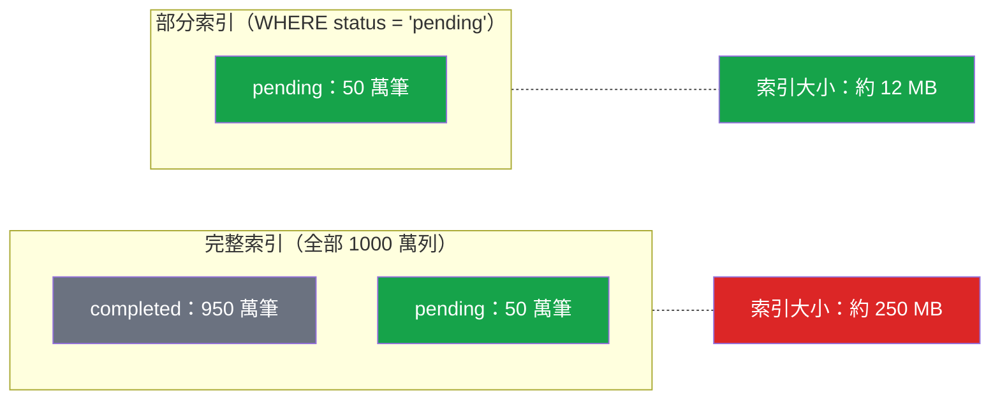

# [DEE-154] 部分與條件索引

:::info
部分索引僅對符合 WHERE 條件的資料列建立索引。當查詢持續篩選已知條件時，開發者SHOULD使用部分索引，以減少索引大小和維護成本，同時提升查詢效能。
:::

## 背景

標準索引涵蓋資料表中的每一列，無論該列是否會被查詢。對許多真實世界的存取模式來說，這是浪費的。假設一張訂單資料表有 1000 萬列，其中 95% 的 `status = 'completed'`，而查詢幾乎只針對那 5% 的 `status = 'pending'`。在 `status` 上建立完整的 B-tree 索引，會浪費空間和 I/O 在應用程式很少查詢的 950 萬列上。

部分索引透過僅包含在建立索引時指定的條件所符合的資料列來解決此問題。結果是一個更小的索引，掃描更快、寫入維護成本更低，且使用更少的磁碟空間。

PostgreSQL 自 7.2 版起便透過 `CREATE INDEX ... WHERE` 語法支援部分索引。這是一個成熟且經過良好最佳化的功能。

**MySQL 不支援部分索引。** MySQL 的 `CREATE INDEX` 沒有等效的 `WHERE` 子句。MySQL 開發者必須使用替代方案，例如以篩選欄位作為前導欄位的複合索引、產生欄位（generated column），或應用層策略。這是 PostgreSQL 與 MySQL 之間重要的索引能力差異之一。

## 原則

- 當查詢持續篩選穩定且已知的條件，且僅有一小部分資料列符合時，開發者SHOULD使用部分索引。
- 部分索引的條件MUST與查詢的 WHERE 子句匹配（或被其蘊含），最佳化器才能使用該索引。
- 開發者SHOULD NOT建立許多互不重疊的部分索引來替代資料表分區——應使用實際的資料表分區。
- 開發者MUST了解 MySQL 不支援部分索引，並據此規劃替代方案。

## 視覺化



部分索引小了 95%，因為它排除了查詢不會觸及的 950 萬筆已完成資料列。

## 範例

### 僅對活躍使用者建立索引

```sql
-- 完整索引：包含所有使用者，包括已停用的
CREATE INDEX idx_users_email_full ON users (email);

-- 部分索引：僅活躍使用者（小很多）
CREATE INDEX idx_users_email_active ON users (email)
 WHERE is_active = true;

-- 此查詢使用部分索引：
SELECT * FROM users WHERE email = 'alice@example.com' AND is_active = true;

-- 此查詢無法使用部分索引（沒有 is_active 篩選條件）：
SELECT * FROM users WHERE email = 'alice@example.com';
```

### 軟刪除的唯一約束

```sql
-- 問題：強制 email 唯一，但允許多個已刪除的使用者
-- 擁有相同的 email（軟刪除模式）

-- 普通的唯一索引會拒絕重複使用已刪除使用者的 email：
-- CREATE UNIQUE INDEX idx_users_email_unique ON users (email);  -- 太嚴格

-- 解決方案：僅對未刪除資料列建立唯一部分索引
CREATE UNIQUE INDEX idx_users_email_unique ON users (email)
 WHERE deleted_at IS NULL;

-- 活躍使用者 alice@example.com 存在：
INSERT INTO users (email, deleted_at) VALUES ('alice@example.com', NULL);
-- OK

-- 軟刪除該使用者：
UPDATE users SET deleted_at = NOW() WHERE email = 'alice@example.com';

-- 以相同 email 重新註冊：
INSERT INTO users (email, deleted_at) VALUES ('alice@example.com', NULL);
-- OK：舊資料列已設定 deleted_at，因此不在部分索引的範圍內
```

### 對近期訂單建立索引

```sql
-- 僅對最近 90 天的訂單建立索引，用於儀表板查詢
-- 注意：此處使用固定日期；你需要重新建立或使用函式
CREATE INDEX idx_orders_recent ON orders (customer_id, created_at)
 WHERE created_at >= '2025-01-01';

-- 使用此索引的查詢：
SELECT * FROM orders
 WHERE customer_id = 42
   AND created_at >= '2025-03-01';
-- 最佳化器認得 created_at >= '2025-03-01'
-- 蘊含 created_at >= '2025-01-01'
```

### MySQL 替代方案（不支援部分索引）

```sql
-- MySQL：沒有部分索引語法。替代方案：

-- 替代方案 1：以篩選欄位作為前導的複合索引
CREATE INDEX idx_orders_status_date ON orders (status, created_at);
-- 這有助於縮小到 status = 'pending'，但仍然索引所有資料列。

-- 替代方案 2：產生欄位 + 索引
ALTER TABLE orders
  ADD COLUMN is_pending TINYINT
  GENERATED ALWAYS AS (IF(status = 'pending', 1, NULL)) STORED;

CREATE INDEX idx_orders_pending ON orders (is_pending, created_at);
-- NULL 值在 MySQL 中不被索引，因此已完成的訂單被排除。
-- 這近似於部分索引的效果。
```

## 常見錯誤

1. **部分索引條件與查詢 WHERE 子句不匹配。** PostgreSQL 最佳化器只有在能證明查詢條件蘊含索引條件時才會使用部分索引。如果你的索引條件是 `WHERE status = 'pending'`，但查詢篩選的是 `WHERE status != 'completed'`，最佳化器可能不會認為這兩者等價。保持條件簡單，並在查詢中逐字匹配。

2. **使用參數化查詢使部分索引失效。** 具有參數如 `WHERE status = $1` 的預備語句無法使用條件為 `WHERE status = 'pending'` 的部分索引，因為規劃器在計畫階段不知道參數值。在查詢中使用明確的值，或重新組織以在計畫階段傳遞條件。

3. **過度使用部分索引。** 為每個狀態值（pending、processing、shipped、completed、cancelled）各建立一個部分索引，比建立一個 `(status, ...)` 的複合索引更差。許多互不重疊的部分索引會增加規劃器的開銷，因為 PostgreSQL 需要逐一評估。對此模式請使用資料表分區。

4. **忘記更新基於時間的條件。** 條件為 `WHERE created_at >= '2025-01-01'` 的部分索引不會自動隨時間推進。隨著資料老化，此索引會包含越來越多的資料列。要麼定期以更新的日期重建索引，要麼使用不同的方法（分區、複合索引）。

5. **假設 MySQL 有部分索引。** MySQL 不支援 `CREATE INDEX` 的 `WHERE` 子句。在 PostgreSQL 中可行的程式碼在 MySQL 中會失敗。如果需要跨資料庫相容性，請使用以篩選欄位作為前導的複合索引，或使用產生欄位搭配 NULL 來排除資料列。

## 相關 DEE

- [DEE-150](150.md) 索引與儲存總覽
- [DEE-151](151.md) B-Tree 索引——大多數部分索引的底層結構
- [DEE-153](153.md) 複合索引——通常是部分索引的替代方案

## 參考資料

- [PostgreSQL Documentation: Partial Indexes](https://www.postgresql.org/docs/current/indexes-partial.html) -- 建立和使用部分索引的官方指南
- [PostgreSQL Documentation: CREATE INDEX](https://www.postgresql.org/docs/current/sql-createindex.html) -- 包含 WHERE 子句的語法參考
- [MySQL 8.4 Reference Manual: CREATE INDEX Statement](https://dev.mysql.com/doc/refman/8.4/en/create-index.html) -- 注意缺少部分索引支援
- [Stonebraker, M. (1989). "The Case for Partial Indexes"](https://dl.acm.org/doi/10.1145/74120.74151) -- 提出部分索引概念的原始學術論文
