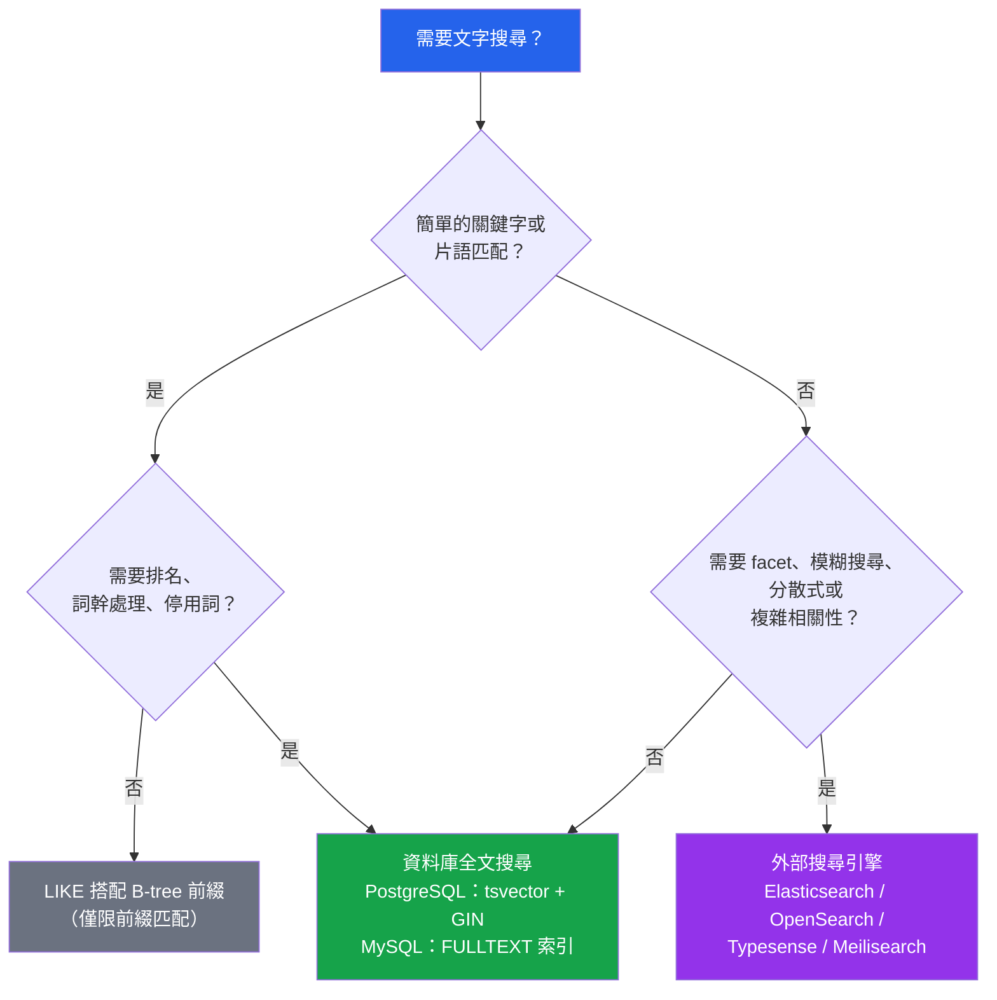

# [DEE-155] 全文搜尋索引

:::info
資料庫內建的全文搜尋足以應付許多搜尋需求。開發者SHOULD在引入 Elasticsearch 等外部搜尋引擎之前，先使用內建全文搜尋。只有當資料庫無法提供所需功能時，才升級到 Elasticsearch。
:::

## 背景

應用程式搜尋是一個光譜。一端是 `WHERE name LIKE '%search%'`，它對每次查詢進行全資料表掃描——無法使用索引、忽略字詞邊界、也不對結果排名。另一端是 Elasticsearch，提供分散式全文搜尋，包含相關性評分、facet 導航、模糊匹配、同義詞和水平擴展。在這兩個極端之間，資料庫原生全文搜尋提供了一個有能力的中間方案，消除了獨立搜尋叢集的維運複雜度。

### PostgreSQL 全文搜尋

PostgreSQL 提供了一套成熟的全文搜尋系統，基於兩種資料型別：`tsvector`（處理過的文件表示，儲存帶有位置資訊的詞素）和 `tsquery`（帶有布林運算子的搜尋查詢）。`@@` 運算子用於將 `tsquery` 與 `tsvector` 進行匹配。GIN（Generalized Inverted Index，通用倒排索引）是全文搜尋的建議索引類型——它建立一個倒排索引，將每個詞素對應到包含它的資料列，實現快速查詢。GiST 索引是替代方案，但有損（可能產生需要回堆重新驗證的假匹配），對純文字搜尋通常較慢。

### MySQL 全文搜尋

MySQL 在 InnoDB 和 MyISAM 儲存引擎中支援 `CHAR`、`VARCHAR` 和 `TEXT` 欄位的 `FULLTEXT` 索引。查詢使用 `MATCH ... AGAINST` 語法，有三種模式：自然語言模式（預設，按相關性排名）、布林模式（使用 `+`、`-`、`*` 等運算子）和查詢擴展模式（自動擴展搜尋詞）。MySQL 的全文搜尋比 PostgreSQL 更容易設定，但對文字處理的控制較少（沒有自訂字典、有限的詞幹處理設定）。

### 何時使用外部搜尋引擎

當你需要以下功能時，Elasticsearch（或 OpenSearch、Typesense、Meilisearch）就有其必要性：跨非常大型語料庫的分散式搜尋、使用自訂評分的複雜相關性調整、facet/聚合搜尋結果、超越基本詞幹處理的模糊匹配和容錯、文字資料的即時分析，或每個欄位使用不同分析器的多語言支援。

## 原則

- 開發者在引入外部搜尋引擎之前，SHOULD先對簡單的搜尋需求使用資料庫全文搜尋。
- 開發者MUST NOT對面向使用者的搜尋使用 `LIKE '%term%'`——它強制進行全資料表掃描、忽略語言處理，且無法按相關性排名結果。
- 開發者SHOULD為 PostgreSQL 全文搜尋使用 GIN 索引（而非 GiST），除非涵蓋索引或多類型欄位的需求更適合 GiST。
- 開發者SHOULD根據具體的功能需求來評估是否需要 Elasticsearch，而非基於對效能的假設。

## 視覺化



## 範例

### PostgreSQL：tsvector + GIN 索引

```sql
-- 新增 tsvector 欄位（也可以在查詢時即時計算，但預存更快）
ALTER TABLE articles ADD COLUMN search_vector tsvector;

-- 填充 tsvector 欄位
UPDATE articles
   SET search_vector = to_tsvector('english', coalesce(title, '') || ' ' || coalesce(body, ''));

-- 在 tsvector 欄位上建立 GIN 索引
CREATE INDEX idx_articles_search ON articles USING GIN (search_vector);

-- 透過觸發器保持欄位同步
CREATE FUNCTION articles_search_trigger() RETURNS trigger AS $$
BEGIN
  NEW.search_vector :=
    to_tsvector('english', coalesce(NEW.title, '') || ' ' || coalesce(NEW.body, ''));
  RETURN NEW;
END
$$ LANGUAGE plpgsql;

CREATE TRIGGER trg_articles_search
  BEFORE INSERT OR UPDATE ON articles
  FOR EACH ROW EXECUTE FUNCTION articles_search_trigger();

-- 搜尋並排名
SELECT title,
       ts_rank(search_vector, query) AS rank
  FROM articles,
       to_tsquery('english', 'database & indexing') AS query
 WHERE search_vector @@ query
 ORDER BY rank DESC
 LIMIT 20;
```

### MySQL：FULLTEXT 索引搭配 MATCH AGAINST

```sql
-- 建立 FULLTEXT 索引（InnoDB 或 MyISAM）
CREATE FULLTEXT INDEX idx_articles_ft ON articles (title, body);

-- 自然語言搜尋（預設，回傳相關性分數）
SELECT title,
       MATCH(title, body) AGAINST('database indexing') AS relevance
  FROM articles
 WHERE MATCH(title, body) AGAINST('database indexing')
 ORDER BY relevance DESC
 LIMIT 20;

-- 布林模式（運算子：+ 必須包含、- 必須排除、* 萬用字元）
SELECT title
  FROM articles
 WHERE MATCH(title, body) AGAINST('+database -nosql +index*' IN BOOLEAN MODE);

-- 查詢擴展（自動找出相關詞彙）
SELECT title
  FROM articles
 WHERE MATCH(title, body) AGAINST('database' WITH QUERY EXPANSION);
```

### 比較表

| 功能 | PostgreSQL FTS | MySQL FULLTEXT | Elasticsearch |
|------|---------------|----------------|---------------|
| **設定複雜度** | 中等（tsvector、觸發器） | 低（只需加 FULLTEXT 索引） | 高（獨立叢集） |
| **相關性排名** | `ts_rank`、`ts_rank_cd` | 內建相關性分數 | BM25、自訂評分 |
| **詞幹處理** | 是（可設定字典） | 基本（內建） | 是（每個欄位可設定分析器） |
| **停用詞** | 每個字典可設定 | 內建清單 | 每個分析器可設定 |
| **模糊/容錯** | 有限（pg_trgm 的 trigram） | 否 | 是（原生支援） |
| **布林運算子** | tsquery 中的 `&`、`\|`、`!` | `+`、`-`、`*`、`""` | 完整查詢 DSL |
| **Facet 搜尋** | 手動（GROUP BY） | 手動（GROUP BY） | 原生聚合 |
| **高亮顯示** | `ts_headline()` | 無內建支援 | 原生高亮 |
| **多語言** | 是（每個欄位可設定字典） | 基本（CJK 用 ngram） | 是（每個欄位） |
| **水平擴展** | 否（單節點） | 否（單節點） | 是（分散式） |
| **維運開銷** | 無（在資料庫內） | 無（在資料庫內） | 高（獨立基礎設施） |

## 常見錯誤

1. **使用 `LIKE '%term%'` 做搜尋。** 這會對每次查詢強制進行完整循序掃描。它無法使用任何索引（前導的 `%` 阻止了 B-tree 前綴匹配）。它不理解字詞邊界、詞幹處理或相關性。請改用適當的全文搜尋。

2. **不理解詞幹處理。** 全文搜尋引擎將字詞還原為詞幹：「running」、「runs」和「ran」都匹配詞幹「run」。開發者若期望精確的字串匹配，會對 `to_tsquery('english', 'runs')` 匹配包含「running」的文件感到驚訝。這是正確的行為——了解你的文字搜尋設定。

3. **忘記維護 tsvector 欄位。** 在 PostgreSQL 中，如果你儲存了預先計算的 `tsvector` 欄位但忘記加觸發器在 INSERT/UPDATE 時更新它，搜尋結果會變得過時。要麼使用觸發器（如上所示），要麼在查詢時計算 `to_tsvector()`（較慢但永遠是最新的）。

4. **過早引入 Elasticsearch。** Elasticsearch 需要獨立叢集、資料同步管線和維運監控。對幾百萬列的簡單關鍵字搜尋，資料庫全文搜尋可以零額外基礎設施處理負載。只有在你需要資料庫無法提供的功能（模糊匹配、facet、分散式搜尋）時才引入 Elasticsearch。

5. **忽略 MySQL FULLTEXT 的限制。** MySQL FULLTEXT 有最小字詞長度預設值（InnoDB 為 3 個字元，MyISAM 為 4 個字元），會靜默忽略過短的搜尋詞。它在自然語言模式下還有 50% 的閾值——出現在超過 50% 資料列中的字詞會被當作停用詞。這些預設值常讓開發者措手不及。檢查 `innodb_ft_min_token_size` 並了解頻率閾值。

## 相關 DEE

- [DEE-150](150.md) 索引與儲存總覽
- [DEE-151](151.md) B-Tree 索引——為何 B-tree 無法服務全文搜尋
- [DEE-154](154.md) 部分與條件索引——可與全文索引結合使用

## 參考資料

- [PostgreSQL Documentation: Full-Text Search](https://www.postgresql.org/docs/current/textsearch.html) -- PostgreSQL 全文搜尋的完整指南
- [PostgreSQL Documentation: Text Search Indexes (GIN, GiST)](https://www.postgresql.org/docs/current/textsearch-indexes.html) -- 文字搜尋索引類型比較
- [MySQL 8.4 Reference Manual: Full-Text Search Functions](https://dev.mysql.com/doc/refman/8.4/en/fulltext-search.html) -- MySQL FULLTEXT 語法與模式
- [MySQL 8.4 Reference Manual: InnoDB Full-Text Indexes](https://dev.mysql.com/doc/refman/8.4/en/innodb-fulltext-index.html) -- InnoDB 特定的全文搜尋細節
- [Elasticsearch: The Definitive Guide](https://www.elastic.co/guide/en/elasticsearch/reference/current/index.html) -- 何時及如何使用 Elasticsearch
