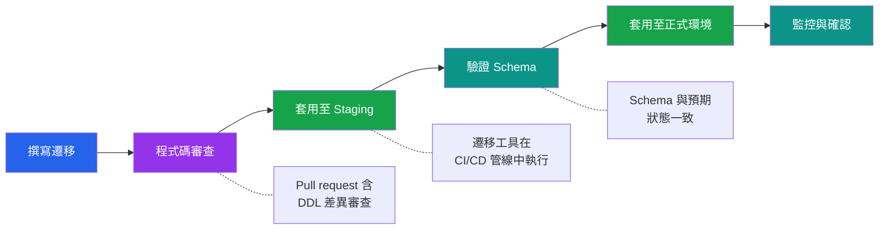

# [DEE-301] 遷移基礎

:::info
每一次 schema 變更都MUST以版本化、可審查的遷移檔案來記錄。直接在正式環境手動執行 DDL 是絕對不被允許的。
:::

## 背景脈絡

應用程式碼有版本控管、同儕審查，並透過管線進行部署。資料庫 schema 的變更理應獲得同等的嚴謹對待。缺乏版本控管的遷移，團隊將無法追蹤什麼被改了、何時改的、為什麼改。Schema 漂移——正式環境的 schema 與開發者預期不再一致——會導致部署失敗、資料損毀，以及數小時的除錯排查。

遷移工具透過將 schema 變更視為一系列有序的檔案來解決這個問題，每個檔案包含將 schema 從一個版本推進到下一個版本所需的 DDL。每個主要生態系都有成熟的遷移工具：JVM 專案使用 Flyway 和 Liquibase、Python/SQLAlchemy 使用 Alembic、Django 使用 Django Migrations、Rails 使用 ActiveRecord Migrations、Go 使用 golang-migrate。儘管語法和設計哲學不同，它們都共享相同的核心模型：一個按順序套用的編號變更腳本序列，追蹤於資料庫本身的中繼資料表中。

遷移的生命週期有四個階段：**撰寫**遷移檔案、像任何其他程式碼變更一樣進行**審查**、透過部署管線**套用**、以及**驗證** schema 是否符合預期。跳過任何階段——尤其是審查——都會招來正式環境事故。

## 原則

- 每一次 schema 變更都MUST以版本化的遷移檔案記錄，並提交至版本控管系統。
- 遷移MUST在合併前透過 pull request 進行審查，就像應用程式碼一樣。
- 團隊SHOULD使用遷移工具（Flyway、Alembic、Django Migrations、ActiveRecord、golang-migrate 或同等工具），而非自行撰寫自訂遷移基礎設施。
- 遷移MUST透過部署管線套用——絕不可在正式環境終端機中手動執行 SQL。
- 可逆的遷移SHOULD維護 Down（回退）遷移，但當回退具有破壞性或不切實際時（例如，刪除欄位後無法在沒有備份的情況下復原），團隊MAY省略。

## 視覺化



**關鍵洞察：** 遷移的生命週期與程式碼部署的生命週期如出一轍。每一次 schema 變更都經過撰寫、審查、套用至 staging 環境、驗證，然後推進到正式環境。

## 範例

### SQL 式遷移（Flyway 風格命名）

Flyway 使用 `V<版本>__<描述>.sql` 的命名慣例：

```
migrations/
  V1__create_users_table.sql
  V2__add_orders_table.sql
  V3__add_email_index_to_users.sql
  V4__add_shipping_address_to_orders.sql
```

典型的遷移檔案：

```sql
-- V3__add_email_index_to_users.sql
-- Up 遷移：在 users.email 上建立唯一索引

CREATE UNIQUE INDEX CONCURRENTLY idx_users_email ON users (email);
```

### ORM 產生的遷移（Django）

Django 從模型變更自動產生遷移檔案：

```python
# 0003_user_email_unique.py（由 Django 自動產生）
from django.db import migrations, models

class Migration(migrations.Migration):

    dependencies = [
        ('users', '0002_add_orders'),
    ]

    operations = [
        migrations.AddField(
            model_name='user',
            name='phone',
            field=models.CharField(max_length=20, null=True),
        ),
    ]
```

### ORM 產生的遷移（Alembic）

```python
# alembic/versions/a1b2c3d4_add_phone_to_users.py
"""add phone to users"""
revision = 'a1b2c3d4'
down_revision = '9e8f7a6b'

from alembic import op
import sqlalchemy as sa

def upgrade():
    op.add_column('users', sa.Column('phone', sa.String(20), nullable=True))

def downgrade():
    op.drop_column('users', 'phone')
```

### Up/Down 遷移模式

Up/Down 模式提供可逆性：

```sql
-- V5__add_status_to_orders.sql (UP)
ALTER TABLE orders ADD COLUMN status VARCHAR(20) DEFAULT 'pending';

-- V5__add_status_to_orders__down.sql (DOWN / UNDO)
ALTER TABLE orders DROP COLUMN status;
```

**何時值得維護 Down 遷移：**

| 情境 | 維護 Down 遷移？ | 理由 |
|------|-----------------|------|
| 新增可為 NULL 的欄位 | 是 | `DROP COLUMN` 很直接 |
| 建立索引 | 是 | `DROP INDEX` 是安全的 |
| 建立資料表 | 是 | 如果尚無資料，`DROP TABLE` 即可 |
| 刪除欄位 | 否 | 資料已遺失；沒有備份無法復原 |
| 資料轉換 | 否 | 原始資料可能無法恢復 |
| 新增 NOT NULL 約束 | 視情況 | 取決於之前是否存在 NULL 值 |

實務上，許多團隊會為了開發方便（重設本機資料庫）而維護 down 遷移，但不會在正式環境依賴它們。正式環境的回退更適合透過部署一個新的前進遷移來反轉變更。

## 常見錯誤

1. **在正式環境手動執行 DDL。** 直接在 psql 中執行 `ALTER TABLE` 會繞過版本控管、審查與遷移中繼資料表。下一次部署要不就失敗（遷移工具預期不同的 schema），要不就靜默地偏離預期狀態。每一次變更都必須透過遷移檔案進行。

2. **未經審查的遷移。** 自動產生的遷移（Django、Alembic）可能包含非預期的變更——刪除欄位、變更型別或重新排序操作。將遷移檔案視為正式環境程式碼：在 pull request 中審查、檢查產生的 SQL、驗證是否符合意圖。

3. **沒有回退計畫。** 部署遷移時若未考慮如何反轉，一旦出問題團隊就會陷入困境。對每一次遷移，都應記錄回退是否可行以及其方式——即使答案是「從備份還原」。

4. **將 schema 變更與資料變更混在一起。** 同時修改資料表結構並回填資料的遷移更難審查、執行更慢、回退風險更高。將結構性 DDL 與資料操作分開成不同的遷移檔案。

5. **未針對接近正式環境規模的資料測試遷移。** 在只有 100 筆資料的開發資料庫上瞬間完成的遷移，在有 5,000 萬筆資料的正式環境資料表上可能會鎖定數分鐘。在推進到正式環境之前，請針對實際資料量測試遷移的執行時間與鎖定行為。

6. **修改已套用的遷移。** 一旦遷移已套用至任何共享環境，其檔案就絕不可被修改。遷移工具會追蹤校驗碼；在套用後修改檔案會導致驗證失敗。如果需要修正，請建立新的遷移。

## 相關 DEE

- [DEE-300](300.md) 結構演進總覽
- [DEE-302](302.md) 向後相容的 Schema 變更——確保遷移不會破壞正在運行的程式碼
- [DEE-303](303.md) 零停機遷移——在遷移執行期間避免鎖定
- [DEE-305](305.md) Schema 版本管理——追蹤哪些遷移已被套用

## 參考資料

- [Flyway Documentation: Migrations](https://documentation.red-gate.com/flyway/flyway-concepts/migrations) -- Flyway 官方遷移概念與命名慣例
- [Liquibase Documentation: Concepts](https://docs.liquibase.com/concepts/home.html) -- Liquibase changelog 與 changeset 概念
- [Django Documentation: Migrations](https://docs.djangoproject.com/en/5.1/topics/migrations/) -- Django 內建遷移框架
- [Alembic Tutorial](https://alembic.sqlalchemy.org/en/latest/tutorial.html) -- SQLAlchemy 官方 Alembic 遷移教學
- [golang-migrate GitHub](https://github.com/golang-migrate/migrate) -- Go 的資料庫遷移工具
- [Rails Guides: Active Record Migrations](https://guides.rubyonrails.org/active_record_migrations.html) -- Rails 遷移慣例與最佳實踐
