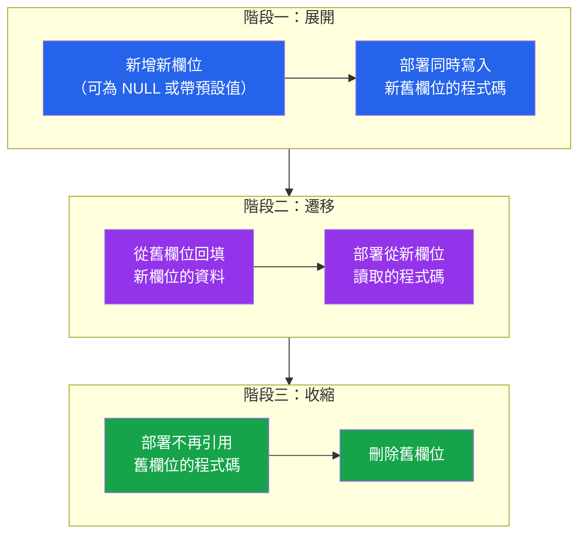

# [DEE-302] 向後相容的 Schema 變更

:::info
Schema 變更MUST與目前正在運行的應用程式版本向後相容。在滾動部署期間，新舊程式碼共存——一個破壞性的 schema 變更會讓舊版本的實例崩潰。
:::

## 背景脈絡

在持續部署的系統中，應用程式碼與資料庫 schema 不會在同一瞬間改變。在滾動部署期間，應用程式的舊版本（v1）與新版本（v2）同時運行，兩者都從同一個資料庫讀取與寫入。如果 schema 遷移移除了 v1 仍在讀取的欄位，v1 就會崩潰。如果遷移重新命名了某個欄位，v1 的查詢會出現「column not found」錯誤。

這個問題在任何資料庫由多個未同步升級的應用程式實例共享的系統中都是根本性的。Kubernetes 滾動部署、藍綠部署和金絲雀發布都會產生多個應用程式版本共存的窗口。

**展開與收縮**模式（也稱為**平行變更**）透過將每個破壞性變更分解為一系列向後相容的步驟來解決此問題。首先，**展開**（expand）schema——在舊結構旁邊新增新結構。然後，**遷移**應用程式碼以使用新結構，同時維持與兩者的相容性。最後，**收縮**（contract）schema——在沒有任何運行中程式碼引用舊結構後將其移除。

## 原則

- Schema 變更MUST與目前正在運行的應用程式版本向後相容。
- 破壞性變更MUST使用展開與收縮模式分解為一系列非破壞性步驟。
- 在所有引用某欄位或資料表的應用程式版本完全除役之前，**禁止**刪除該欄位或資料表。
- 開發者在撰寫遷移前，SHOULD將每個 DDL 操作分類為安全或不安全。

## 視覺化



**關鍵洞察：** 每個階段都是一次獨立的部署。在任何時刻，舊程式碼都不會崩潰，因為 schema 在過渡期間始終同時支援新舊應用程式版本。

## 範例

### 新增欄位（安全）

新增一個可為 NULL 且無預設值的欄位是安全的——舊程式碼只是忽略新欄位：

```sql
-- 遷移：安全、向後相容
ALTER TABLE users ADD COLUMN phone VARCHAR(20);
```

舊程式碼不會 `SELECT phone`，也不會 `INSERT` 該欄位，所以不會有任何問題。新程式碼可以立即開始讀寫該欄位。

### 重新命名欄位（不安全——使用展開與收縮）

在單一步驟中將 `users.name` 重新命名為 `users.full_name` 會破壞所有引用 `name` 的程式碼：

```sql
-- 不安全：立即破壞 v1 程式碼
ALTER TABLE users RENAME COLUMN name TO full_name;
```

**展開與收縮方法（3 次部署）：**

```sql
-- 部署 1：展開——新增新欄位、雙寫觸發器
ALTER TABLE users ADD COLUMN full_name VARCHAR(255);

-- 回填既有資料列
UPDATE users SET full_name = name WHERE full_name IS NULL;

-- 建立觸發器以保持欄位同步
CREATE OR REPLACE FUNCTION sync_user_name() RETURNS trigger AS $$
BEGIN
    IF NEW.full_name IS NULL THEN
        NEW.full_name := NEW.name;
    END IF;
    IF NEW.name IS NULL THEN
        NEW.name := NEW.full_name;
    END IF;
    RETURN NEW;
END;
$$ LANGUAGE plpgsql;

CREATE TRIGGER trg_sync_user_name
    BEFORE INSERT OR UPDATE ON users
    FOR EACH ROW EXECUTE FUNCTION sync_user_name();
```

```sql
-- 部署 2：遷移——新程式碼從 full_name 讀取
-- （應用程式碼變更，無需 DDL）
-- 當所有實例都升級到新程式碼版本後，繼續下一步。
```

```sql
-- 部署 3：收縮——移除舊欄位與觸發器
DROP TRIGGER trg_sync_user_name ON users;
DROP FUNCTION sync_user_name();
ALTER TABLE users DROP COLUMN name;
```

### 移除欄位（多步驟）

刪除 `users.middle_name`：

```sql
-- 步驟 1：部署不再讀取或寫入 middle_name 的程式碼
-- （僅應用程式碼變更——無遷移）

-- 步驟 2：在所有舊實例除役後，刪除欄位
ALTER TABLE users DROP COLUMN middle_name;
```

如果在步驟 1 之前就刪除欄位，任何仍在運行的舊實例都會崩潰，錯誤訊息為 `ERROR: column "middle_name" does not exist`。

## 安全與不安全操作

| 操作 | 安全？ | 備註 |
|------|--------|------|
| `ADD COLUMN`（可為 NULL、無預設值） | 安全 | 舊程式碼忽略新欄位 |
| `ADD COLUMN`（帶預設值，PG 11+） | 安全 | PostgreSQL 11+ 不會重寫資料表 |
| `ADD COLUMN ... NOT NULL`（無預設值） | 不安全 | 既有資料列有 NULL 時會失敗；舊版 PostgreSQL 會阻塞寫入 |
| `DROP COLUMN` | 不安全 | 破壞仍在引用該欄位的程式碼 |
| `RENAME COLUMN` | 不安全 | 破壞所有使用舊名稱的查詢 |
| `RENAME TABLE` | 不安全 | 破壞所有使用舊資料表名稱的查詢 |
| `ALTER COLUMN TYPE`（相容轉換） | 注意 | `VARCHAR(50)` 轉 `VARCHAR(100)` 安全；`VARCHAR` 轉 `INTEGER` 不安全 |
| `ALTER COLUMN TYPE`（不相容轉換） | 不安全 | 需要展開與收縮 |
| `ADD INDEX` | 安全 | 使用 `CONCURRENTLY` 避免鎖定（見 [DEE-303](303.md)） |
| `DROP INDEX` | 安全 | 查詢可能變慢但不會中斷 |
| `ADD FOREIGN KEY` | 注意 | 會驗證既有資料；使用 `NOT VALID` 然後另外執行 `VALIDATE CONSTRAINT` |
| `ADD CHECK CONSTRAINT` | 注意 | 使用 `NOT VALID` 然後分兩步驟執行 `VALIDATE CONSTRAINT` |
| `ADD NOT NULL`（對既有欄位） | 不安全 | 使用帶 `NOT VALID` 的 `CHECK` 約束，然後再驗證 |

## 常見錯誤

1. **在程式碼停止使用之前就刪除欄位。** 部署失敗最常見的原因。舊版應用程式查詢 `SELECT name FROM users`，遷移刪除了 `name`，每個舊實例都崩潰。務必先部署程式碼變更、等待完全上線，然後在後續版本中刪除欄位。

2. **新增 NOT NULL 而不帶預設值。** `ALTER TABLE users ADD COLUMN status VARCHAR(20) NOT NULL` 在資料表有既有資料列時會立即失敗（沒有值可填）。即使現在資料表是空的，在正式環境執行遷移時也可能已有資料。務必提供預設值，或先以可為 NULL 新增欄位。

3. **一步完成重新命名。** `RENAME COLUMN` 永遠不具向後相容性。使用展開與收縮模式：新增新欄位、雙寫、遷移讀取、然後刪除舊欄位。

4. **未確認相容性就變更欄位型別。** 將 `VARCHAR(50)` 擴展為 `VARCHAR(100)` 是安全的。但將 `VARCHAR` 改為 `INTEGER`、`TEXT` 改為 `JSONB`、或將 `VARCHAR(100)` 縮窄為 `VARCHAR(50)` 都可能在既有資料上失敗，或破壞預期舊型別的應用程式碼。

5. **假設遷移會在新程式碼之前執行。** 在某些部署策略中，新程式碼會在遷移完成前啟動。設計遷移時要確保無論執行順序如何都是安全的——新增可為 NULL 的欄位無論程式碼先部署還是後部署都是安全的。

6. **忘記清理展開後的 schema。** 展開階段會新增臨時欄位、觸發器或視圖。如果收縮階段從未執行，schema 會累積無用的重量。追蹤展開與收縮遷移，並排定收縮步驟的執行時程。

## 相關 DEE

- [DEE-300](300.md) 結構演進總覽
- [DEE-301](301.md) 遷移基礎——版本化遷移基礎
- [DEE-303](303.md) 零停機遷移——在 schema 變更期間避免鎖定
- [DEE-304](304.md) 資料回填策略——在展開後填充新欄位

## 參考資料

- [Martin Fowler: Parallel Change](https://martinfowler.com/bliki/ParallelChange.html) -- 展開與收縮模式的「平行變更」描述
- [Prisma Data Guide: Expand and Contract Pattern](https://www.prisma.io/dataguide/types/relational/expand-and-contract-pattern) -- 展開與收縮的實務操作指南
- [PlanetScale: Backward Compatible Database Changes](https://planetscale.com/blog/backward-compatible-databases-changes) -- 安全與不安全操作的分類
- [GoCardless: Zero-Downtime Postgres Migrations -- The Hard Parts](https://gocardless.com/blog/zero-downtime-postgres-migrations-the-hard-parts/) -- 向後相容變更的真實正式環境經驗
- [PostgreSQL Documentation: ALTER TABLE](https://www.postgresql.org/docs/current/sql-altertable.html) -- DDL 操作及其行為的官方參考
- [Xata: pgroll Expand and Contract](https://xata.io/blog/pgroll-expand-contract) -- PostgreSQL 自動化展開與收縮工具
