# [DEE-303] 零停機遷移

:::info
正式環境資料表上的遷移MUST避免長時間持有鎖定。一個鎖定資料表數分鐘的遷移，對於查詢該資料表的每個應用程式而言，與系統中斷無異。
:::

## 背景脈絡

當你在 PostgreSQL 資料表上執行 `ALTER TABLE` 或 `CREATE INDEX` 時，資料庫會取得一個鎖定。根據操作類型，這個鎖定可能阻塞所有讀寫（`ACCESS EXCLUSIVE`）或僅阻塞寫入（`SHARE` 鎖定）。在有數百萬筆資料的資料表上，操作本身可能需要數秒到數分鐘。在此期間，所有針對該資料表的查詢都排在鎖定之後等候，連線池被填滿，應用程式開始回傳錯誤或逾時。

MySQL 也有類似問題。雖然 MySQL 的線上 DDL（`ALGORITHM=INPLACE`）可以在不阻塞 DML 的情況下執行某些操作，但許多操作仍需要在準備和提交階段取得中繼資料鎖定來阻塞查詢。對於大型資料表，即使是「線上」路徑也可能持有鎖定足夠長的時間而導致逾時。

解決方案是使用非阻塞遷移技術：PostgreSQL 的 `CREATE INDEX CONCURRENTLY`、MySQL 的 `ALGORITHM=INPLACE` 或外部工具如 gh-ost 和 pt-online-schema-change，以及謹慎構造 `ALTER TABLE` 語句以最小化鎖定持續時間。

## 原則

- 正式環境資料表上的遷移MUST避免長時間持有排他鎖定。
- PostgreSQL 上的索引建立MUST使用 `CREATE INDEX CONCURRENTLY` 而非一般的 `CREATE INDEX`。
- 大型 MySQL schema 變更SHOULD使用 gh-ost、pt-online-schema-change 或經驗證鎖定行為的原生線上 DDL。
- 開發者在部署前MUST針對正式環境規模的資料測試遷移的持續時間與鎖定行為。
- 長時間運行的遷移SHOULD設定 `lock_timeout` 以快速失敗，而非阻塞整個應用程式。

## 視覺化

```mermaid
flowchart TD
    subgraph Blocking["阻塞式遷移"]
        B1["BEGIN"] --> B2["ALTER TABLE<br/>（ACCESS EXCLUSIVE 鎖定）"]
        B2 --> B3["資料表在操作期間<br/>被鎖定"]
        B3 --> B4["所有查詢排隊等候"]
        B4 --> B5["COMMIT<br/>（釋放鎖定）"]
    end

    subgraph NonBlocking["非阻塞式遷移"]
        N1["CREATE INDEX<br/>CONCURRENTLY"] --> N2["階段一：快照<br/>（短暫鎖定）"]
        N2 --> N3["階段二：建立索引<br/>（無鎖定，讀寫正常）"]
        N3 --> N4["階段三：驗證<br/>（短暫鎖定）"]
        N4 --> N5["索引就緒"]
    end

    style B2 fill:#dc2626,color:#fff
    style B3 fill:#dc2626,color:#fff
    style B4 fill:#dc2626,color:#fff
    style N1 fill:#16a34a,color:#fff
    style N2 fill:#2563eb,color:#fff
    style N3 fill:#16a34a,color:#fff
    style N4 fill:#2563eb,color:#fff
    style N5 fill:#16a34a,color:#fff
```



**左側：** 阻塞式 `ALTER TABLE` 在整個操作期間持有排他鎖定。所有並行查詢都在等待。**右側：** `CREATE INDEX CONCURRENTLY` 僅在開始和結束時短暫取得鎖定，允許在建立過程中正常操作。

## 範例

### PostgreSQL：CREATE INDEX CONCURRENTLY

```sql
-- 錯誤：在索引建立期間阻塞所有寫入
CREATE INDEX idx_orders_customer ON orders (customer_id);

-- 正確：建立索引而不阻塞寫入
CREATE INDEX CONCURRENTLY idx_orders_customer ON orders (customer_id);
```

重要注意事項：
- `CONCURRENTLY` 不能在交易區塊中執行。如果你的遷移工具會將遷移包在 `BEGIN ... COMMIT` 中，你必須設定讓此遷移在交易外執行。
- 如果並行建立中途失敗，會留下一個 `INVALID` 索引。使用 `SELECT * FROM pg_indexes WHERE indexdef LIKE '%INVALID%'` 檢查，並在重試前將其刪除。

### PostgreSQL：帶 Lock Timeout 的 ALTER TABLE

```sql
-- 設定短暫的鎖定逾時，讓遷移快速失敗
-- 而非阻塞應用程式
SET lock_timeout = '5s';

ALTER TABLE orders ADD COLUMN shipped_at TIMESTAMPTZ;

-- 重設逾時
RESET lock_timeout;
```

如果另一個交易持有衝突的鎖定，`ALTER TABLE` 會在 5 秒後失敗而非無限等待。在較空閒的時段重試即可。

### 將高風險遷移拆分為安全步驟

在既有欄位上新增帶預設值的 `NOT NULL` 約束：

```sql
-- 步驟 1：以可為 NULL 新增欄位（瞬間完成，短暫鎖定）
ALTER TABLE orders ADD COLUMN priority INTEGER;

-- 步驟 2：分批回填既有資料列（無 DDL 鎖定）
-- 參見 DEE-304 的批次回填技巧
UPDATE orders SET priority = 0 WHERE priority IS NULL AND id BETWEEN 1 AND 10000;
UPDATE orders SET priority = 0 WHERE priority IS NULL AND id BETWEEN 10001 AND 20000;
-- ... 繼續分批

-- 步驟 3：使用 CHECK 約束新增 NOT NULL（避免全表掃描鎖定）
ALTER TABLE orders ADD CONSTRAINT orders_priority_not_null
    CHECK (priority IS NOT NULL) NOT VALID;

-- 步驟 4：驗證約束（取得 SHARE UPDATE EXCLUSIVE 鎖定，而非 ACCESS EXCLUSIVE）
ALTER TABLE orders VALIDATE CONSTRAINT orders_priority_not_null;

-- 步驟 5（選擇性）：轉換為正式的 NOT NULL
-- 在 PostgreSQL 12+ 中，如果已存在有效的 CHECK (col IS NOT NULL)，
-- SET NOT NULL 不會重新掃描資料表
ALTER TABLE orders ALTER COLUMN priority SET NOT NULL;
ALTER TABLE orders DROP CONSTRAINT orders_priority_not_null;
```

### 工具比較：MySQL 線上 Schema 變更

| 特性 | 原生線上 DDL | pt-online-schema-change | gh-ost |
|------|-------------|------------------------|--------|
| **機制** | 原地重建 | 影子表 + 觸發器 | 影子表 + binlog 追蹤 |
| **寫入阻塞** | 開始/結束時短暫鎖定 | 極小（觸發器開銷） | 極小（無觸發器） |
| **節流** | 無 | 基於 replica lag | 基於 replica lag、負載、手動 |
| **可暫停** | 否 | 否 | 是——真正暫停，零寫入 |
| **外鍵** | 支援 | 支援 | 不支援 |
| **需求** | MySQL 5.6+ | Percona Toolkit | Row-based replication |
| **切換** | 自動 | 原子性 `RENAME TABLE` | 手動、可稽核 |
| **最適合** | 簡單操作 | 通用、有外鍵的資料表 | 高寫入量、大型資料表 |

**建議：** 對於 PostgreSQL，使用原生功能（`CONCURRENTLY`、`NOT VALID`、`lock_timeout`）。對於 MySQL，簡單操作從原生線上 DDL 開始；大型資料表或原生 DDL 無法在不阻塞的情況下處理的操作，使用 pt-online-schema-change 或 gh-ost。

## 常見錯誤

1. **忘記使用 CONCURRENTLY。** 在有 1 億筆資料的 PostgreSQL 資料表上執行一般的 `CREATE INDEX` 會取得 `SHARE` 鎖定，在整個建立期間阻塞所有寫入——可能長達數分鐘。正式環境務必使用 `CREATE INDEX CONCURRENTLY`。設定遷移檢查工具或 CI 檢查來標記非並行的索引建立。

2. **長時間運行的交易阻塞 DDL。** 即使非阻塞的 DDL 語句也需要短暫的 `ACCESS EXCLUSIVE` 鎖定。如果另一個交易已經運行了數小時（一個開啟的 `psql` 連線、一個忘記 `COMMIT` 的 `BEGIN`），DDL 會等待該交易結束。同時，新查詢堆積在 DDL 之後。在執行遷移前監控長時間運行的交易。

3. **未測試遷移持續時間。** 在有 1,000 筆資料的開發資料庫上需要 50 毫秒的遷移，在有 5,000 萬筆資料的正式環境資料表上可能需要 10 分鐘。務必針對正式環境規模的資料進行測試——無論是還原的備份或有實際資料量的 staging 環境。

4. **在單一交易中執行多個 DDL 操作。** 將多個 `ALTER TABLE` 語句合併在單一交易中，會在合併的持續時間內持有排他鎖定。將它們拆分成個別的遷移，讓每個鎖定窗口盡可能短。

5. **未設定 lock_timeout。** 沒有 `lock_timeout` 的 `ALTER TABLE` 會無限期等待衝突的鎖定。如果一個長時間運行的查詢持有鎖定，遷移就被阻塞，後續的每個查詢都會堆積起來。設定 `lock_timeout` 為幾秒，讓遷移快速失敗並可重試。

6. **忽略失敗的並行索引建立。** 如果 `CREATE INDEX CONCURRENTLY` 失敗（由於唯一性違反或取消），它會留下一個 `INVALID` 索引。這個索引佔用空間並拖慢寫入，但永遠不會被查詢使用。在失敗的建立後，務必檢查並清理無效的索引。

## 相關 DEE

- [DEE-300](300.md) 結構演進總覽
- [DEE-301](301.md) 遷移基礎——遷移的生命週期
- [DEE-302](302.md) 向後相容的 Schema 變更——確保 schema 變更不會破壞正在運行的程式碼
- [DEE-304](304.md) 資料回填策略——分批更新以避免鎖定競爭

## 參考資料

- [PostgreSQL Documentation: CREATE INDEX (CONCURRENTLY)](https://www.postgresql.org/docs/current/sql-createindex.html#SQL-CREATEINDEX-CONCURRENTLY) -- 並行索引建立的官方參考
- [PostgreSQL Documentation: Explicit Locking](https://www.postgresql.org/docs/current/explicit-locking.html) -- 鎖定類型及其互動
- [MySQL Documentation: Online DDL Operations](https://dev.mysql.com/doc/refman/8.4/en/innodb-online-ddl-operations.html) -- MySQL 可原地執行的 ALTER TABLE 操作
- [GitHub: gh-ost](https://github.com/github/gh-ost) -- GitHub 的 MySQL 無觸發器線上 schema 遷移工具
- [Percona: pt-online-schema-change](https://docs.percona.com/percona-toolkit/pt-online-schema-change.html) -- Percona 基於觸發器的線上 schema 變更工具
- [Bytebase: gh-ost vs pt-online-schema-change](https://www.bytebase.com/blog/gh-ost-vs-pt-online-schema-change/) -- MySQL 線上遷移工具的詳細比較
- [GoCardless: Zero-Downtime Postgres Migrations -- The Hard Parts](https://gocardless.com/blog/zero-downtime-postgres-migrations-the-hard-parts/) -- 實際正式環境經驗
