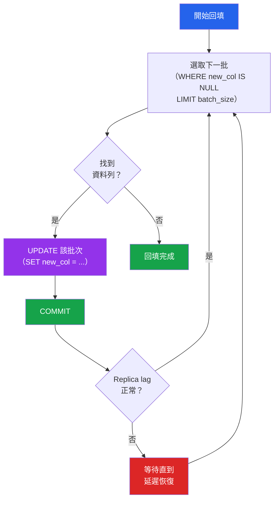

# [DEE-304] 資料回填策略

:::info
回填MUST分批執行以避免鎖定整張資料表。對數百萬筆資料執行單一 `UPDATE ... SET column = value` 會持有鎖定、產生大量 WAL/binlog 流量，並可能拖垮複寫。
:::

## 背景脈絡

當你新增欄位或變更資料格式時，既有的資料列需要填入新的值。這就是回填——將資料寫入在 schema 變更之前就已建立的資料列。

最天真的做法是一條 `UPDATE` 語句：`UPDATE users SET full_name = name`。在有 1,000 萬筆資料的資料表上，這會取得每一列的列級鎖定、產生數 GB 的 WAL（PostgreSQL）或 binlog（MySQL）條目、因死元組導致資料表膨脹，並可能讓 replica lag 從數秒飆升到數小時。如果語句在執行中途失敗，所有進度都會遺失，必須從頭重新開始整個操作。

分批回填透過以小批次處理資料列——通常每批 1,000 至 10,000 列——並在批次之間短暫暫停來解決這些問題。每個批次是一個獨立的交易，只鎖定一小部分資料列，產生可管理的 WAL 量，且如果失敗可以獨立重試。

## 原則

- 回填MUST分批處理，每個交易處理有限數量的資料列。
- 每個批次SHOULD是獨立且冪等的交易，使得失敗時不會遺失先前的進度。
- 回填任務SHOULD監控複寫延遲，並在延遲超過安全閾值時進行節流或暫停。
- 回填**禁止**在與 DDL 變更相同的交易中執行——將 schema 遷移與資料遷移分開。
- 進度SHOULD被追蹤，使得失敗或中斷的回填可以從停止處繼續。

## 視覺化



**關鍵洞察：** 每個批次是一個獨立的交易。在批次之間，任務會檢查複寫延遲，如有需要就暫停。如果任務崩潰，它會從第一筆 `new_col IS NULL` 的資料列繼續。

## 範例

### 以主鍵範圍進行批次 UPDATE

使用主鍵進行分批可以避免 `LIMIT/OFFSET` 的效能陷阱：

```sql
-- 找出範圍
SELECT MIN(id), MAX(id) FROM users;
-- min: 1, max: 10,000,000

-- 以每批 5,000 筆處理
UPDATE users
SET full_name = first_name || ' ' || last_name
WHERE id BETWEEN 1 AND 5000
  AND full_name IS NULL;

UPDATE users
SET full_name = first_name || ' ' || last_name
WHERE id BETWEEN 5001 AND 10000
  AND full_name IS NULL;

-- ... 以 5,000 的增量繼續
```

### 基於游標的批次腳本（PostgreSQL）

```sql
DO $$
DECLARE
    batch_size INT := 5000;
    current_id BIGINT := 0;
    max_id BIGINT;
    rows_updated INT;
BEGIN
    SELECT MAX(id) INTO max_id FROM users;

    WHILE current_id < max_id LOOP
        UPDATE users
        SET full_name = first_name || ' ' || last_name
        WHERE id > current_id
          AND id <= current_id + batch_size
          AND full_name IS NULL;

        GET DIAGNOSTICS rows_updated = ROW_COUNT;
        RAISE NOTICE 'Updated % rows (id range % to %)',
            rows_updated, current_id + 1, current_id + batch_size;

        current_id := current_id + batch_size;
        COMMIT;

        -- 短暫暫停以降低負載
        PERFORM pg_sleep(0.1);
    END LOOP;
END $$;
```

### 背景工作者方法（應用程式碼）

對於正式環境的回填，應用程式層級的工作者提供更好的控制：

```python
# Python 範例，使用 SQLAlchemy
import time
from sqlalchemy import text

BATCH_SIZE = 5000
SLEEP_BETWEEN_BATCHES = 0.5  # 秒
MAX_REPLICA_LAG_SECONDS = 5

def get_replica_lag(session):
    """檢查複寫延遲（PostgreSQL 範例）。"""
    result = session.execute(text(
        "SELECT EXTRACT(EPOCH FROM (now() - pg_last_xact_replay_timestamp()))"
    )).scalar()
    return result or 0

def backfill_full_name(session):
    """從 first_name + last_name 回填 users.full_name。"""
    total_updated = 0
    last_id = 0

    while True:
        # 等待 replica lag 恢復
        while get_replica_lag(session) > MAX_REPLICA_LAG_SECONDS:
            print(f"Replica lag 過高，休眠中...")
            time.sleep(5)

        # 處理一個批次
        result = session.execute(text("""
            UPDATE users
            SET full_name = first_name || ' ' || last_name
            WHERE id > :last_id
              AND full_name IS NULL
            ORDER BY id
            LIMIT :batch_size
            RETURNING id
        """), {"last_id": last_id, "batch_size": BATCH_SIZE})

        rows = result.fetchall()
        if not rows:
            break  # 沒有更多資料列需要更新

        session.commit()
        last_id = rows[-1][0]
        total_updated += len(rows)
        print(f"已更新 {total_updated} 筆資料列（last_id={last_id}）")

        time.sleep(SLEEP_BETWEEN_BATCHES)

    print(f"回填完成：共更新 {total_updated} 筆資料列")
```

### 資料格式變更的雙寫模式

當變更資料儲存方式時（例如，將 `name` 拆分為 `first_name` 和 `last_name`），雙寫模式可確保在轉換期間不會遺失任何資料：

```
時間軸：
  1. 新增新欄位（first_name, last_name）——可為 NULL
  2. 部署同時寫入舊（name）和新（first_name, last_name）的程式碼
  3. 執行回填：從 name 為舊資料列填充 first_name/last_name
  4. 部署從新欄位讀取的程式碼
  5. 部署停止寫入舊欄位的程式碼
  6. 刪除舊欄位（name）
```

```sql
-- 步驟 1：展開
ALTER TABLE users ADD COLUMN first_name VARCHAR(100);
ALTER TABLE users ADD COLUMN last_name VARCHAR(100);

-- 步驟 3：回填（分批）
UPDATE users
SET first_name = split_part(name, ' ', 1),
    last_name  = split_part(name, ' ', 2)
WHERE first_name IS NULL
  AND id BETWEEN 1 AND 5000;
-- ... 分批重複
```

在步驟 2-5 期間，應用程式同時寫入 `name` 和 `first_name`/`last_name`，確保在回填窗口期間建立的資料列兩種格式都有填入。

## 常見錯誤

1. **對數百萬筆資料執行未分批的 UPDATE。** 在有 1,000 萬筆資料的資料表上執行 `UPDATE users SET status = 'active'` 會在單一交易中取得 1,000 萬個列鎖定、產生數 GB 的 WAL，且操作可能執行數分鐘到數小時，同時阻塞其他交易。務必分批。

2. **沒有進度追蹤。** 如果回填在第 500 萬筆（共 1,000 萬筆）時崩潰，且無法得知停在哪裡，整個操作必須從頭開始——工作量和風險都翻倍。使用主鍵游標或獨立的進度表來追蹤進度。

3. **未處理回填中途的失敗。** 每個批次應該是冪等的：如果批次被重試（例如，由於死結或逾時），應產生相同的結果。使用 `WHERE new_col IS NULL` 或等效的條件，使已更新的資料列在重試時被跳過。

4. **忽略複寫延遲。** 持續的回填產生大量寫入流量，可能導致 replica 落後數小時。如果應用程式從 replica 讀取，使用者會看到過時的資料。在批次之間監控延遲，超過閾值（通常 5-10 秒）時暫停。

5. **使用 LIMIT/OFFSET 進行分批。** `OFFSET 5000000 LIMIT 5000` 需要資料庫掃描並跳過 500 萬筆資料才能回傳 5,000 筆。隨著偏移量增加，每個批次變得越來越慢。改用主鍵範圍（`WHERE id > last_processed_id ORDER BY id LIMIT 5000`）。

6. **在尖峰流量期間執行回填。** 即使分批回填也會增加寫入負載。將大型回填排程在離峰時段，或在高流量期間設定激進的節流（批次間更長的休眠時間、更小的批次大小）。

## 相關 DEE

- [DEE-300](300.md) 結構演進總覽
- [DEE-302](302.md) 向後相容的 Schema 變更——觸發回填的展開與收縮模式
- [DEE-303](303.md) 零停機遷移——在 schema 變更期間避免鎖定
- [DEE-305](305.md) Schema 版本管理——追蹤遷移狀態

## 參考資料

- [GitLab: Batched Background Migrations](https://docs.gitlab.com/ee/development/database/batched_background_migrations.html) -- GitLab 大規模資料回填的框架
- [Carwow Engineering: Backfilling 50 Million Records](https://medium.com/carwow-product-engineering/backfilling-50-million-records-quickly-eaa04ba5617f) -- 真實的大規模回填案例
- [Fly.io: Backfilling Data](https://fly.io/phoenix-files/backfilling-data/) -- 實用的批次回填模式
- [InfoQ: Shadow Table Strategy for Data Migrations](https://www.infoq.com/articles/shadow-table-strategy-data-migration/) -- 大型遷移的影子表方法
- [PostgreSQL Documentation: UPDATE](https://www.postgresql.org/docs/current/sql-update.html) -- 官方 UPDATE 參考，包含 RETURNING 子句
- [TigerData: Low-Downtime Migrations with Dual-Write](https://www.tigerdata.com/docs/migrate/latest/dual-write-and-backfill) -- 雙寫與回填模式文件
