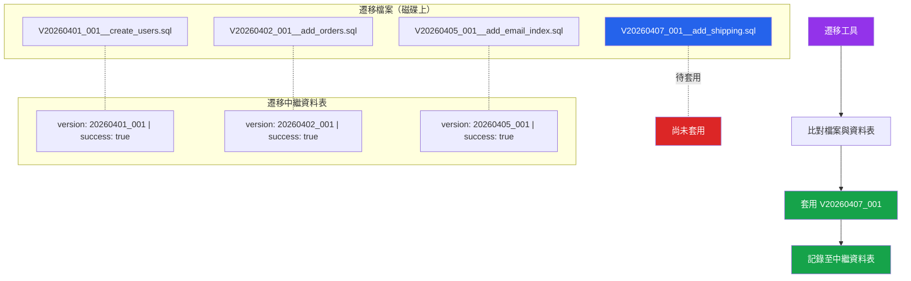

# [DEE-305] Schema 版本管理

:::info
Schema 版本SHOULD在資料庫本身中被追蹤。遷移中繼資料表記錄了哪些遷移已被套用、以什麼順序、以及是否成功。
:::

## 背景脈絡

當遷移工具執行時，它需要回答一個問題：哪些遷移已經被套用了？如果沒有可靠的答案，工具可能會跳過遷移（導致 schema 不完整）或重新套用遷移（導致錯誤或資料損毀）。

每個成熟的遷移工具都透過在資料庫中維護一張中繼資料表來解決這個問題：

| 工具 | 表名 | 關鍵欄位 |
|------|------|----------|
| Flyway | `flyway_schema_history` | `installed_rank`、`version`、`checksum`、`success` |
| Liquibase | `databasechangelog` | `id`、`author`、`filename`、`orderexecuted` |
| Alembic | `alembic_version` | `version_num` |
| Django | `django_migrations` | `app`、`name`、`applied` |
| ActiveRecord | `schema_migrations` | `version` |
| golang-migrate | `schema_migrations` | `version`、`dirty` |

這張表是唯一的事實來源。工具會比對磁碟上的遷移檔案清單與中繼資料表中的條目，以判斷哪些遷移尚待執行。如果某個遷移被記錄為已套用，就會被跳過。如果某個遷移檔案存在但沒有對應的記錄，它就是下一個要套用的遷移。

除了中繼資料表之外，團隊還必須決定遷移檔案的命名策略。兩種主流方式是**連續編號**（V1、V2、V3）和**基於時間戳的命名**（20260407120000）。每種方式都有取捨，特別是當多位開發者在不同分支上同時引入遷移時。

## 原則

- Schema 版本SHOULD使用遷移工具管理的遷移中繼資料表在資料庫本身中被追蹤。
- 團隊**禁止**手動編輯遷移中繼資料表——它專屬於遷移工具管理。
- 遷移檔案SHOULD使用基於時間戳的命名，以減少多個分支同時引入遷移時的衝突。
- 失敗的遷移MUST被記錄，以便團隊能夠診斷和修復問題，而非靜默地重試。
- 團隊SHOULD在啟動時驗證遷移校驗碼，以偵測對已套用遷移檔案的未授權修改。

## 視覺化



**關鍵洞察：** 遷移工具比對磁碟上的檔案與中繼資料表。只有沒有對應「success」記錄的遷移會被套用。成功套用後，會插入一筆新記錄。

## 範例

### 遷移中繼資料表 Schema（Flyway 風格）

```sql
CREATE TABLE flyway_schema_history (
    installed_rank  INTEGER     NOT NULL PRIMARY KEY,
    version         VARCHAR(50),
    description     VARCHAR(200) NOT NULL,
    type            VARCHAR(20)  NOT NULL,  -- 'SQL', 'JDBC', 'BASELINE'
    script          VARCHAR(1000) NOT NULL,
    checksum        INTEGER,
    installed_by    VARCHAR(100) NOT NULL,
    installed_on    TIMESTAMP    NOT NULL DEFAULT now(),
    execution_time  INTEGER      NOT NULL,  -- 毫秒
    success         BOOLEAN      NOT NULL
);

CREATE INDEX idx_flyway_history_success
    ON flyway_schema_history (success);
```

執行遷移後：

```
installed_rank | version      | description          | checksum   | success
1              | 1            | create_users         | -817269334 | true
2              | 2            | add_orders           |  491823745 | true
3              | 3            | add_email_index      | -112938475 | true
4              | 4            | add_shipping         |  738291045 | false   <-- 失敗
```

`success = false` 的資料列告訴團隊遷移 V4 曾嘗試執行但失敗了。工具不會繼續執行超過此版本的遷移，直到問題被解決。

### 連續編號 vs 基於時間戳的命名

**連續編號：**
```
V1__create_users.sql
V2__add_orders.sql
V3__add_email_index.sql
```

**基於時間戳：**
```
V20260401120000__create_users.sql
V20260402093000__add_orders.sql
V20260405141500__add_email_index.sql
```

| 面向 | 連續編號 | 基於時間戳 |
|------|----------|-----------|
| 可讀性 | 排序清晰（V1、V2、V3） | 較難閱讀，但包含建立日期 |
| 分支衝突 | 高——兩位開發者都建立 V4 | 低——時間戳很少碰撞 |
| 合併解決 | 需手動重新編號 | 通常自動解決 |
| 工具支援 | 所有工具 | 所有工具（視為版本字串） |

**建議：** 有多個活躍分支的團隊使用基於時間戳的命名。單人開發者或嚴格 trunk-based 工作流程的專案使用連續編號。

### 處理來自不同分支的並行遷移

考慮兩個功能分支都新增了遷移：

```
main:      V1 -- V2 -- V3
                      \
branch-A:              V20260407_A__add_phone.sql
                      \
branch-B:              V20260407_B__add_avatar.sql
```

使用基於時間戳的命名，兩個遷移有唯一的版本識別碼，可以在不發生衝突的情況下合併。遷移工具按版本順序套用：

```
V20260407_A__add_phone.sql   （依字母順序先套用）
V20260407_B__add_avatar.sql  （第二個套用）
```

使用連續編號（兩個分支都建立 V4），合併時會發生衝突，必須手動重新編號其中一個遷移。

### 鎖定以防止並行執行

大多數遷移工具使用鎖定來防止兩個應用程式實例同時執行遷移：

```sql
-- Liquibase 使用獨立的鎖定表
CREATE TABLE databasechangeloglock (
    id          INTEGER     NOT NULL PRIMARY KEY,
    locked      BOOLEAN     NOT NULL,
    lockgranted TIMESTAMP,
    lockedby    VARCHAR(255)
);

-- Flyway 使用 advisory lock 或表級鎖定
-- 以防止並行遷移執行
SELECT pg_advisory_lock(123456789);
-- ... 執行遷移 ...
SELECT pg_advisory_unlock(123456789);
```

這可以防止兩個同時啟動的應用程式實例都嘗試套用相同的待執行遷移的競態條件。

## 常見錯誤

1. **分支中的遷移順序衝突。** 兩位開發者在不同分支上都建立了遷移 V4。當兩個分支都合併到 main 時，工具看到兩個 V4 檔案就會失敗。使用基於時間戳的命名或分支感知的命名慣例來防止碰撞。

2. **版本序列中的間隙。** 某些工具（特別是嚴格模式的 Flyway）會拒絕有間隙的遷移——例如 V1、V2、V5（缺少 V3 和 V4）。這發生在一個帶有 V3 和 V4 的分支在另一個分支建立 V5 後被放棄。設定工具的間隙處理（Flyway 的 `ignoreMissingMigrations`）或使用能避免此問題的命名策略。

3. **不記錄失敗的遷移。** 如果遷移失敗但沒有寫入記錄，工具會在下次啟動時重試——可能在部分修改的 schema 上執行。像 Flyway 這樣的工具會記錄失敗（`success = false`），以便團隊必須明確解決問題。確保你的工具被設定為記錄失敗。

4. **手動編輯中繼資料表。** 在遷移中繼資料表中插入、更新或刪除資料列來「修復」問題是危險的。這會使資料表與實際 schema 狀態不同步。如果需要修復，使用遷移工具的修復命令（`flyway repair`、`alembic stamp`）。

5. **不驗證校驗碼。** 如果有人修改了已套用的遷移檔案，中繼資料表中儲存的校驗碼就不再匹配。如果不進行校驗碼驗證，這會被忽略，實際 schema 會與遷移檔案描述的不一致。啟用校驗碼驗證（在 Flyway 和 Liquibase 中預設開啟）。

6. **在某些環境中跳過遷移執行。** 如果 staging 執行遷移但正式環境跳過（或反之），環境就會不一致。每個環境——開發、staging、正式環境——都必須透過相同的工具執行相同的遷移序列。

## 相關 DEE

- [DEE-300](300.md) 結構演進總覽
- [DEE-301](301.md) 遷移基礎——整體遷移生命週期
- [DEE-302](302.md) 向後相容的 Schema 變更——安全的變更模式
- [DEE-304](304.md) 資料回填策略——依賴 schema 版本的資料遷移

## 參考資料

- [Flyway Documentation: Schema History Table](https://documentation.red-gate.com/flyway/flyway-concepts/migrations/flyway-schema-history-table) -- Flyway 如何追蹤已套用的遷移
- [Liquibase Documentation: DATABASECHANGELOG Table](https://docs.liquibase.com/concepts/tracking-tables/databasechangelog-table.html) -- Liquibase 的遷移追蹤表
- [Alembic Documentation: Tutorial](https://alembic.sqlalchemy.org/en/latest/tutorial.html) -- Alembic 使用 alembic_version 表的版本追蹤
- [Django Documentation: Migrations](https://docs.djangoproject.com/en/5.1/topics/migrations/) -- Django 的 django_migrations 表與遷移排序
- [Rails Guides: Active Record Migrations](https://guides.rubyonrails.org/active_record_migrations.html) -- Rails 的 schema_migrations 表與基於時間戳的命名
- [golang-migrate: README](https://github.com/golang-migrate/migrate) -- 帶有 dirty 旗標的 schema_migrations 表用於失敗追蹤
