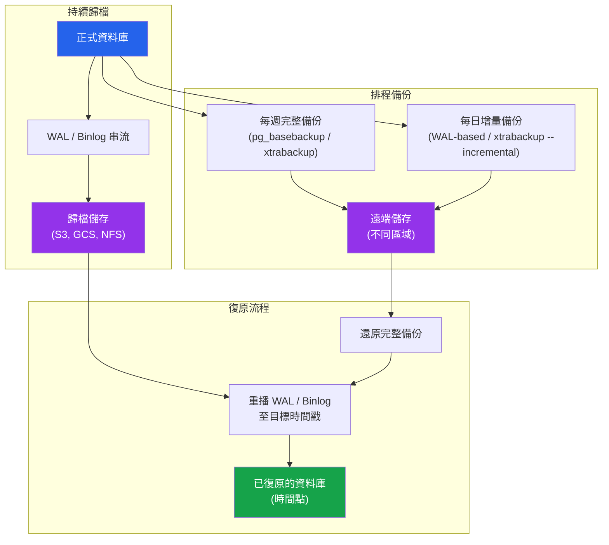

# [DEE-601] 備份與還原策略

:::info
每個正式環境的資料庫都MUST具備自動化且經過測試的備份，並定義明確的保留政策。從未還原驗證過的備份不是備份——只是一種期望。
:::

## 背景

備份是防止資料遺失的最後一道防線。硬體會故障、軟體有缺陷、人會犯錯、攻擊者會加密磁碟。當其他一切機制都失效——複製、快照、冗餘——備份是你與災難性、不可復原的資料遺失事件之間唯一的屏障。

儘管如此，備份失敗仍然是導致長時間停機的最常見原因之一。失敗模式是可預測的：備份從未被設定、備份數月前就悄悄停止運作、備份存在但從未有人測試過還原、或者備份存儲在剛剛故障的同一顆磁碟上。

資料庫備份有兩個基本類別：**邏輯備份**與**實體備份**。邏輯備份（pg_dump、mysqldump）將資料匯出為 SQL 語句或結構化格式——它們跨版本和平台可攜，但對大型資料庫來說速度較慢。實體備份（pg_basebackup、Percona XtraBackup）複製原始資料檔案——速度快但受限於相同的資料庫版本和架構。大多數正式環境使用實體備份進行日常復原，邏輯備份則用於跨版本移轉和精細的物件層級還原。

除了完整備份之外，**持續歸檔**預寫日誌（PostgreSQL 中的 WAL、MySQL 中的 binary log）可以實現**時間點復原（PITR）**——將資料庫還原到任何特定時刻，而不僅僅是最後一次備份。這對於從已知時間點發生的意外資料刪除或損毀進行復原至關重要。

## 原則

- 每個正式環境的資料庫都MUST按照定義的排程執行自動化備份。
- 團隊MUST定期測試還原——至少每季，理想情況下每月——在隔離的環境中進行。
- 備份MUST儲存在與其保護的資料庫不同的基礎設施上（不同的磁碟、不同的伺服器，最好是不同的區域）。
- 團隊SHOULD實施持續的 WAL/binlog 歸檔，以便為所有正式環境資料庫啟用時間點復原。
- 備份保留政策MUST被定義並記錄下來，在儲存成本與復原時間窗口需求之間取得平衡。
- 備份的完成狀態和完整性MUST受到監控並發出告警——靜默失敗的備份工作比完全沒有備份更危險，因為它會製造虛假的信心。

## 圖示



**關鍵洞察：** 完整備份提供一個起始點。WAL/binlog 歸檔則提供在兩次備份之間任何時間點復原的能力。兩者結合，提供了全面的保護——既能應對完全遺失，也能從錯誤中精確復原。

## 範例

### PostgreSQL：pg_basebackup + WAL 歸檔

在 `postgresql.conf` 中設定 WAL 歸檔：

```ini
# 啟用 WAL 歸檔
wal_level = replica
archive_mode = on
archive_command = 'pgbackrest --stanza=main archive-push %p'
# 或使用純檔案複製：
# archive_command = 'cp %p /var/lib/postgresql/wal_archive/%f'
```

進行基礎備份：

```bash
# 使用 pg_basebackup 進行實體備份
pg_basebackup -h localhost -U replicator \
  -D /backups/base/$(date +%Y%m%d) \
  --checkpoint=fast --wal-method=stream \
  --progress --verbose

# 使用 pg_dump 進行邏輯備份（用於可攜性或單一資料庫還原）
pg_dump -h localhost -U backup_user \
  --format=custom --compress=9 \
  --file=/backups/logical/mydb_$(date +%Y%m%d).dump \
  mydb
```

還原到特定時間點：

```bash
# 1. 還原基礎備份
cp -r /backups/base/20260405 /var/lib/postgresql/data

# 2. 建立 recovery.signal 並設定復原目標
cat > /var/lib/postgresql/data/postgresql.auto.conf << 'EOF'
restore_command = 'pgbackrest --stanza=main archive-get %f %p'
recovery_target_time = '2026-04-05 14:30:00 UTC'
recovery_target_action = 'promote'
EOF

# 3. 建立 recovery signal 檔案並啟動 PostgreSQL
touch /var/lib/postgresql/data/recovery.signal
pg_ctl start -D /var/lib/postgresql/data
```

### MySQL：Percona XtraBackup

```bash
# 完整實體備份（對 InnoDB 無阻塞）
xtrabackup --backup --target-dir=/backups/full/$(date +%Y%m%d) \
  --user=backup_user --password=secret

# 基於上次完整備份的增量備份
xtrabackup --backup --target-dir=/backups/incr/$(date +%Y%m%d) \
  --incremental-basedir=/backups/full/20260405 \
  --user=backup_user --password=secret

# 還原：準備完整備份，然後套用增量
xtrabackup --prepare --apply-log-only --target-dir=/backups/full/20260405
xtrabackup --prepare --apply-log-only --target-dir=/backups/full/20260405 \
  --incremental-dir=/backups/incr/20260406
xtrabackup --copy-back --target-dir=/backups/full/20260405
```

### 邏輯備份 vs 實體備份比較

| 面向 | 邏輯備份（pg_dump / mysqldump） | 實體備份（pg_basebackup / xtrabackup） |
|--------|-------------------------------|---------------------------------------|
| **備份速度** | 慢——讀取並序列化所有資料 | 快——複製原始檔案 |
| **還原速度** | 慢——重新執行 SQL/COPY | 快——檔案複製 + WAL 重播 |
| **大小** | 壓縮後較小 | 較大（完整資料目錄） |
| **跨版本** | 是——跨主要版本可攜 | 否——需要相同主要版本 |
| **粒度** | 單一資料庫、資料表或 schema | 僅限整個叢集 |
| **PITR 支援** | 否 | 是（搭配 WAL/binlog 歸檔） |
| **對伺服器的影響** | 部分操作需要共用鎖 | 使用 WAL 串流時影響最小 |
| **最適合** | 小型資料庫、移轉、選擇性還原 | 大型資料庫、日常完整復原 |

### 完整備份 vs 增量備份比較

| 面向 | 完整備份 | 增量備份 |
|--------|-------------|-------------------|
| **包含內容** | 所有資料的完整副本 | 僅自上次備份以來的變更 |
| **大小** | 大 | 小（通常為完整備份的 5-20%） |
| **備份時間** | 長 | 短 |
| **還原時間** | 短（單一步驟） | 較長（完整備份 + 所有增量） |
| **還原複雜度** | 簡單 | 必須按順序套用鏈 |
| **典型排程** | 每週 | 每日 |

## 常見錯誤

1. **未經測試的備份。** 最危險的備份失敗模式：備份每晚都在執行，監控顯示「成功」，但從來沒有人嘗試過還原。備份檔案可能已損毀、不完整或缺少關鍵資料。排定定期還原測試到隔離環境，並在每次測試後驗證資料完整性。

2. **沒有時間點復原能力。** 只做每晚完整備份而不歸檔 WAL/binlog，意味著最佳情況下復原也會遺失最多 24 小時的資料。如果有人在下午 4 點執行了 `DELETE FROM orders WHERE 1=1`，而上次備份是在午夜，那 16 小時的資料就消失了。啟用持續歸檔以復原到任何一秒。

3. **備份儲存在相同的磁碟或伺服器上。** 如果磁碟故障，資料庫和其備份會同時遺失。將備份儲存在不同的實體基礎設施上——最好是在不同的可用區或區域。雲端物件儲存（S3、GCS）是一個經濟實惠且耐久的選項。

4. **沒有保留政策。** 沒有定義保留政策，你要麼會耗盡磁碟空間（不清理），要麼會失去從數天後才發現的問題中復原的能力（過於積極的清理）。根據合規性和復原需求，定義每日、每週和每月備份的保留時間。

5. **靜默失敗的備份工作。** 一個失敗並將輸出導向 `/dev/null` 的備份 cron 工作是常見的災難設定。監控備份工作的完成狀態、驗證備份檔案大小，並在失敗時發出告警。你的監控系統應該在備份未在預期時間窗口內成功完成時發出告警。

6. **僅對大型資料庫使用邏輯備份。** 對 500 GB 的資料庫使用 `pg_dump` 或 `mysqldump` 需要數小時且會對伺服器造成負載。對於大型資料庫，使用實體備份（pg_basebackup、xtrabackup）進行日常復原，邏輯備份則保留用於跨版本移轉或選擇性還原。

## 相關 DEE

- [DEE-600](600.md) 維運總覽
- [DEE-602](602.md) 複製拓撲——複製提供冗餘但無法取代備份
- [DEE-605](605.md) 災難復原——備份是災難復原策略的核心組成

## 參考資料

- [PostgreSQL Documentation: Continuous Archiving and Point-in-Time Recovery](https://www.postgresql.org/docs/current/continuous-archiving.html) -- PostgreSQL 官方 PITR 文件
- [PostgreSQL Documentation: pg_basebackup](https://www.postgresql.org/docs/current/app-pgbasebackup.html) -- 實體備份工具參考
- [Percona XtraBackup Documentation](https://docs.percona.com/percona-xtrabackup/latest/) -- MySQL 熱備份工具
- [pgBackRest Documentation](https://pgbackrest.org/) -- 企業級 PostgreSQL 備份，支援 PITR、平行備份/還原與雲端儲存
- [Percona Blog: MySQL Backup and Recovery Best Practices](https://www.percona.com/blog/mysql-backup-and-recovery-best-practices/) -- 完整的 MySQL 備份指南
- [Crunchy Data Blog: Introduction to Postgres Backups](https://www.crunchydata.com/blog/introduction-to-postgres-backups) -- 實用的 PostgreSQL 備份概述
