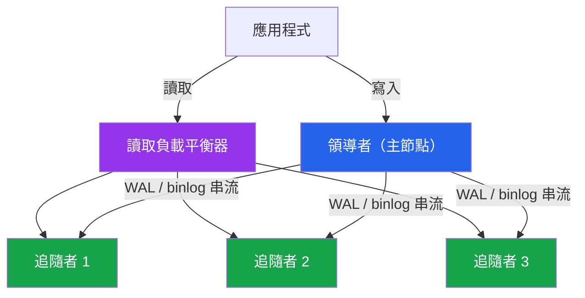
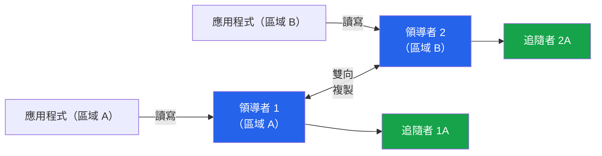
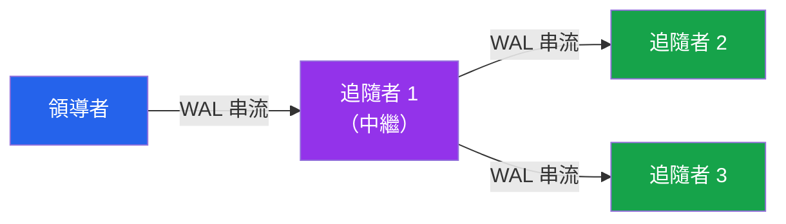

# [DEE-602] 複製拓撲

:::info
根據可用性需求和一致性取捨來選擇複製拓撲。複製不是備份策略——它是可用性和讀取擴展策略。
:::

## 背景

複製將資料從一台資料庫伺服器（領導者，也稱為主節點或來源）複製到一台或多台其他伺服器（追隨者，也稱為副本或備援）。它有兩個主要用途：**高可用性**（如果領導者故障，追隨者可以被晉升）和**讀取擴展**（將讀取查詢分散到多台伺服器）。

每個複製系統都會在**一致性**（副本的資料有多即時）和**效能**（領導者因等待副本而被拖慢多少）之間強制取捨。這種取捨表現為**複製延遲**——一筆交易在領導者提交到在副本上可見之間的延遲。根據設定，這個延遲從次毫秒（同步複製）到數秒甚至數分鐘（高負載下的非同步複製）不等。

PostgreSQL 使用**串流複製**來持續從主節點傳送 WAL 記錄到備援節點。MySQL 使用 **binary log 複製**，來源將事件寫入 binary log，副本拉取並重播。兩者都支援非同步、半同步，以及（MySQL 透過 Group Replication）近乎同步的模式。

拓撲——伺服器之間如何連接——決定了你的故障模式、讀取容量和維運複雜度。三種基本拓撲分別是**領導者-追隨者**（一個寫入者，多個讀取者）、**多領導者**（多個寫入者，需要衝突解決）和**串聯/級聯**（追隨者從其他追隨者複製以減少領導者負載）。

## 原則

- 團隊MUST根據文件化的可用性需求（SLA、RPO、RTO）而非預設值來選擇複製拓撲。
- 讀取副本SHOULD用來分擔主節點的讀取密集工作負載，但使用非同步副本時，消費者MUST容忍讀取到過期的資料。
- 當容錯切換時需要零資料遺失，SHOULD使用同步複製，並理解它會增加寫入延遲。
- 團隊MUST持續監控複製延遲，並在延遲超過可接受閾值時發出告警。
- 多領導者複製**只應該**在應用程式能處理衝突解決時才使用——它不是領導者-追隨者的通用升級。

## 圖示

### 領導者-追隨者（單一領導者）拓撲



### 多領導者拓撲



### 級聯（鏈式）拓撲



**關鍵洞察：** 領導者-追隨者是大多數工作負載的預設選擇。多領導者以衝突解決的複雜度為代價，在多個區域增加寫入可用性。級聯複製在你有很多副本時減少領導者的網路負載。

## 範例

### PostgreSQL 串流複製設定

在主節點上設定 `postgresql.conf`：

```ini
wal_level = replica
max_wal_senders = 10          # 最大複製連線數
wal_keep_size = 1GB           # 為較慢的副本保留 WAL
hot_standby = on              # 允許在備援節點上執行讀取查詢

# 同步複製（選用——會增加寫入延遲）：
synchronous_standby_names = 'FIRST 1 (standby1, standby2)'
synchronous_commit = on       # 'on' 等待 WAL 刷寫到備援節點
                              # 'remote_apply' 等待備援節點重播完成
```

在副本上使用 `pg_basebackup` 建立備援：

```bash
pg_basebackup -h primary-host -U replicator \
  -D /var/lib/postgresql/data --checkpoint=fast \
  --wal-method=stream --write-recovery-conf
```

這會建立 `standby.signal` 並在 `postgresql.auto.conf` 中設定 `primary_conninfo`，讓副本可以從主節點串流 WAL。

### 讀取副本路由模式

```python
# 應用程式層級的讀寫分離
class DatabaseRouter:
    def __init__(self, primary_dsn, replica_dsns):
        self.primary = create_pool(primary_dsn)
        self.replicas = [create_pool(dsn) for dsn in replica_dsns]
        self._replica_index = 0

    def get_connection(self, read_only=False):
        if read_only and self.replicas:
            # 輪詢方式分配到各副本
            conn = self.replicas[self._replica_index % len(self.replicas)]
            self._replica_index += 1
            return conn
        return self.primary

    def query(self, sql, params=None, read_only=False):
        conn = self.get_connection(read_only=read_only)
        return conn.execute(sql, params)

# 使用方式
db = DatabaseRouter(
    primary_dsn="postgresql://primary:5432/mydb",
    replica_dsns=[
        "postgresql://replica1:5432/mydb",
        "postgresql://replica2:5432/mydb",
    ]
)

# 寫入永遠導向主節點
db.query("INSERT INTO orders (user_id, total) VALUES (%s, %s)", [42, 99.99])

# 讀取可以導向副本（接受潛在的資料過期）
db.query("SELECT * FROM products WHERE category = %s", ["electronics"], read_only=True)
```

### 監控複製延遲

```sql
-- PostgreSQL：在主節點上檢查複製延遲
SELECT client_addr,
       state,
       sent_lsn,
       write_lsn,
       flush_lsn,
       replay_lsn,
       pg_wal_lsn_diff(sent_lsn, replay_lsn) AS replay_lag_bytes,
       write_lag,
       flush_lag,
       replay_lag
FROM pg_stat_replication;

-- MySQL：在副本上檢查複製延遲
SHOW REPLICA STATUS\G
-- 關鍵欄位：Seconds_Behind_Source
```

### 複製模式比較

| 面向 | 非同步 | 半同步 | 同步 |
|--------|-------------|-----------------|-------------|
| **寫入延遲** | 最低 | 中等（1 RTT） | 最高（1+ RTT） |
| **容錯切換時的資料遺失** | 可能（未提交的交易） | 極少（已記錄到副本） | 無（已提交到副本） |
| **吞吐量影響** | 無 | 中等 | 顯著 |
| **複製延遲** | 不定（毫秒到分鐘） | 低（次秒級） | 無（零延遲保證） |
| **PostgreSQL** | 預設 | synchronous_commit=on | synchronous_commit=remote_apply |
| **MySQL** | 預設 | Semi-sync 外掛 | Group Replication |
| **最適合** | 讀取擴展、分析副本 | 大多數高可用設定 | 金融、零遺失需求 |

## 常見錯誤

1. **從副本讀取時期望強一致性。** 非同步副本可能落後領導者數秒。如果使用者寫入資料後立即從副本讀回，可能會看到過期資料——這是典型的「讀取自己的寫入」違規。將必須反映最近寫入的讀取導向主節點，或對關鍵副本使用同步複製。

2. **不監控複製延遲。** 一個落後數小時的副本比沒有副本更糟——它提供冗餘的假象，同時向使用者提供危險的過期資料。監控每個副本的 `replay_lag`（PostgreSQL）或 `Seconds_Behind_Source`（MySQL），並在延遲超過可接受閾值時發出告警。

3. **所有副本都在單一區域，用於災難復原。** 同一可用區或資料中心的所有副本在全站停機時會一起故障。要實現真正的災難復原，至少一個副本必須在不同的區域，即使這意味著更高的複製延遲。

4. **使用多領導者但沒有衝突解決機制。** 多領導者複製允許在不同領導者上同時寫入相同資料，這會產生衝突。沒有確定性的衝突解決策略（最後寫入者勝出、自訂合併邏輯或應用程式層級的協調），資料會在領導者之間悄悄分歧。

5. **在容錯切換時晉升落後的副本。** 如果領導者故障，而你晉升一個落後 30 秒的副本，你就會遺失 30 秒的已提交交易。監控哪個副本最為即時並晉升那個。自動化容錯切換工具（PostgreSQL 的 Patroni、MySQL 的 Orchestrator）能正確處理這個問題。

6. **太多副本直接從領導者串流。** 每個複製連線都會消耗領導者的 CPU 和網路頻寬。副本數量多時，使用級聯複製：少數副本連接到領導者，其他副本連接到這些中繼節點。PostgreSQL 原生支援級聯備援。

## 相關 DEE

- [DEE-600](600.md) 維運總覽
- [DEE-601](601.md) 備份與還原策略——複製不能取代備份
- [DEE-603](603.md) 分片策略——分片解決寫入擴展，複製解決讀取擴展
- [DEE-605](605.md) 災難復原——跨區域副本是災難復原的關鍵組成

## 參考資料

- [PostgreSQL Documentation: High Availability, Load Balancing, and Replication](https://www.postgresql.org/docs/current/different-replication-solutions.html) -- PostgreSQL 高可用解決方案比較
- [PostgreSQL Documentation: Log-Shipping Standby Servers](https://www.postgresql.org/docs/current/warm-standby.html) -- 串流複製設定
- [MySQL Documentation: Semisynchronous Replication](https://dev.mysql.com/doc/refman/8.4/en/replication-semisync.html) -- MySQL 半同步複製參考
- [MySQL Documentation: Group Replication](https://dev.mysql.com/doc/refman/8.0/en/group-replication.html) -- MySQL 多領導者複製
- [Crunchy Data Blog: Synchronous Replication in PostgreSQL](https://www.crunchydata.com/blog/synchronous-replication-in-postgresql) -- 實用同步複製指南
- [Percona Blog: Overview of Different MySQL Replication Solutions](https://www.percona.com/blog/overview-of-different-mysql-replication-solutions/) -- 完整 MySQL 複製解決方案比較
