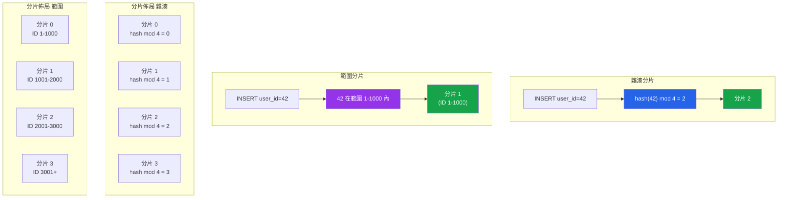

# [DEE-603] 分片策略

:::info
在考慮分片**之前**，先用盡垂直擴展和讀取副本。分片是一道單向門，會引入永久的維運複雜度。
:::

## 背景

分片將資料水平分割到多個獨立的資料庫實例（分片）上，每個分片持有總資料的一個子集。與複製（將所有資料複製到多台伺服器以進行讀取擴展）不同，分片將資料切分，使每台伺服器處理一部分的寫入和儲存。這是將寫入吞吐量擴展到超過單一伺服器所能處理的主要機制。

分片的決定應該在系統演進的後期才做出。一台經過良好調校的單一 PostgreSQL 或 MySQL 伺服器搭配讀取副本，能處理的流量遠超大多數團隊的預期。垂直擴展（更大的伺服器、更多的 RAM、更快的磁碟）和讀取副本比分片更簡單、更便宜、維運上也更安全。過早分片是團隊可能犯下的最昂貴的架構錯誤之一——它碎片化了資料模型、使每個查詢變得複雜、打破跨分片邊界的交易，並使 schema 變更指數級地困難。

當分片變得必要時，**分片鍵**是最重要的單一決策。分片鍵決定每一列資料落在哪個分片上。一個好的分片鍵能均勻分散資料和流量（避免熱點）、與最常見的查詢模式對齊（避免跨分片查詢），且很少變更。常見的分片鍵選擇包括租戶 ID（用於多租戶 SaaS）、使用者 ID（用於以使用者為中心的應用程式）和地理區域（用於資料駐留要求）。

兩種主要的分片策略：**雜湊分片**（對分片鍵套用雜湊函式來決定放置位置）和**範圍分片**（將分片鍵的連續範圍分配給每個分片）。雜湊分片能更均勻地分散資料，但使範圍查詢效率低下。範圍分片保留排序，但在最活躍的範圍上有熱點風險。

## 原則

- 團隊MUST在實施分片之前，先用盡垂直擴展、查詢最佳化、快取和讀取副本。
- 分片鍵MUST根據查詢模式和資料分佈分析來選擇，而非憑直覺。
- 跨分片查詢SHOULD透過將相關資料共置在同一分片上來最小化（例如，將一個租戶的訂單和訂單項目放在同一分片）。
- 團隊MUST從一開始就規劃重新分片——初始的分片數量終究會不夠用。
- 跨分片交易SHOULD避免；如果有需要，團隊MUST理解一致性和效能方面的影響。

## 圖示

### 雜湊分片 vs 範圍分片



**關鍵洞察：** 雜湊分片均勻分散資料，但會將範圍查詢分散到所有分片。範圍分片將有序資料保持在一起，但會將寫入集中在活躍範圍上（最新的 ID、當前的時間段）。

## 範例

### 多租戶 SaaS 應用程式的分片鍵選擇

```sql
-- 以 tenant_id 作為分片鍵的資料表結構
CREATE TABLE orders (
    order_id    BIGINT GENERATED ALWAYS AS IDENTITY,
    tenant_id   BIGINT NOT NULL,    -- 分片鍵
    customer_id BIGINT NOT NULL,
    total       DECIMAL(10,2),
    created_at  TIMESTAMPTZ DEFAULT now(),
    PRIMARY KEY (tenant_id, order_id)  -- 分片鍵必須是主鍵的一部分
);

-- 這個查詢只命中單一分片（好）：
SELECT * FROM orders WHERE tenant_id = 42 AND created_at > '2026-01-01';

-- 這個查詢必須分散到所有分片（不好）：
SELECT * FROM orders WHERE customer_id = 99;
-- customer_id 不是分片鍵，所以路由器不知道它在哪個分片
```

### PostgreSQL 搭配 Citus：雜湊分散式資料表

```sql
-- 安裝 Citus 擴充
CREATE EXTENSION citus;

-- 新增工作節點
SELECT citus_add_node('worker1', 5432);
SELECT citus_add_node('worker2', 5432);
SELECT citus_add_node('worker3', 5432);

-- 以 tenant_id 分散 orders 資料表（雜湊分片）
SELECT create_distributed_table('orders', 'tenant_id');

-- 將相關資料表共置在同一分片上
SELECT create_distributed_table('order_items', 'tenant_id',
       colocate_with => 'orders');

-- 單一分片查詢（快速——只命中一個工作節點）：
SELECT o.order_id, oi.product_name, oi.quantity
FROM orders o
JOIN order_items oi ON o.tenant_id = oi.tenant_id
                   AND o.order_id = oi.order_id
WHERE o.tenant_id = 42;

-- 跨分片聚合（較慢——命中所有工作節點）：
SELECT tenant_id, COUNT(*), SUM(total)
FROM orders
GROUP BY tenant_id;
```

### MySQL 搭配 Vitess：分片設定

```yaml
# Vitess VSchema 定義
{
  "sharded": true,
  "vindexes": {
    "hash_tenant": {
      "type": "hash"
    }
  },
  "tables": {
    "orders": {
      "column_vindexes": [
        {
          "column": "tenant_id",
          "name": "hash_tenant"
        }
      ]
    },
    "order_items": {
      "column_vindexes": [
        {
          "column": "tenant_id",
          "name": "hash_tenant"
        }
      ]
    }
  }
}
```

### 分片策略比較

| 面向 | 雜湊分片 | 範圍分片 | 目錄分片 |
|--------|-----------|-------------|-----------------|
| **分佈** | 均勻（使用良好的雜湊） | 取決於鍵的分佈 | 完全可控 |
| **範圍查詢** | 分散到所有分片 | 高效（單一分片） | 取決於映射 |
| **熱點** | 罕見（雜湊分散負載） | 常見（活躍範圍） | 可透過重新映射避免 |
| **重新分片** | 困難（需要重新雜湊） | 切分範圍（中等） | 更新目錄（最容易） |
| **實作** | 簡單（雜湊函式） | 簡單（邊界表） | 需要查詢服務 |
| **最適合** | 多租戶、以使用者為基礎 | 時間序列、序列 ID | 自訂放置、地理 |

### 跨分片查詢策略

當跨分片查詢無法避免時：

| 策略 | 運作方式 | 取捨 |
|----------|-------------|-----------|
| **分散-收集** | 查詢所有分片，合併結果 | 延遲 = 最慢的分片 |
| **全域資料表** | 將小型參考資料表複製到所有分片 | 儲存開銷、同步延遲 |
| **反正規化** | 將資料複製到分片本地資料表 | 寫入放大 |
| **非同步物化** | ETL/CDC 到讀取最佳化的儲存 | 最終一致性 |

## 常見錯誤

1. **過早分片。** 對一個透過適當索引和讀取副本就能由單一伺服器處理的資料庫進行分片，增加了巨大的複雜度卻沒有任何好處。在現代硬體上（64+ 核心、512 GB RAM、NVMe 儲存），一台經過良好調校的 PostgreSQL 實例可以處理數百萬列和每秒數千筆交易。只有在有證據表明垂直擴展已用盡時才進行分片。

2. **錯誤的分片鍵導致熱點。** 選擇單調遞增的值（自動遞增 ID、時間戳）作為雜湊分片鍵，會將最近的寫入集中在單一分片上。對於範圍分片，所有新插入都會進入最後一個範圍。分析你的寫入模式：如果 90% 的流量來自 10% 的租戶，即使是 tenant_id 也會造成熱點分片。考慮使用複合鍵或虛擬分片桶。

3. **跨分片交易。** 跨分片的分散式交易（兩階段提交）速度慢、複雜且脆弱。如果你的應用程式需要跨多個分片的交易，要麼重新設計資料模型以共置相關資料，要麼接受最終一致性搭配補償交易。

4. **未共置相關資料。** 如果 `orders` 以 `tenant_id` 分片，但 `order_items` 以 `order_id` 分片，兩者之間的每次 join 都會變成跨分片操作。透過使用相同的分片鍵來共置經常一起 join 的資料表（Citus 的 `colocate_with`、Vitess 的相同 vindex）。

5. **沒有重新分片計畫。** 一開始用 4 個分片並期望永遠夠用，是為日後痛苦且高風險的遷移做準備。使用遠高於實體分片數的邏輯分片數（例如，256 個虛擬分片映射到 4 台實體伺服器），這樣重新分片就是重新映射虛擬到實體的對應，而非重新雜湊資料。

6. **忽略維運開銷。** 分片會倍增每項維運任務：schema 遷移要在每個分片上執行、備份倍增、監控涵蓋更多實例、除錯需要在各分片間關聯日誌。在決定採用分片架構之前，先為這些持續性的維運成本做好預算。

## 相關 DEE

- [DEE-600](600.md) 維運總覽
- [DEE-602](602.md) 複製拓撲——在分片之前先使用讀取副本
- [DEE-604](604.md) 資料庫監控與告警——有多個分片時監控變得至關重要
- [DEE-605](605.md) 災難復原——災難復原計畫必須涵蓋所有分片

## 參考資料

- [Citus Documentation: Choosing a Distribution Column](https://docs.citusdata.com/en/stable/sharding/data_modeling.html) -- Citus 官方分片鍵選擇指南
- [Vitess Documentation: Sharding](https://vitess.io/docs/) -- Vitess 分片概念與 VSchema 設定
- [PlanetScale: Sharding Strategies](https://planetscale.com/learn/courses/database-scaling/sharding/sharding-strategies) -- 實用分片策略比較
- [Last9: Database Sharding -- How It Works and When You Actually Need It](https://last9.io/blog/database-sharding/) -- 何時該分片、何時不該
- [Percona Blog: MySQL Sharding with ProxySQL](https://www.percona.com/blog/) -- MySQL 分片模式
- [Martin Kleppmann: Designing Data-Intensive Applications, Chapter 6](https://dataintensive.net/) -- 分割策略的權威著作
