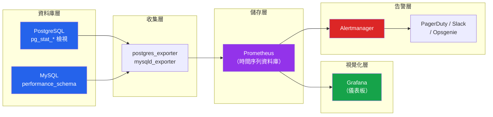

# [DEE-604] 資料庫監控與告警

:::info
每個正式環境的資料庫都MUST對關鍵健康指標進行監控，並設定可操作的告警。無法衡量就無法最佳化，無法看見就無法回應。
:::

## 背景

資料庫問題很少會清楚地自我通報。一個今天花 200 毫秒的慢查詢，隨著資料表成長，下個月會變成 2 秒。磁碟使用量每天增加 1%，直到在 100% 時資料庫崩潰。複製延遲連續數週維持在 50 毫秒，然後在一個沒人知道的批次工作期間飆升到 30 秒。沒有監控，這些問題在變成停機事件之前都是不可見的。

有效的資料庫監控涵蓋四個領域：**資源使用率**（CPU、記憶體、磁碟、連線數）、**查詢效能**（延遲、吞吐量、慢查詢）、**複製健康狀態**（延遲、狀態、錯誤），以及**內部引擎指標**（快取命中率、鎖等待、vacuum 進度、checkpoint 頻率）。每個領域都有指示正常運作的指標和指示問題的閾值。

現代資料庫監控技術堆疊通常包含：一個**指標匯出器**（postgres_exporter、mysqld_exporter）以 Prometheus 格式暴露資料庫指標、一個**時間序列資料庫**（Prometheus、VictoriaMetrics）擷取並儲存指標、一個**視覺化層**（Grafana）用於儀表板，以及一個**告警系統**（Alertmanager、PagerDuty、Opsgenie）用於通知。

PostgreSQL 透過其 `pg_stat_*` 系統檢視和 `pg_stat_statements` 擴充暴露廣泛的指標。MySQL 則提供 `performance_schema` 和 `information_schema` 以達到類似的可見性。挑戰不在於收集指標——而在於知道哪些指標重要、該設定什麼閾值，以及如何避免告警疲勞。

## 原則

- 每個正式環境的資料庫都MUST對連線數、查詢延遲、複製延遲、磁碟使用量和快取命中率進行持續監控。
- 告警閾值SHOULD根據基線測量來設定，而非任意數值。
- 團隊MUST在正式環境中啟用 `pg_stat_statements`（PostgreSQL）或 `performance_schema`（MySQL），以追蹤查詢層級的效能。
- 告警MUST是可操作的——每個告警都應該有記錄在案的回應程序。如果沒有人對告警採取行動，就移除它或調整閾值。
- 監控資料SHOULD至少保留 30 天，以便進行趨勢分析和容量規劃。

## 圖示



**關鍵洞察：** 監控流水線是：資料庫暴露指標 -> 匯出器擷取並格式化 -> Prometheus 儲存時間序列資料 -> Grafana 視覺化趨勢 -> Alertmanager 路由通知。每一層都可以替換，但模式是一致的。

## 範例

### PostgreSQL：啟用 pg_stat_statements

```sql
-- 步驟 1：加入 postgresql.conf（需要重啟）
-- shared_preload_libraries = 'pg_stat_statements'
-- pg_stat_statements.track = all

-- 步驟 2：建立擴充
CREATE EXTENSION IF NOT EXISTS pg_stat_statements;

-- 依總執行時間排序的前 10 名查詢
SELECT
    substring(query, 1, 80) AS query_preview,
    calls,
    round(total_exec_time::numeric, 2) AS total_ms,
    round(mean_exec_time::numeric, 2) AS avg_ms,
    round((100.0 * shared_blks_hit / NULLIF(shared_blks_hit + shared_blks_read, 0))::numeric, 2)
        AS cache_hit_pct,
    rows
FROM pg_stat_statements
ORDER BY total_exec_time DESC
LIMIT 10;
```

### 關鍵健康檢查查詢（PostgreSQL）

```sql
-- 作用中連線 vs 上限
SELECT
    count(*) AS active_connections,
    (SELECT setting::int FROM pg_settings WHERE name = 'max_connections') AS max_connections,
    round(100.0 * count(*) /
        (SELECT setting::int FROM pg_settings WHERE name = 'max_connections'), 1)
        AS usage_pct
FROM pg_stat_activity
WHERE state IS NOT NULL;

-- 快取命中率（OLTP 應 > 99%）
SELECT
    round(100.0 * sum(blks_hit) / NULLIF(sum(blks_hit) + sum(blks_read), 0), 2)
        AS cache_hit_ratio
FROM pg_stat_database;

-- 複製延遲（在主節點上執行）
SELECT
    client_addr,
    state,
    pg_wal_lsn_diff(sent_lsn, replay_lsn) AS replay_lag_bytes,
    replay_lag
FROM pg_stat_replication;

-- 長時間執行的查詢（> 5 分鐘）
SELECT
    pid,
    now() - query_start AS duration,
    state,
    substring(query, 1, 100) AS query_preview
FROM pg_stat_activity
WHERE state = 'active'
  AND now() - query_start > interval '5 minutes'
ORDER BY duration DESC;

-- 資料表膨脹 / 死亡元組（vacuum 健康）
SELECT
    schemaname,
    relname,
    n_dead_tup,
    n_live_tup,
    round(100.0 * n_dead_tup / NULLIF(n_live_tup + n_dead_tup, 0), 2) AS dead_pct,
    last_autovacuum
FROM pg_stat_user_tables
WHERE n_dead_tup > 10000
ORDER BY n_dead_tup DESC
LIMIT 10;

-- 鎖等待
SELECT
    blocked.pid AS blocked_pid,
    blocked_activity.query AS blocked_query,
    blocking.pid AS blocking_pid,
    blocking_activity.query AS blocking_query,
    now() - blocked_activity.query_start AS blocked_duration
FROM pg_catalog.pg_locks blocked
JOIN pg_catalog.pg_stat_activity blocked_activity ON blocked.pid = blocked_activity.pid
JOIN pg_catalog.pg_locks blocking
    ON blocking.locktype = blocked.locktype
    AND blocking.relation = blocked.relation
    AND blocking.pid != blocked.pid
JOIN pg_catalog.pg_stat_activity blocking_activity ON blocking.pid = blocking_activity.pid
WHERE NOT blocked.granted;
```

### 關鍵指標表

| 指標 | 衡量內容 | 警告閾值 | 嚴重閾值 |
|--------|-----------------|-------------------|-------------------|
| **連線使用率** | 作用中 / max_connections | > 70% | > 90% |
| **查詢延遲（p95）** | 第 95 百分位查詢時間 | > 100 ms（OLTP） | > 500 ms |
| **複製延遲** | 主節點與副本之間的延遲 | > 1 秒 | > 10 秒 |
| **磁碟使用量** | 資料目錄磁碟消耗 | > 75% | > 90% |
| **快取命中率** | 緩衝區快取效能 | < 99%（OLTP） | < 95% |
| **鎖等待** | 被鎖阻塞的查詢 | > 5 個並行 | > 20 個並行 |
| **死鎖** | 每分鐘死鎖數 | > 0.1/分鐘 | > 1/分鐘 |
| **長時間查詢** | 超過時間限制的查詢 | > 5 分鐘 | > 30 分鐘 |
| **每秒交易數** | 寫入吞吐量 | 依基線而定 | 突然下降 > 50% |
| **WAL 產生速率** | 預寫日誌量 | 趨勢分析 | 突然飆升 > 3 倍 |
| **Vacuum 死亡元組** | Autovacuum 效能 | > 10% 死亡列 | > 25% 死亡列 |

### Prometheus 告警規則

```yaml
groups:
  - name: database-alerts
    rules:
      - alert: HighConnectionUsage
        expr: pg_stat_activity_count / pg_settings_max_connections > 0.8
        for: 5m
        labels:
          severity: warning
        annotations:
          summary: "資料庫連線使用率超過 80%"
          runbook: "https://wiki.example.com/runbooks/db-connections"

      - alert: ReplicationLagHigh
        expr: pg_replication_lag_seconds > 10
        for: 2m
        labels:
          severity: critical
        annotations:
          summary: "複製延遲超過 10 秒"
          runbook: "https://wiki.example.com/runbooks/replication-lag"

      - alert: DiskSpaceLow
        expr: (pg_database_size_bytes / node_filesystem_size_bytes) > 0.85
        for: 10m
        labels:
          severity: warning
        annotations:
          summary: "資料庫磁碟使用量超過 85%"
          runbook: "https://wiki.example.com/runbooks/disk-space"

      - alert: CacheHitRatioLow
        expr: pg_stat_database_blks_hit /
              (pg_stat_database_blks_hit + pg_stat_database_blks_read) < 0.95
        for: 15m
        labels:
          severity: warning
        annotations:
          summary: "緩衝區快取命中率低於 95%"
          runbook: "https://wiki.example.com/runbooks/cache-hit"
```

## 常見錯誤

1. **只監控磁碟空間。** 磁碟空間很重要，但只是眾多關鍵指標之一。只監控磁碟的團隊會錯過慢查詢、複製延遲、連線耗盡和鎖競爭——這些都會在磁碟填滿之前就造成停機。實施涵蓋所有類別的全面監控：資源、查詢、複製和引擎內部。

2. **沒有對複製延遲設定告警。** 一個靜默地落後數小時的副本會向使用者提供危險的過期資料，也無法用於快速容錯切換。監控每個副本的複製延遲，並在超過可接受閾值（通常依使用情境而定為 1-10 秒）時發出告警。

3. **未追蹤慢查詢。** 如果沒有啟用 `pg_stat_statements` 或 `performance_schema`，就無法看到哪些查詢消耗最多時間。在正式環境中啟用查詢追蹤——額外開銷很小（通常 1-2%），而可見性是無價的。每週檢視依總執行時間排序的前幾名查詢。

4. **告警疲勞。** 過多的告警，或閾值設定得過於激進，會訓練團隊忽略通知。每個告警都必須是可操作的：如果告警觸發，應該有人採取特定的行動。如果告警經常觸發但不需要採取行動，就提高閾值或移除它。將每個告警連結到記錄回應方式的 runbook。

5. **沒有基線測量。** 在不了解正常行為的情況下設定告警閾值，會導致誤報或漏報。記錄正常運作期間的連線數、查詢延遲和吞吐量基線，然後將警告閾值設為基線的 2 倍，嚴重閾值設為基線的 5 倍。根據經驗調整。

6. **缺少值班用儀表板。** 在事故期間，值班工程師需要一個單一的 Grafana 儀表板來一覽資料庫健康狀態：連線數、延遲、吞吐量、複製、磁碟和最近的錯誤。主動建立這個儀表板——而不是在凌晨 3 點的停機期間。

## 相關 DEE

- [DEE-600](600.md) 維運總覽
- [DEE-602](602.md) 複製拓撲——複製延遲監控至關重要
- [DEE-604](604.md) 本文
- [DEE-605](605.md) 災難復原——監控在災難發生前提供早期警告

## 參考資料

- [PostgreSQL Documentation: The Cumulative Statistics System](https://www.postgresql.org/docs/current/monitoring-stats.html) -- pg_stat_* 檢視參考
- [PostgreSQL Documentation: pg_stat_statements](https://www.postgresql.org/docs/current/pgstatstatements.html) -- 查詢統計擴充
- [prometheus-community/postgres_exporter](https://github.com/prometheus-community/postgres_exporter) -- PostgreSQL 指標的 Prometheus 匯出器
- [Grafana: PostgreSQL Integration](https://grafana.com/docs/grafana-cloud/monitor-infrastructure/integrations/integration-reference/integration-postgres/) -- 預建的 PostgreSQL 儀表板
- [Sysdig: Top Metrics in PostgreSQL Monitoring with Prometheus](https://www.sysdig.com/blog/postgresql-monitoring) -- PostgreSQL 關鍵指標實用指南
- [MySQL Documentation: Performance Schema](https://dev.mysql.com/doc/refman/8.0/en/performance-schema.html) -- MySQL 查詢與效能檢測
