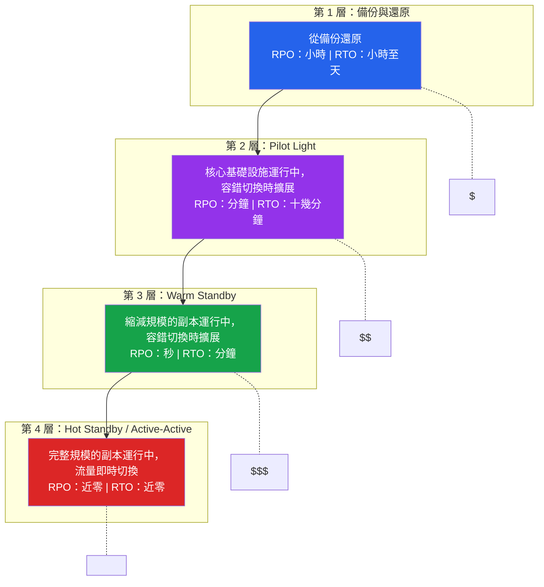

# [DEE-605] 災難復原

:::info
在設計復原策略**之前**，先定義你的復原點目標（RPO）和復原時間目標（RTO）。策略是為了達成那些數字而存在，而非反過來。
:::

## 背景

災難復原（DR）規劃處理的是當事情嚴重出錯時的情況——不是單一磁碟故障或當機的程序，而是整個區域的停機、損毀的資料中心、加密所有磁區的勒索軟體攻擊，或是導致整個正式環境堆疊癱瘓的連鎖故障。

大多數團隊混淆了高可用性（HA）和災難復原。HA 處理的是日常故障：伺服器當機、網路中斷、磁碟故障。DR 處理的是 HA 本身也失效的場景——當整個可用區或區域不可用時、當主要位置的備份遭到破壞時，或者故障嚴重到自動容錯切換無法復原時。

兩個數字定義了每個 DR 策略：

- **復原點目標（RPO）**：最大可接受的資料遺失量，以時間衡量。RPO 為 1 小時代表你可以承受遺失最多 1 小時的資料。RPO 為零代表不接受任何資料遺失。
- **復原時間目標（RTO）**：最大可接受的停機時間，以時間衡量。RTO 為 4 小時代表系統必須在災難發生後 4 小時內恢復運作。

這些數字驅動每個 DR 決策：你複製什麼、複製到哪裡、多久備份一次，以及在復原區域保持多少基礎設施運行。較低的 RPO 和 RTO 花費更多金錢——目標是讓策略匹配業務需求，而非對所有項目都追求零。

## 原則

- 團隊MUST根據業務影響分析，為每個正式環境資料庫定義 RPO 和 RTO。
- DR 策略MUST被選擇以滿足所定義的 RPO 和 RTO——不要過度設計超出業務需求。
- DR 計畫MUST至少每年透過完整的容錯切換演練進行測試，而非僅僅是文件審查。
- 用於 DR 的備份MUST儲存在與正式環境資料庫不同的區域。
- DR runbook MUST存在且在停機期間可存取（不要只儲存在故障中的系統上）。

## 圖示

### 時間軸上的 RPO 與 RTO


### DR 策略層級



**關鍵洞察：** 每一層都降低 RPO 和 RTO，但增加成本和複雜度。大多數系統不需要第 4 層。讓層級匹配你的業務需求。

## 範例

### DR 策略比較

| 策略 | RPO | RTO | 成本 | 複雜度 | 運作方式 |
|----------|-----|-----|------|------------|-------------|
| **備份與還原** | 小時（自上次備份以來的時間） | 小時至天 | 低 | 低 | 從儲存在復原區域的備份還原資料庫。在需要之前，DR 區域沒有運行中的基礎設施。 |
| **Pilot Light** | 分鐘（非同步複製延遲） | 10-30 分鐘 | 中等 | 中等 | 資料庫複製持續運行至 DR 區域。計算資源已關閉但已預先設定。容錯切換時：啟動計算資源、驗證資料庫、切換 DNS。 |
| **Warm Standby** | 秒（同步/近同步複製） | 1-10 分鐘 | 高 | 高 | 功能完整但規模縮減的環境在 DR 區域運行中。容錯切換時：擴展計算資源、晉升副本、切換流量。 |
| **Hot Standby / Active-Active** | 近零 | 近零 | 非常高 | 非常高 | 完整規模的環境在兩個區域運行並服務流量。災難發生時：從負載平衡器移除故障區域。無需晉升。 |

### Pilot Light 實作

```
正式區域（us-east-1）                 DR 區域（us-west-2）
+----------------------------+         +----------------------------+
| 應用伺服器（運行中）         |         | 應用伺服器（關閉）          |
| 負載平衡器（作用中）         |         | 負載平衡器（備援）          |
| 主資料庫（PostgreSQL）      | ------> | 副本資料庫（串流複製）       |
|   - 處理所有流量            | 非同步  |   - 接收 WAL 串流           |
| 物件儲存                    | ------> | 物件儲存（已複製）          |
+----------------------------+  複製   +----------------------------+
```

Pilot Light 的容錯切換程序：

```bash
# 1. 將 DR 副本晉升為主節點
psql -h dr-replica -c "SELECT pg_promote();"

# 2. 在 DR 區域啟動應用伺服器（預先設定的 AMI/容器）
aws autoscaling update-auto-scaling-group \
  --auto-scaling-group-name dr-app-servers \
  --desired-capacity 4 --min-size 4

# 3. 驗證晉升後的資料庫可接受寫入
psql -h dr-replica -c "CREATE TEMP TABLE dr_test (id int); DROP TABLE dr_test;"

# 4. 將 DNS 切換到 DR 區域
aws route53 change-resource-record-sets \
  --hosted-zone-id Z123456 \
  --change-batch '{
    "Changes": [{
      "Action": "UPSERT",
      "ResourceRecordSet": {
        "Name": "api.example.com",
        "Type": "CNAME",
        "TTL": 60,
        "ResourceRecords": [{"Value": "dr-lb.us-west-2.elb.amazonaws.com"}]
      }
    }]
  }'

# 5. 驗證端對端連線
curl -s https://api.example.com/health | jq .status
```

### DR Runbook 必備內容

每份 DR runbook 都必須包含：

| 章節 | 內容 |
|---------|----------|
| **觸發條件** | 何時宣告災難 vs 等待 HA 復原 |
| **決策權責** | 誰有權發起容錯切換 |
| **溝通計畫** | 通知誰、狀態頁更新、客戶溝通 |
| **逐步程序** | 要執行的確切指令、順序、預期輸出 |
| **驗證步驟** | 如何確認 DR 環境健康 |
| **資料完整性檢查** | 驗證無資料遺失或損毀的查詢 |
| **回切程序** | 復原後如何回到主要區域 |
| **聯絡清單** | 值班工程師、資料庫管理員、雲端支援升級 |
| **存取憑證** | DR 區域存取（獨立於正式環境儲存） |
| **最後測試日期** | runbook 最後一次透過演練驗證的時間 |

### RPO/RTO 規劃工作表

```
業務問題：                              | 決定：
--------------------------------------|---------------------------
我們能容忍多少資料遺失？               | RPO 目標
服務可以停機多久？                     | RTO 目標
每小時停機成本是多少？                 | DR 基礎設施預算
哪些資料最為關鍵？                     | 複製優先順序
合規要求是什麼？                       | 最低 DR 層級要求

範例：
  電商結帳：     RPO=0, RTO=5 分鐘   -> Hot Standby（第 4 層）
  內部分析：     RPO=24 小時, RTO=48 小時 -> 備份與還原（第 1 層）
  客戶入口網站： RPO=1 分鐘, RTO=15 分鐘 -> Warm Standby（第 3 層）
```

## 常見錯誤

1. **完全沒有 DR 計畫。** 許多團隊在「雲端供應商會處理」或「複製就是我們的 DR」的假設下運作。雲端供應商防護基礎設施故障，但無法防護應用程式層級的資料損毀、意外刪除或整個區域的停機。複製會忠實地將損毀複製到每個副本。一份有文件記錄、經過測試的 DR 計畫對正式環境系統而言是不可妥協的。

2. **未經測試的容錯切換。** 從未測試過的 DR 計畫是一個假說，不是計畫。紙面上看起來正確的容錯切換程序在實踐中會因為過期的憑證、變更的 API 端點、缺少的權限或 DNS 傳播延遲而失敗。至少每年——最好每季——在真實場景中測試完整的容錯切換流程。

3. **未定義 RPO 和 RTO。** 如果工程和業務利害關係人之間沒有明確約定的 RPO 和 RTO 數字，團隊要麼過度投資 DR（為一個可容忍數小時停機的系統運行 Hot Standby），要麼投資不足（在停機期間才發現業務期望零資料遺失，但備份已是 6 小時前的）。

4. **所有東西都在單一區域。** 所有資料庫、備份、副本和應用伺服器都在同一區域，意味著區域停機會將所有東西連同復原機制一起癱瘓。至少將備份儲存在不同的區域。對於關鍵系統，在另一個區域維護副本或備援環境。

5. **DR runbook 只儲存在受影響的系統上。** 如果你的 DR 文件放在一個託管於剛剛故障的同一區域的 wiki 上，災難期間沒有人能存取它。將 runbook 儲存在至少兩個獨立的位置：不同的雲端區域、值班人員筆電上的本地副本，或辦公室的紙本文件夾。

6. **沒有回切計畫。** 切換到 DR 區域只是問題的一半。在主要區域恢復後回切——且不遺失 DR 服務期間的資料——需要它自己的程序。與容錯切換一起規劃並測試回切。

## 相關 DEE

- [DEE-600](600.md) 維運總覽
- [DEE-601](601.md) 備份與還原策略——備份是第 1 層 DR 的基礎
- [DEE-602](602.md) 複製拓撲——跨區域複製實現第 2-4 層 DR
- [DEE-604](604.md) 資料庫監控與告警——監控偵測何時需要啟動 DR

## 參考資料

- [AWS: Disaster Recovery Options in the Cloud](https://docs.aws.amazon.com/whitepapers/latest/disaster-recovery-workloads-on-aws/disaster-recovery-options-in-the-cloud.html) -- AWS DR 策略層級（備份還原、pilot light、warm standby、多站 active-active）
- [AWS Architecture Blog: Disaster Recovery -- Pilot Light and Warm Standby](https://aws.amazon.com/blogs/architecture/disaster-recovery-dr-architecture-on-aws-part-iii-pilot-light-and-warm-standby/) -- pilot light vs warm standby 詳細比較
- [AWS Well-Architected Framework: Planning for Recovery](https://docs.aws.amazon.com/wellarchitected/latest/reliability-pillar/rel_planning_for_recovery_disaster_recovery.html) -- RPO/RTO 規劃指引
- [PostgreSQL Documentation: High Availability and Replication](https://www.postgresql.org/docs/current/different-replication-solutions.html) -- 用於 DR 的 PostgreSQL 高可用選項
- [Google Cloud: Disaster Recovery Planning Guide](https://cloud.google.com/architecture/dr-scenarios-planning-guide) -- 跨雲 DR 規劃原則
