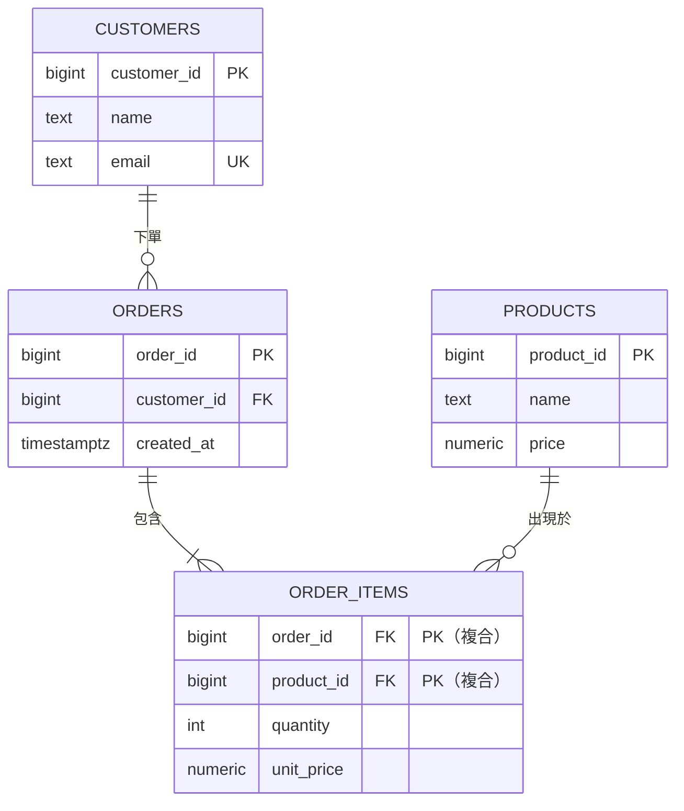

# [DEE-102] 外鍵與參照完整性

:::info
資料表之間的每個關聯 SHOULD 由外鍵約束強制。始終對外鍵欄位建立索引，並刻意選擇 ON DELETE 動作。
:::

## 背景

外鍵（FK）是一個資料表中引用另一個資料表主鍵的欄位（或欄位組合）。資料庫引擎強制參照完整性：它保證每個 FK 值都指向被引用資料表中的現有列。沒有 FK 約束，應用程式必須在程式碼中強制這個不變量——這是一種歷史上不可靠的做法，會導致孤立列和中斷的 join。

外鍵也作為可執行的文件：它們使關聯在 schema 中可見，並使工具（ER 圖產生器、ORM、遷移框架）能自動理解資料模型。

## 原則

- 你 SHOULD 為每個引用另一資料表主鍵的欄位宣告外鍵約束。
- 你 MUST 為每個外鍵欄位建立索引。PostgreSQL 不會自動建立；MySQL/InnoDB 會。
- 你 MUST 明確選擇 ON DELETE 動作，而非依賴預設值（NO ACTION）。
- 你 SHOULD NOT 在持有財務或法律上重要記錄的資料表上使用 ON DELETE CASCADE。
- 你 MAY 在純追加的分析資料表或事件存儲中省略 FK 約束，前提是寫入吞吐量至關重要且參照完整性在上游已強制——但需記錄這個權衡。

## 圖解



## ON DELETE 行為

ON DELETE 子句決定當父列被刪除時，子列會發生什麼。

| 動作 | 行為 | 使用時機 |
|------|------|---------|
| **RESTRICT** | 如果有子列存在，阻止刪除父列。立即檢查。 | 子資料很重要且 MUST NOT 被孤立或遺失（例如發票、稽核日誌） |
| **NO ACTION** | 與 RESTRICT 相同，但在交易結束時才檢查（允許延遲約束）。 | 你需要在交易內延遲約束檢查 |
| **CASCADE** | 當父列被刪除時，自動刪除所有子列。 | 子資料沒有獨立意義（例如 session token、通知偏好、購物車項目） |
| **SET NULL** | 將子列中的 FK 欄位設為 NULL。欄位必須允許 null。 | 子資料應保留但關聯可以斷開（例如員工的主管被刪除；之後重新指派） |
| **SET DEFAULT** | 將 FK 欄位設為其預設值。 | 很少使用。適用於存在哨兵/備用列的情況（例如「未分類」類別） |

### 決策啟發法

1. 子實體是父項的**組成部分**，沒有獨立存在？使用 **CASCADE**。
2. 子實體**獨立有價值**（財務記錄、內容、稽核軌跡）？使用 **RESTRICT**。
3. 子項應**保留**但失去關聯？使用 **SET NULL**。
4. 不確定時，選擇 **RESTRICT**——這是最安全的預設值。

## 範例

```sql
-- 父資料表
CREATE TABLE departments (
    department_id  BIGINT GENERATED ALWAYS AS IDENTITY PRIMARY KEY,
    name           TEXT NOT NULL UNIQUE
);

-- 子資料表：員工隸屬於部門
CREATE TABLE employees (
    employee_id    BIGINT GENERATED ALWAYS AS IDENTITY PRIMARY KEY,
    name           TEXT NOT NULL,
    department_id  BIGINT NOT NULL
        REFERENCES departments(department_id)
        ON DELETE RESTRICT,
    manager_id     BIGINT
        REFERENCES employees(employee_id)
        ON DELETE SET NULL
);

-- 關鍵：為 FK 欄位建立索引以提升 join 和刪除效能
CREATE INDEX idx_employees_department_id ON employees(department_id);
CREATE INDEX idx_employees_manager_id    ON employees(manager_id);
```

重點：

- `department_id` 使用 **RESTRICT**：你不能刪除仍有員工的部門。
- `manager_id` 使用 **SET NULL**：如果主管離職，其下屬保留但暫時沒有主管。
- 兩個 FK 欄位都有明確的索引。沒有它們，刪除部門需要對員工資料表做順序掃描以驗證無引用存在。

### MySQL 範例

```sql
CREATE TABLE departments (
    department_id  BIGINT AUTO_INCREMENT PRIMARY KEY,
    name           VARCHAR(255) NOT NULL UNIQUE
) ENGINE=InnoDB;

CREATE TABLE employees (
    employee_id    BIGINT AUTO_INCREMENT PRIMARY KEY,
    name           VARCHAR(255) NOT NULL,
    department_id  BIGINT NOT NULL,
    manager_id     BIGINT NULL,
    FOREIGN KEY (department_id)
        REFERENCES departments(department_id)
        ON DELETE RESTRICT,
    FOREIGN KEY (manager_id)
        REFERENCES employees(employee_id)
        ON DELETE SET NULL
) ENGINE=InnoDB;
-- InnoDB 會自動為 FK 欄位建立索引
```

## 常見錯誤

| 錯誤 | 為何有害 | 修正 |
|------|---------|------|
| **以「效能」為由省略 FK** | 節省可忽略的寫入開銷，卻允許孤立列和靜默資料損壞 | 加上 FK；寫入成本（約 2-5%）幾乎總是值得的完整性保證 |
| **對所有東西都用 CASCADE** | 單一父列刪除可能靜默地跨多個資料表抹除數千個子列 | 預設用 RESTRICT；僅對真正的組合關係使用 CASCADE |
| **FK 欄位缺少索引（PostgreSQL）** | 刪除或更新父列觸發子表的順序掃描 | 始終為 FK 欄位建立明確的索引 |
| **僅依賴應用層強制** | 每個程式碼路徑（API、遷移腳本、手動 SQL、背景任務）都必須複製檢查——漏掉一個就會損壞資料 | 使用資料庫層級的 FK 約束作為唯一的事實來源 |
| **循環外鍵沒有延遲約束** | 兩個互相引用的資料表在 FK 立即檢查時無法填入資料 | 使用 `DEFERRABLE INITIALLY DEFERRED` 或重構 schema |
| **在 NOT NULL 欄位上使用 ON DELETE SET NULL** | 刪除會因約束違規而失敗，違背了目的 | 如果 SET NULL 是預期行為，確保 FK 欄位允許 NULL |

## 相關 DEE

- [DEE-100](100.md) 正規化
- [DEE-101](101.md) 主鍵與代理鍵
- [DEE-103](103.md) 關聯（1:1、1:N、M:N）

## 參考資料

- [PostgreSQL Documentation: Constraints](https://www.postgresql.org/docs/current/ddl-constraints.html) -- 外鍵語法、ON DELETE 動作、可延遲約束
- [MySQL Documentation: FOREIGN KEY Constraints](https://dev.mysql.com/doc/refman/8.4/en/create-table-foreign-keys.html) -- InnoDB FK 行為和索引需求
- [Cascade Deletes -- Supabase Docs](https://supabase.com/docs/guides/database/postgres/cascade-deletes) -- ON DELETE 動作的實務指南與範例
- [A Practical Guide to Postgres Foreign Keys](https://medium.com/the-table-sql-and-devtalk/a-practical-guide-to-postgres-foreign-keys-59e663b10045) -- 語法、使用場景和最佳實踐
